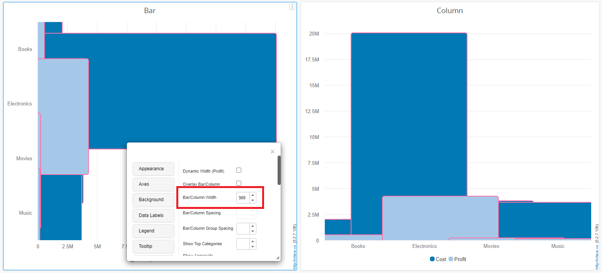

# Bar/Column Width

The width of bars in a chart is a critical aspect that significantly impacts the visual representation and clarity of the data. Typically, the width of bars is constrained within a range of 1 to 50. This range is carefully selected to maintain a balance between ensuring a clear visualization of the data and preventing the chart from becoming too cluttered or overwhelming.\
This option is available in the property editor under the ‘Columns/bars’ tab and is titled Bar/Column width.

\

Examples of bar and column widths are easily seen in the screenshot below. 

\

### Enhancement

From version 5.2.7, there is no longer a limit on the width of bar/column . The width of bars plays a crucial role in highlighting differences between data points and aiding viewers in interpreting the information presented.

&#x20;On one hand, the removal of limitations on bar width provides greater flexibility and customization in chart design. Users now have the freedom to adjust the width of bars according to their preferences, leading to more visually appealing and engaging charts. This enhancement allows for better alignment with specific design requirements and the ability to create charts that effectively convey the intended message.

Below is the screenshot of charts with bar width:

<figure><figcaption></figcaption></figure>

<figure><figcaption></figcaption></figure>
