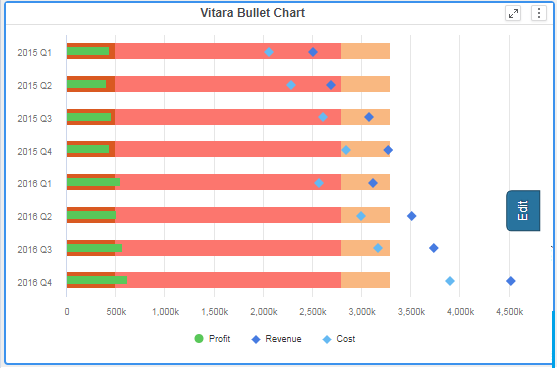
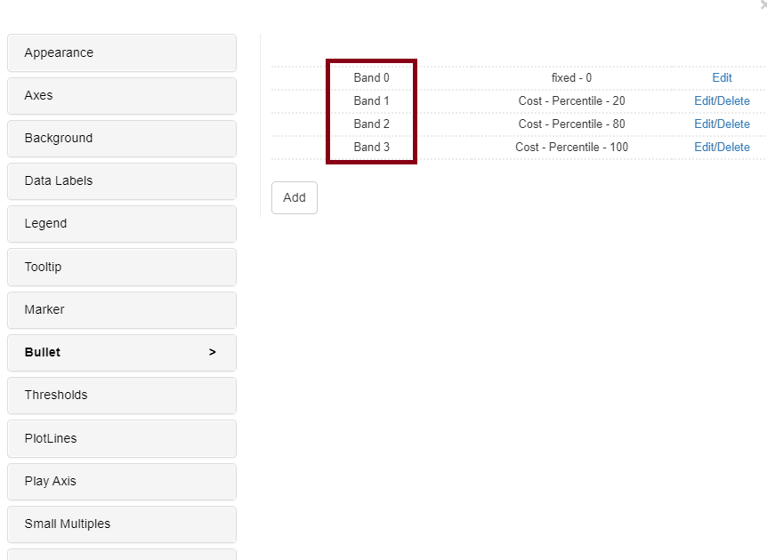
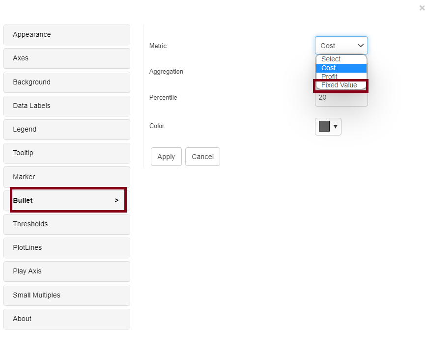
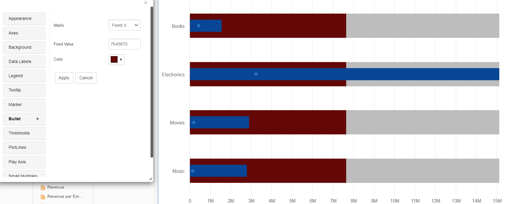
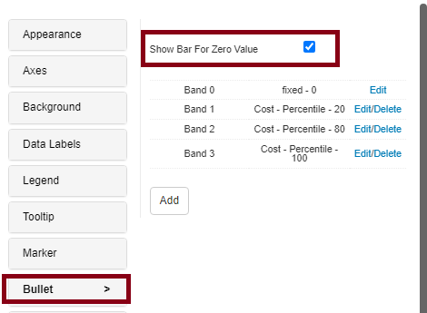
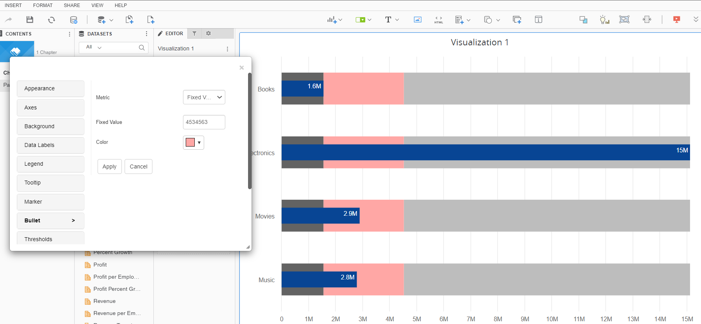
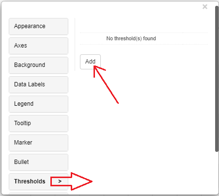
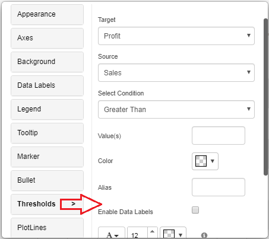
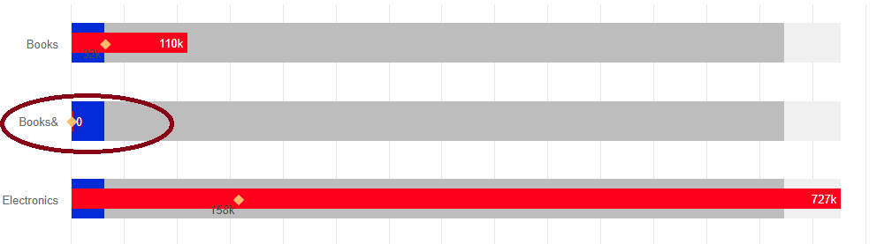

---
layout:
  title:
    visible: true
  description:
    visible: false
  tableOfContents:
    visible: true
  outline:
    visible: true
  pagination:
    visible: true
---

# Bullet Chart

Stephen Few created a bar graph version called a bullet chart. The bullet graph is used as a replacement for dashboard gauges and meters, and it appears to be inspired by the conventional thermometer charts and progress bars present on many dashboards. Since gauges and meter usually display too little information, take up too much space, and are overloaded with unnecessary and distracting accessory, bullet graphs were created to solve these problems. The bullet graph displays a single, major metric (such as total revenue for the current financial year) and compares it with one or more other measurements to clarify its meaning (such as in comparison to a target).

## Inputs 

Metrics- At Least 2 metrics are required for this visualization to be meaningful. A base Metric M1, a target M2. Additional target metrics M3, M4, etc can be added as shown below. Attributes - 1 or more attributes can be included. Use as Filter Option - Available

<figure><figcaption></figcaption></figure>

## Plot Bands 

The plot band feature in a bullet chart is used to highlight specific ranges of data within the chart. It consists of colored bands that can be placed at predefined intervals along the chart’s axis. This helps users quickly identify whether data points fall within or outside desired target ranges, making bullet charts effective for assessing performance or progress towards goals in a visually informative manner.

Bullet chart plot bands can be defined based on metric aggregations, similar to bullet chart type in Vitara Micro Chart. By default, the bullet chart will plot bands based on ‘percentile’ function on the metric applied in the ‘Bar’ drop zone.

We can edit these default bands and can apply different aggregation functions for different bands. As shown in the below screenshot hover the cursor on the chart, click on the ‘Edit’ button to get a properties popup window.

<figure><figcaption></figcaption></figure>

By default, all bands are plotted based on the ‘percentile’ value of the metric. We can also make the bands plot using fixed values. In the property editor, go to bullet tab and select ‘Fixed Value’ from the Metric dropdown. Set some value in the ‘Fixed Value’ textbox. Repeat this process for whichever bands should have the ‘fixed value’. See the screenshot below.

<figure><figcaption></figcaption></figure>

And the bands should look like this:\

<figure><figcaption></figcaption></figure>

## Customization of bands 

From version 5.1, we’ve included new features for band customization under the Bullets property option, allowing us to add more than four bands.

<figure><figcaption></figcaption></figure>

<figure><figcaption></figcaption></figure>

## Thresholds 

In the business point of view, certain part of the chart needs to be highlighted to draw more attention from the desicion makers. For example, highlight the stores where total sales is greater than a specific value or highlight the top 10 products whose sales is high during last year’s winter. Thresholds are very useful objects in these use cases.

Thresholds will display some conditional formatting in a chart to highlight certain data points depending on predefined criteria.The criteria are attribute or metric qualifications. If a qualification’s expression evaluates to TRUE, the report displays the threshold. We can also include markers in thresholds.

To apply thresholds in vitara charts, hover the cursor on the chart. Vitara chart will display an ‘Edit’ button. When you click on this ‘Edit’ button the properties window will pop out. Select the thresholds tab to open threshold editor. In the window you can add a new threshold or delete any existing threshold or modify the existing threshold.

**Note:** From 4.6 version we can apply thresholds using attributes. The source drop down box in the threshold editor window will list all the attributes and metrics in the chart. we can select an attribute as source and define a threshold condition.

<figure><figcaption></figcaption></figure>

In the threshold editor window apply source, target, threshold condition and the other related information to set a threshold on the chart.

<figure><figcaption></figcaption></figure>

After giving all the inputs click on ‘Apply’ button.

## Play-by Animation 

Play by - animation shows the chart for each element of the first attribute. For more details about the play by feature please refer to [play-by](play-animation.md).

## Background Image 

The steps to set a background image for all Vitara charts are explained in [backgroundImage](background-images.md).

## Zero Value Bar 

In Version 5.1.1.010, we included a new feature that allows users to show zero value bars.

The zero value bar feature in a bullet chart ensures that even when there is no data for a particular category or period, a visible and proportional bar is displayed at zero. This maintains the chart’s scale and context, preventing misinterpretation or distortion of data. It allows viewers to accurately assess the absence of data and makes the chart more informative and reliable for analyzing performance against goals or benchmarks, aiding in decision-making and performance assessment in areas where zero values may occur.

This feature can be enabled under the “Bullet” tabs, where it can be used to display metrics, whose values are zero.

<figure><figcaption></figcaption></figure>

<figure><figcaption></figcaption></figure>
