# Calendar Heatmap Chart

A calendar heatmap chart is a graphical representation that displays data across a calendar grid, using color to indicate values. Each cell of the calendar grid represents a day, week, or month, with color intensity corresponding to the data value for that period. This visualization technique is valuable for showing patterns, trends, or seasonal variations in data over time. It is commonly used for tracking events, performance metrics, or any data with temporal aspects, allowing for quick and intuitive data analysis and insights.

## Inputs 

Metrics: 1 metric

Attributes: At Least one date attribute.

Use as a filter option - available.

In the example below, the data is at the day level and shown by the grain Month. The calendar days are color coded by sales values and the bottom grid is controlled by the calendar widget.

The level of display in the calendar can be changed to show year-week, month-day, year-month, etc as needed.

<figure>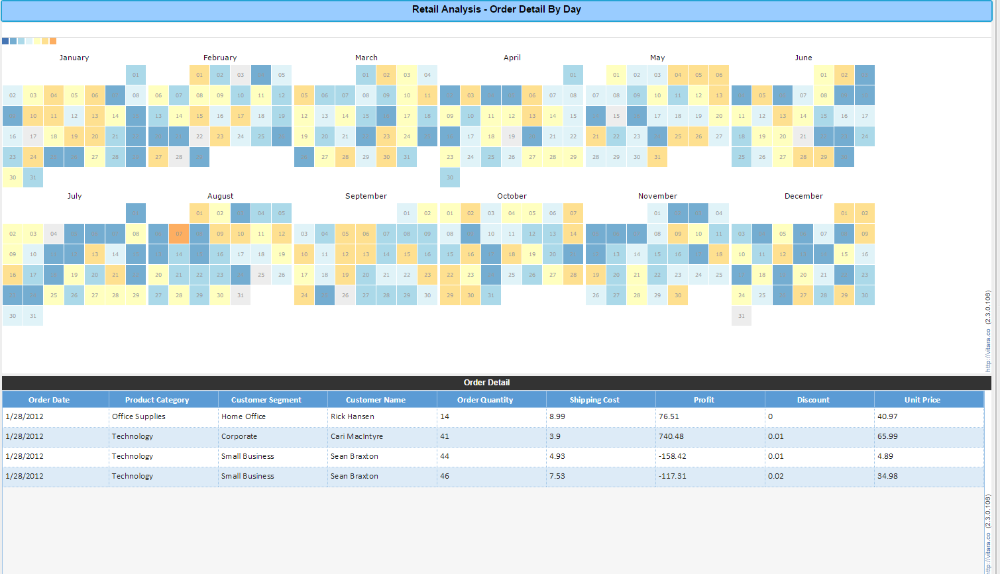<figcaption></figcaption></figure>

## Custom date formats 

By default Vitara Calendar heatmap will recognize the below listed date formats.\
YYYY,\
MMMYYYY,\
DDMMYYYY,\
MMDDYYYY,\
YYYYMMDD,\
D-M-YYYY,\
YYYYMMDD,\
M-D-YYYY,\
YYYY-M-D,\
M/D/YYYY,\
D/M/YYYY,\
YYYY/M/D,\
MMM YYYY,\
YYYY-M-D HH:mm:ss,\
YYYY-M-D HH:mm,\
D/M/YYYY HH:mm:s,\
M/D/YYYY HH:mm:s,\
YYYYMMDD HH:mm,\
DDMMYYYY HH:mm,\
MMDDYYYY HH:mm,\
YY,\
MMMYY,\
DDMMYY,\
MMDDYY,\
YYMMDD,\
D-M-YY,\
YYMMDD,\
M-D-YY,\
YY-M-D,\
M/D/YY,\
D/M/YY,\
YY/M/D,\
MMM YY,\
YY-M-D HH:mm:ss,\
YY-M-D HH:mm,\
D/M/YY HH:mm:s,\
M/D/YY HH:mm:s,\
YYMMDD HH:mm,\
DDMMYY HH:mm,\
MMDDYY HH:mm,\
MM/DD/YY HH:mm,\
M/DD/YY HH:mm,\
MM/DD/YY H:mm,\
M/DD/YY H:mm,\
MM/D/YY HH:mm,\
M/D/YY HH:mm,\
MM/D/YY H:mm,\
M/D/YY H:mm,\
MM/DD/YY HH:mm a,\
M/DD/YY HH:mm a,\
MM/DD/YY H:mm a,\
M/DD/YY H:mm a,\
MM/D/YY HH:mm a,\
M/D/YY HH:mm a,\
MM/D/YY H:mm a,\
M/D/YY H:mm a,\
MM/DD,\
M/D,\
MMMM DD, YYYY,\
MMMM D, YYYY,\
DD-MMM,\
D-MMM,\
DD-MMM-YY,\
D-MMM-YY,\
MMM-YY,\
MMM ‘YY,\
MMMM YYYY.

If the chart shows error message, _“Error: Invalid date format. The first attribute must be date.”_, even if the data belongs to one of the date format listed above, then manually select the date format in the ‘Calendar” menu. Below is the screenshot of calendar menu.

<figure>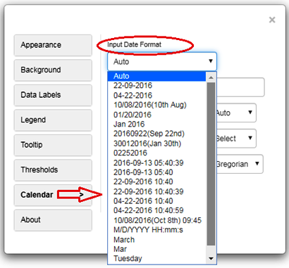<figcaption></figcaption></figure>

If the calendar menu doesn’t have the date format our data belongs to, then we have to choose “Custom Date Format” option in the calendar menu.

## **Steps to define custom date formats in the Vitara Calendar heatmap:**

**Step 1:** For example, _DD.MM.YYYY_ date format is not listed in the vitara calendar chart’s default date formats. Therefore users have to define this date format. Below is the screenshot of actual data with _DD.MM.YYYY_ date format.

<figure>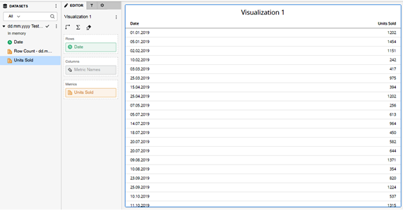<figcaption></figcaption></figure>

**Step 2:** When we apply vitara calendar heatmap to the above dossier, vitara calendar heatmap will display an error message - _Invalid date format_.

<figure>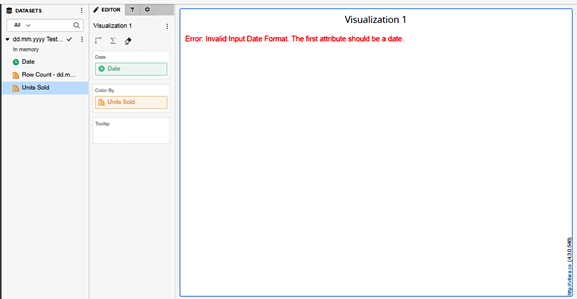<figcaption></figcaption></figure>

**Step 3:** Hover the cursor on the calendar heatmap to display _“Edit”_ properties button.

<figure>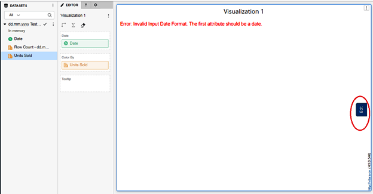<figcaption></figcaption></figure>

**Step 4:** Click on the “Edit” button to open properties menu. In the properties window select the tab _“Calendar”_.

<figure>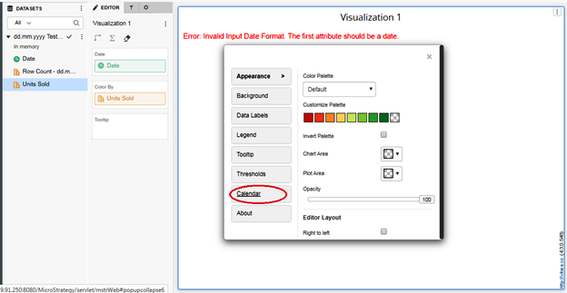<figcaption></figcaption></figure>

**Step 5:** The input date format drop down box will show all the date formats that vitara calendar heatmap will recognize by default.

<figure><figcaption></figcaption></figure>

**Step 6:** If the user’s date format is not in this list, user has to define their own date format using the _“Custom Date Format”_ text input box. The _DD.MM.YYYY_ date format is given as input to this text input box in the below screenshot.

<figure>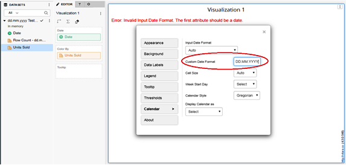<figcaption></figcaption></figure>

**Step 7:** Close the _“Edit”_ properties window. Vitara calendar heatmap will render in the custom date format.

<figure>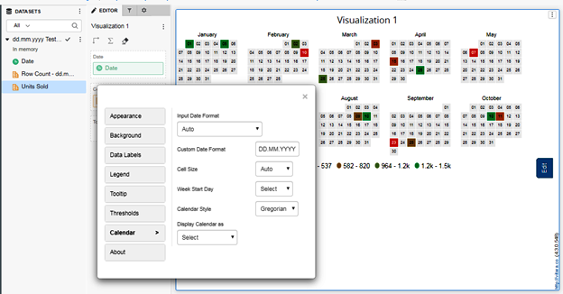<figcaption></figcaption></figure>

## Thresholds 

By default calendar Heatmap creates a threshold (Gradient threshold) and plot colors based on this threshold. Below is the screenshot of threshold editor of calendar heatmap. Threshold editor shows the default threshold applied on the chart. We can edit this threshold or delete this threshold and create a new one by clicking on ‘Add’ button.

<figure>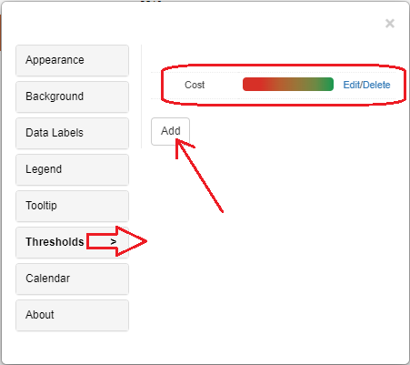<figcaption></figcaption></figure>

We can set thresholds on metrics using any criteria to show specific colors on the chart. Open the property editor by clicking on the ‘Edit’ button and select the ‘Threshold’ tab.

In the threshold editor window apply source, target, threshold condition and the other related information to set a threshold on the chart.

<figure>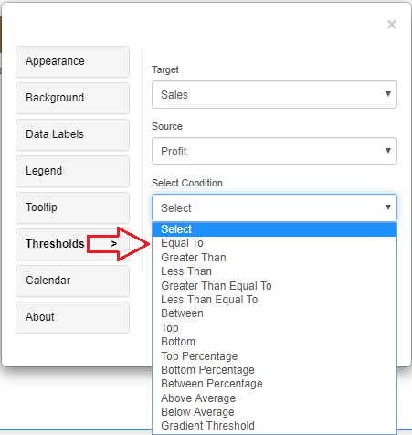<figcaption></figcaption></figure>

After giving all the inputs click on ‘Apply’ button.

## Thresholds Priority

When multiple thresholds are applied to the same metric, the most recently added threshold takes precedence—even if the conditions differ.

For example, if a threshold is applied to the Cost metric with a "greater than" condition and sets a background color, and then another threshold is added to the same Cost metric with a different condition that includes a text color and a marker, the chart will reflect only the styling from the most recently applied threshold.

## Play-by Animation 

Play by - animation shows the chart for each element of the first attribute. For more details about the play by feature please refer to [play-by](play-animation.md).

## Background Image 

The steps to set a background image for all Vitara charts are explained in [backgroundImage](background-images.md).

## Calendar format: Gregorian/Hijri 

Vitara calendar heatmap can work in gregorian calendar format or hijri calendar format. By default chart will display gregorian calendar format.

The Gregorian calendar is the world’s most extensively used calendar system. It is the common calendar format in most nations and is used in daily life for business, personal, and official purposes. Calendar heatmap charts in Gregorian calendar format would be more accessible to a worldwide audience because it is the calendar system with which the majority of people are familiar. If your data and audience primarily use the Gregorian calendar, it’s a logical choice for creating a calendar heatmap chart.

The Hijri calendar, often known as the Islamic or lunar calendar, is largely utilized for religious and cultural purposes in Islamic countries and cultures. It is a lunar calendar, which means that the months are governed by the cycles of the moon. If your data or audience is relevant to Islamic circumstances, or if you want to highlight events or data points that correspond to Islamic dates, the Hijri calendar format is preferable.

The following screen demonstrates the process of enabling the ’Hijri’ format in the calendar heatmap.

<figure>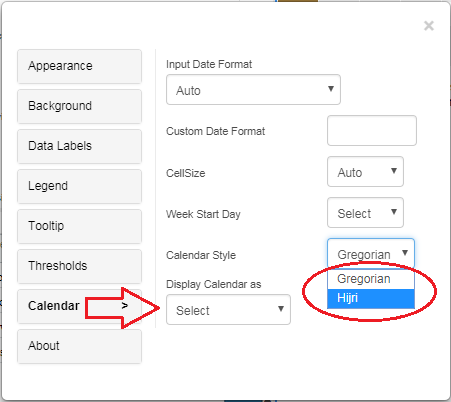<figcaption></figcaption></figure>

## Elimination of Grey Cells 

From version 5.2.4 we have added a new feature of eliminating grey cells from a calendar heatmap feature involves configuring the visualization to exclude periods with no data. This declutters the heatmap, making it more informative by highlighting only the relevant time intervals with data, and improving the visual impact for tracking trends or patterns.

This feature will be accessible from the “Calendar” tab in the chart editor menu.Within the “Calendar” tab, new option named “Hide Empty Cells “ is added.

<figure><figcaption></figcaption></figure>
