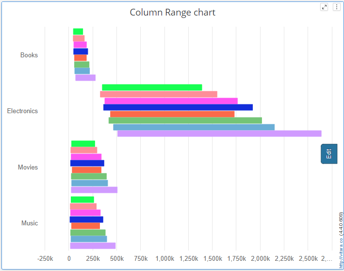
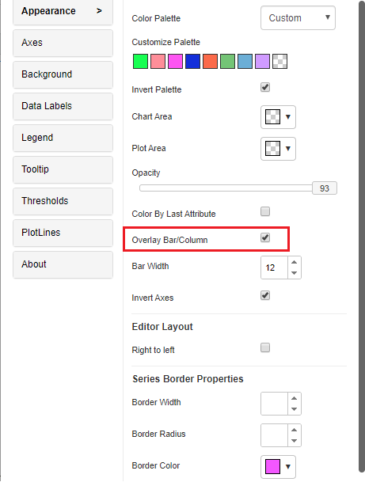
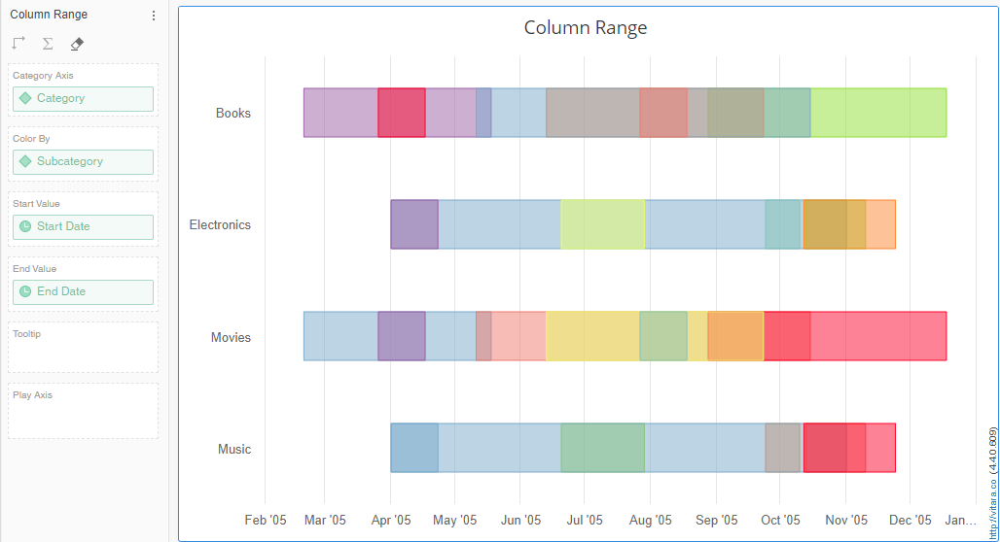
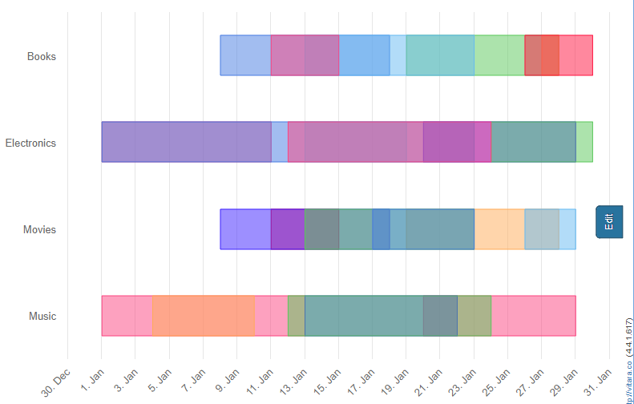
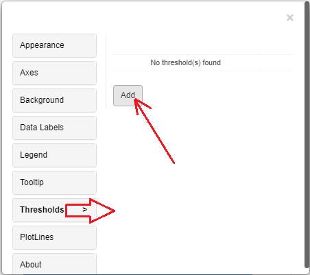
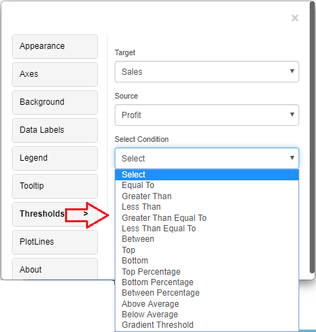
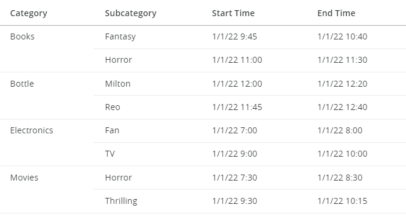
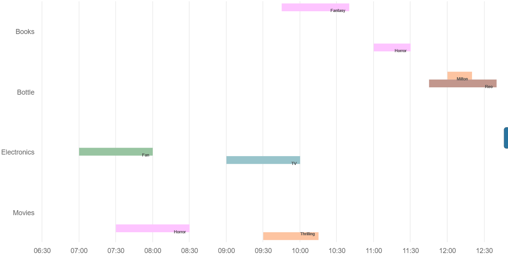
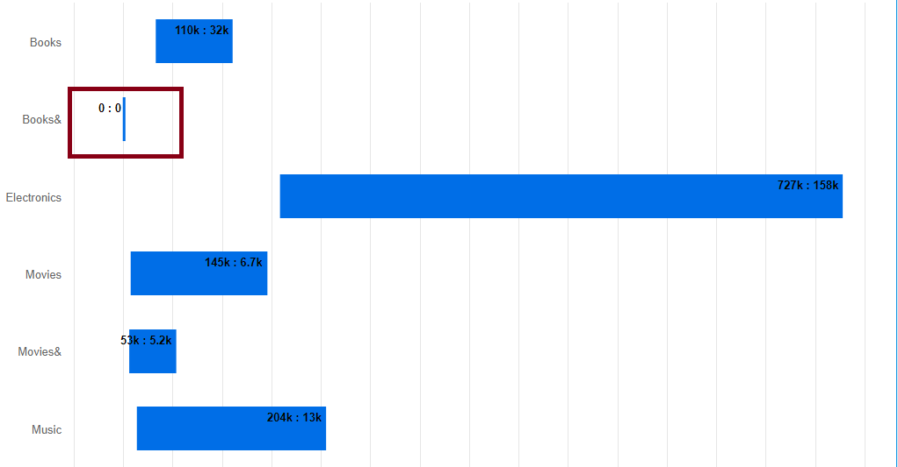

# Column Range Chart

The Column Range visualization in Vitara Charts can be used to illustrate minimum and maximum values over time or to indicate the acceptable range of deviation for a certain category. It can also be used to show the start and finish dates of a project timeline. This style is also suitable for non-aggregable metric representations such as stock on hand at various times.

## Inputs 

Attributes: Level 1 attribute is required and optionally level 2 attributes can also be added. These attributes are used on the x-axis.

Metric: 2 Metrics, start value M1 and End Value M2 will need to be provided. Metrics are used on the Y-axis.

Use as Filter Option - Available

<figure><figcaption></figcaption></figure>

## Column range chart now supports date attributes (for start and end values) 

From 4.4 version, a new feature is added where all the elements in a group can be shown in a single row and to enable this feature, we need to have a color by attribute in the chart. In the appearance property tab, enable the Overlay Bar/Column option, you can see the elements in single row.

<figure><figcaption></figcaption></figure>

Column range chart now supports the date attributes in start and end value dropzones. Below are the examples where All Caegorory levels are shown with start dates and end dates in the chart.

In the below screenshot, the start date and end date values are shown within an year.

<figure><figcaption></figcaption></figure>

In the below screenshot, the start date and end date values are shown within an month.

<figure><figcaption></figcaption></figure>

## Thresholds 

In the business point of view, certain part of the chart needs to be highlighted to draw more attention from the desicion makers. For example, highlight the stores where total sales is greater than a specific value or highlight the top 10 products whose sales is high during last year’s winter. Thresholds are very useful objects in these use cases.

Thresholds will display some conditional formatting in a chart to highlight certain data points depending on predefined criteria.The criteria are attribute or metric qualifications. If a qualification’s expression evaluates to TRUE, the report displays the threshold. We can also include markers in thresholds.

To apply thresholds in vitara charts, hover the cursor on the chart. Vitara chart will display an ‘Edit’ button. When you click on this ‘Edit’ button the properties window will pop out. Select the thresholds tab to open threshold editor. In the window you can add a new threshold or delete any existing threshold or modify the existing threshold.

**Note:** From 4.6 version we can apply thresholds using attributes. The source drop down box in the threshold editor window will list all the attributes and metrics in the chart. we can select an attribute as source and define a threshold condition. The target of the threshold depends on the series of the chart. This means, if the chart series is created using metrics then target drop down box will display the metrics. If we enabled ‘color by’ mode, by adding an attribute to the ‘color by’ drop zone in the dossier’s editor panel, the chart series will be created using attributes. In this case the threshold target drop down box will show all the elements of attribute used in the color by drop zone. In this case we can set threshold target using attribute.

<figure><figcaption></figcaption></figure>

In the threshold editor window apply source, target, threshold condition and the other related information to set a threshold on the chart.

<figure><figcaption></figcaption></figure>

Apply all the inputs then click on ‘Apply’ button.

## Thresholds Priority

When multiple thresholds are applied to the same metric, the most recently added threshold takes precedence—even if the conditions differ.

For example, if a threshold is applied to the Cost metric with a "greater than" condition and sets a background color, and then another threshold is added to the same Cost metric with a different condition that includes a text color and a marker, the chart will reflect only the styling from the most recently applied threshold.

## Displaying stacking bars in a separate row 

We can also display bars stacked in different rows when using an attribute in the “Color by” drop zone for each category element.

The feature of stacking bars in separate rows within a column range chart is a valuable tool for visualizing complex data relationships. In this type of chart, each category or data series is represented as a separate row, and within each row, bars of varying heights are stacked to show the range of values within that category or series.

This approach offers several advantages. Firstly, it allows for easy comparison of the total range between categories. Secondly, it provides a clear view of how individual data points contribute to the overall range, aiding in data analysis.

As an illustration, we made a mock chart and added a number of categories to the Category axis along with subcategories (such as horror, fans, and so forth) to the Color by drop zone.

<figure><figcaption></figcaption></figure>

<figure><figcaption></figcaption></figure>

## Play-by Animation 

Play by - animation shows the chart for each element of the first attribute. For more details about the play by feature please refer to [play-by](play-animation.md).

## Background Image 

The steps to set a background image for all Vitara charts are explained in [backgroundImage](background-images.md).

## Zero Value Bar 

In Version 5.1.1.010, we included a new feature that allows users to show zero value bars.

The zero-value bar feature in a column range chart is a crucial tool for accurately representing data where values can be zero or very close to zero. It ensures that data points with zero values are visibly displayed, preventing them from being overlooked or misrepresented.

In this type of chart, a bar is drawn even when the data point has a value of zero, helping viewers understand the absence of data or the true distribution of values more precisely.

This feature can be enabled under the “ColumnRange” tabs, where it can be used to display metrics, whose values are zero.

<figure><figcaption></figcaption></figure>

<figure><figcaption></figcaption></figure>
