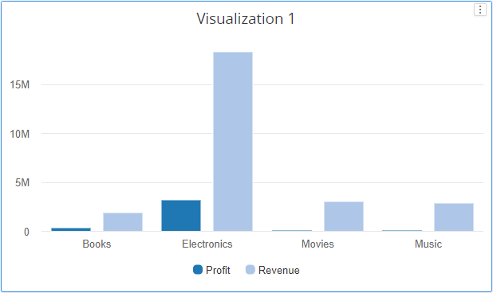

---
layout:
  title:
    visible: true
  description:
    visible: false
  tableOfContents:
    visible: true
  outline:
    visible: true
  pagination:
    visible: true
---

# Combination Chart

You can create a combination chart to represent multiple series as different chart types. For instance, a chart showing sales and profit can be created with sales shown as bars and profit shown as a line or area chart. In addition each of these metrics can use their own axis.

## Inputs 

Metrics - 1 or more metrics\
Attributes - 1 or more attributes\
Use as Filter Option - Available

## Series 

From 4.4 version, ‘Scatter’ is removed from series types. It is now replaced by data markers. And also width property is added in series tab to independently adjust the width of each series. See the screenshot below

<figure><figcaption></figcaption></figure>

## Steps to create a Combination chart 

Combination chart can be created using the series tab in property editor of Line/Bar/Column/Area charts

## **Step 1:**

Create a column chart for example with 2 metrics profit and revenue as shown in the screenshot below.

<figure><figcaption></figcaption></figure>

## **Step 2:**

Now open the property editor and go to the series tab. Click on the edit button for revenue metric as shown in the screenshot below

<figure><figcaption></figcaption></figure>

## **Step 3:**

Select the series type for revenue metric as ‘Line’, width as ‘2’ and click on apply as shown in the below screenshot.

<figure><figcaption></figcaption></figure>

And the combination chart will now be created as shown in the screenshot below.

<figure><figcaption></figcaption></figure>

## **Step 4:**

We can aslo set the series to be on the secondary axis for one of the metric. See the screenshot

<figure><figcaption></figcaption></figure>

And below screenshot shows how the chart looks after enabling the series on secondary axis

<figure><figcaption></figcaption></figure>

#### Data Markers 

From the version 4.4, data markers feature is introduced in the Bar/Column/Line/Area/Sparkline charts. To know about **Data Markers** feature please [click Here.](https://docs.vitaracharts.com/readme/data-markers)
