---
layout:
  title:
    visible: true
  description:
    visible: false
  tableOfContents:
    visible: true
  outline:
    visible: true
  pagination:
    visible: true
---

# Custom Markers

## The Power of Custom Markers in Charts 

Welcome to the fascinating world of charts, where numbers transform into vibrant stories! Imagine your chart as a canvas waiting to be painted with colorful insights. In this enchanting journey, we’ll dive into the secret ingredient that makes charts come alive: custom markers.

You know those little symbols or icons that add flair to your charts? Those are custom markers! They’re like tiny magicians, bringing a touch of magic to every data point. Today, we’ll explore how these markers work their wonders, starting with the familiar bar and column charts.

## Bar and Column Chart Magic: Custom Markers Enchanting Category Axis Labels, Datalabels, and Tooltips in a Dance of Colorful Data 

Imagine bar and column charts as vibrant dance floors where labels and data come to life, thanks to our special guests – custom markers. These markers are like the dance partners for our category labels. Every label gets its own unique symbol or icon, turning our chart into a visual feast that’s exciting to look at. But the fun doesn’t stop there! These markers sprinkle a bit of charm on our datalabels too, making the numbers look cool and friendly. And guess what? When you hover over a bar or column, it’s like lifting the curtain on a surprise party – tooltips pop up with extra secrets, adding an interactive spark to our chart.

Now, let’s dive a bit deeper into the magic happening in our chart. In this dance of labels and datalabels, custom markers act like artistic decorations, making each label a special character and turning boring numbers into something cool and friendly. It’s not just about showing data; it’s like telling a story with every move on the dance floor of our chart.

And here’s where the chart becomes even more exciting. When you hover over a bar or column – it’s like waving a magic wand – tooltips appear with extra details. This makes our chart not just a picture but a lively experience. You can explore, discover, and interact with the data, making it more than just numbers on a page.

So, in our bar and column chart party, custom markers are the cool dancers making labels and data look awesome. They turn our chart into a colorful, interactive dance floor where every move tells a story, and every detail is a surprise waiting to be uncovered. Cool, right? That’s the magic of custom markers in our chart dance party!

### **Exploring Custom Markers in Bar and Column Charts: A Step-by-Step Guide**

Follow these simple steps in the property editor to infuse your charts with a personalized touch:

1. Bar and Column Charts: Personalizing Category Axis Labels

* Open the Property Editor for your bar or column chart.
* Navigate to the ‘Axes’ tab and select the ‘Category Axis’ section.
* Identify the ‘Label’ dropzone under the ‘Category Axis.’

<figure>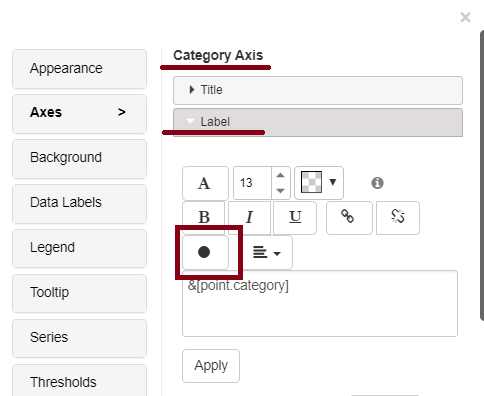<figcaption></figcaption></figure>

* Add your chosen custom markers to infuse visual appeal into category axis labels.

<figure>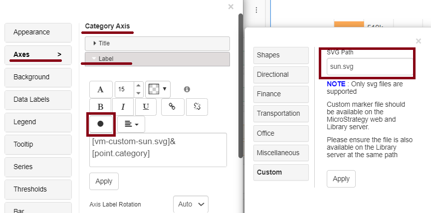<figcaption></figcaption></figure>

<figure>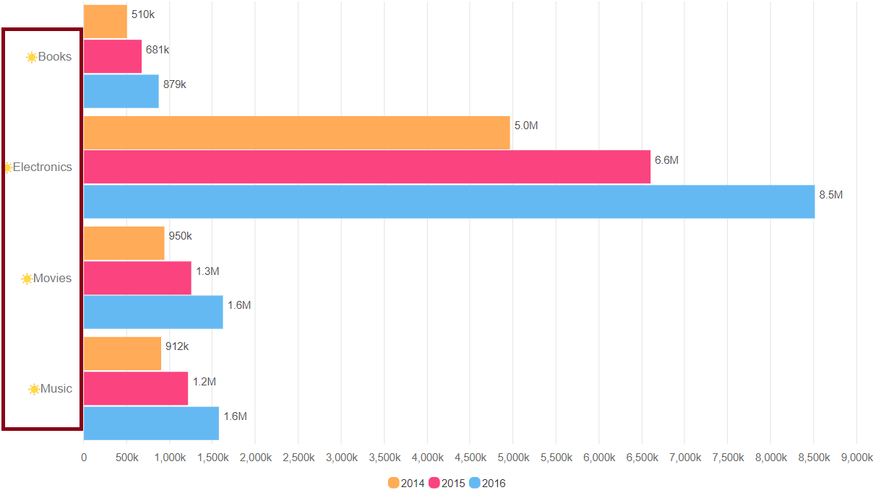<figcaption></figcaption></figure>

2. Tooltip Customization: Adding Insights to Data Points

* In the Property Editor, locate the ‘Tooltip’ section specific to your chart type.
* Find the dropzone designated for custom markers within the ‘Tooltip’ section.

3. Datalabels Enhancement: Bringing Numbers to Life

<figure>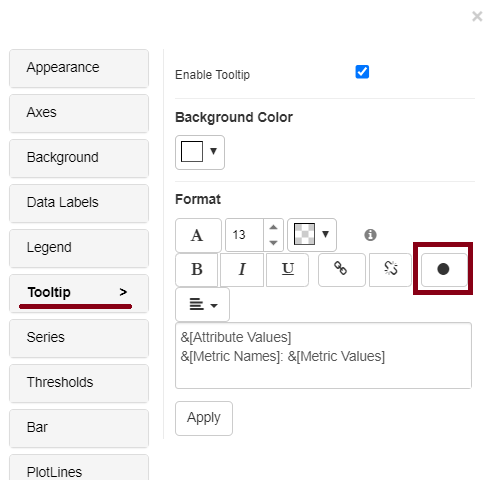<figcaption></figcaption></figure>

* Seamlessly integrate custom markers to provide additional insights when users hover over data points.

<figure>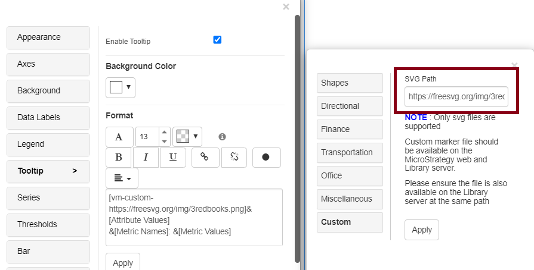<figcaption></figcaption></figure>

<figure>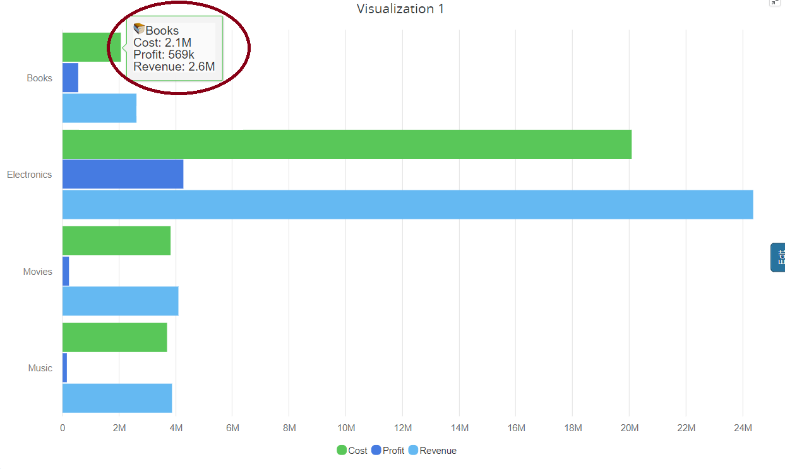<figcaption></figcaption></figure>

1.Datalabels Enhancement: Bringing Numbers to Life

* Navigate to the ‘Datalabels’ section in the Property Editor.
* Identify the dropzone dedicated to custom markers under ‘Datalabels.’

<figure>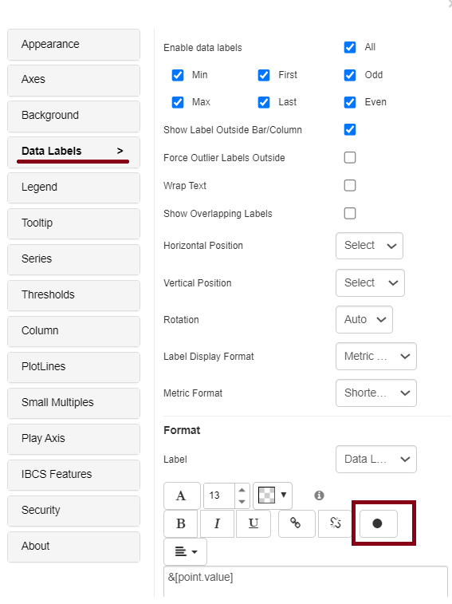<figcaption></figcaption></figure>

* Add custom markers to turn plain numbers into visually enriched elements, enhancing the storytelling aspect of your chart.

<figure>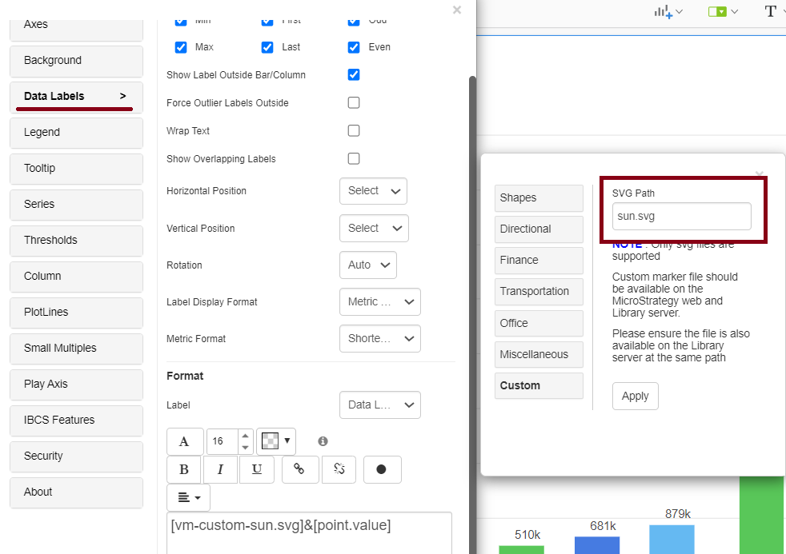<figcaption></figcaption></figure>

<figure>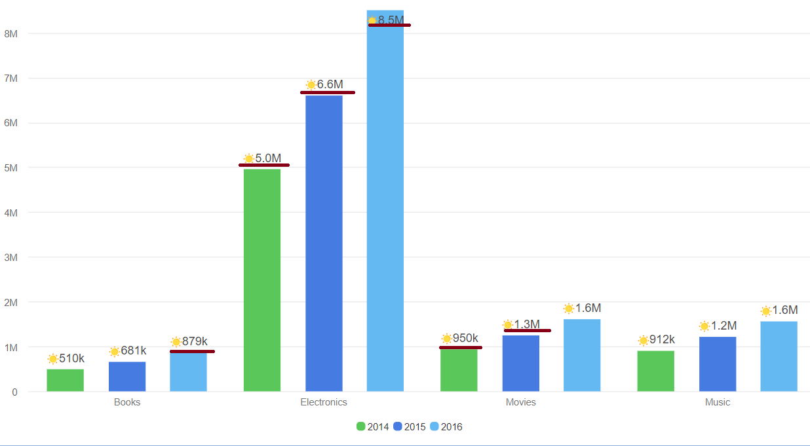<figcaption></figcaption></figure>

#### The Symphony Continues: Unveiling the Versatility of Custom Markers Across Various Chart Types 

Welcome to the world of data visualization, where custom markers enhance the look of your charts. Let’s start by pointing out a key detail: In bar and column charts, these markers shine on the category axis, tooltips, and data labels.

Now, as we explore other Vitara chart types like line charts, stacked column, waterfall charts, and simple kpi charts, it’s important to know that custom markers take a slightly different approach. Unlike their versatile role in bar and column charts, you’ll find these markers working their magic mainly in tooltips and data labels for these other charts.

This distinction helps us understand how custom markers play out across various chart types. So, let’s dive into the details and see how these markers bring a special touch to different elements of your visualizations.

**Line Chart: Guiding Trends with Visual Milestones**

In the realm of line charts, custom markers act as guiding beacons along plotted trends. Each marker becomes a visual milestone, adding a layer of depth and engagement to the interpretation of data points.

<figure>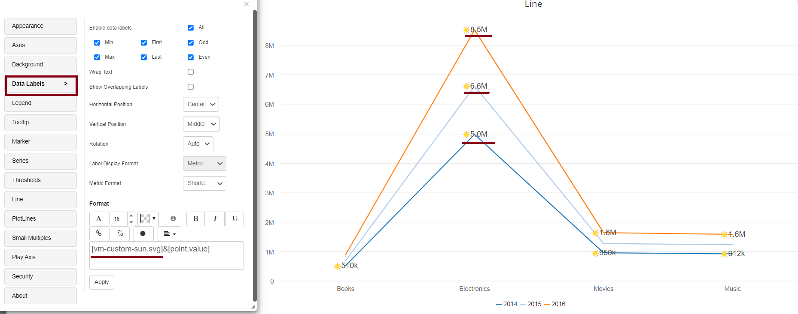<figcaption></figcaption></figure>

**Stacked Column Chart: Visual Signposts Through Layered Data**

Navigating through the layers of stacked column charts becomes more intuitive with custom markers. They act as visual signposts, guiding viewers through the intricate layers and enhancing the clarity of data interpretation in tooltips and datalabels.

<figure>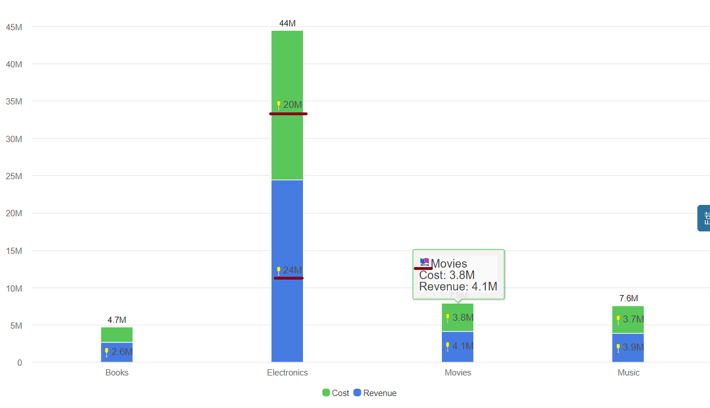<figcaption></figcaption></figure>

**Waterfall Chart: Adding Splash to Data Narratives**

In waterfall charts, custom markers contribute to the narrative by adding a splash of distinction to data points. They transform tooltips and datalabels into expressive elements, turning the chart into a visual story of changing values.

<figure>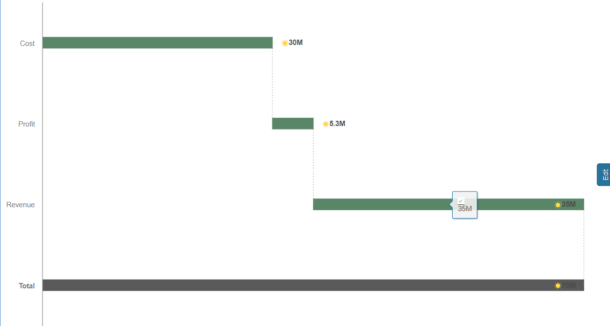<figcaption></figcaption></figure>

**Simple KPI: Custom Markers as Dynamic Storytellers**

Even in simple KPI charts, custom markers play a dynamic role in storytelling. They turn tooltips and datalabels into visual narratives, making key performance indicators more engaging and insightful.

<figure>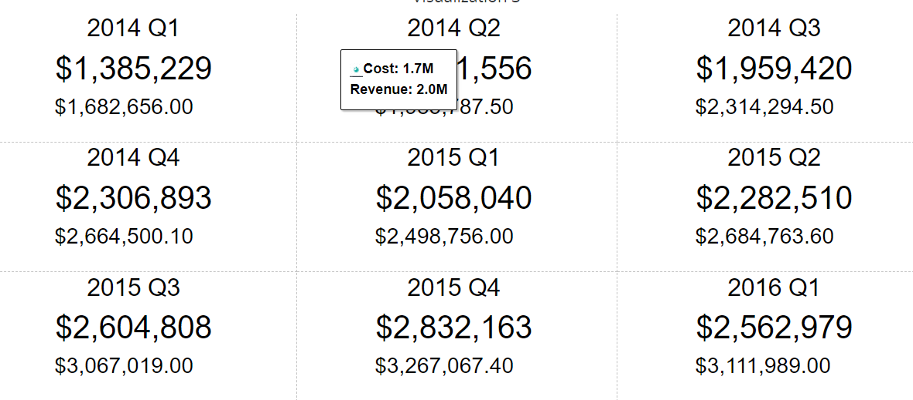<figcaption></figcaption></figure>

**Histogram: Infusing Patterns with Visual Flair**

Custom markers in histograms go beyond traditional representations. They infuse patterns with visual flair, creating an engaging experience in tooltips and datalabels, making data distributions more accessible.

<figure>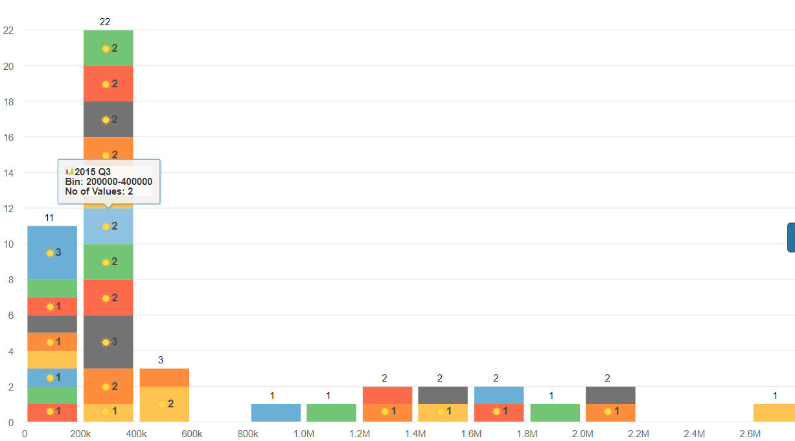<figcaption></figcaption></figure>

**Trellis: Custom Markers Across Multiple Charts**

In trellis charts, custom markers traverse multiple charts, providing consistency and visual appeal. The tooltips and datalabels in each trellis benefit from the expressive touch of these markers, creating a seamless visual experience.

<figure>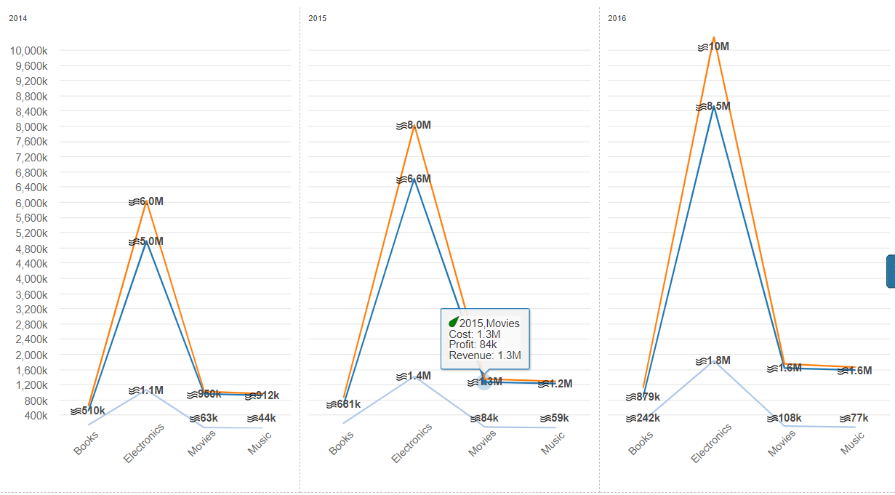<figcaption></figcaption></figure>

**Calendar Heat Map: Time-Driven Insights**

Custom markers in calendar heat maps bring time-driven insights to the forefront. They enrich tooltips, making each date on the calendar a visual story waiting to be explored.

**Spark Line: Tiny Trends with Big Impact**

Even in the compact space of spark lines, custom markers make a big impact. They turn tooltips and datalabels into concise yet powerful narratives, revealing tiny trends with significant insights.

**Dumbbell Chart: Visual Bridges Between Data Points**

Dumbbell charts benefit from the visual bridges created by custom markers. They enhance tooltips and datalabels, turning the chart into a journey of connections between data points.

**Packed Bubble: Adding Depth to Bubble Narratives**

Custom markers in packed bubble charts add depth to bubble narratives. They enrich tooltips and datalabels, making each bubble more than just a point but a visual story within the larger context.

**Slope Chart: Navigating Trends with Grace**

Slope charts gracefully navigate trends with the support of custom markers. They transform tooltips and datalabels into visual guides, making the journey through data points more meaningful and delightful.

As we transition to additional supported charts, including Column, Pie, Column Range, Tornado, Grid, Micro, Angular Gauge, Mekko, Area Chart, Bubble Chart, Bullet Chart, KPI Ring, Sankey Chart, Waffle Chart, Heat Map Chart, Stacked Bar, and Funnel, the custom markers continue to enhance the visual narrative. Whether it’s providing visual landmarks, turning dots into expressive stories, or infusing slices with distinctive identities, custom markers consistently elevate the storytelling potential of each chart type, making the exploration and interpretation of data a truly immersive experience.
