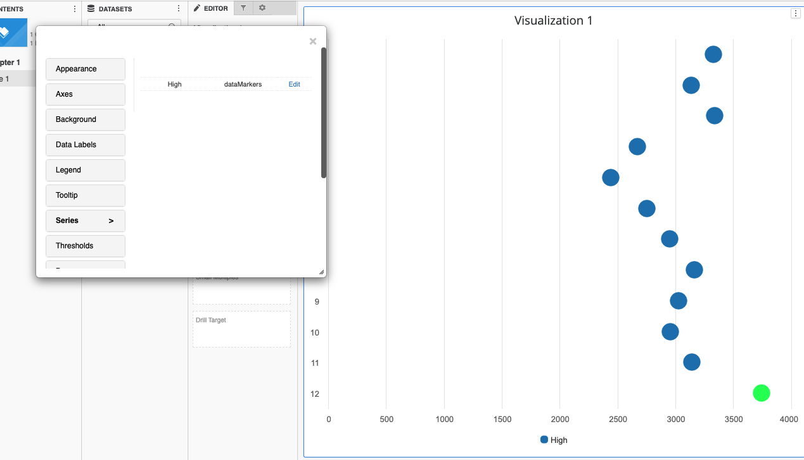

---
layout:
  title:
    visible: true
  description:
    visible: false
  tableOfContents:
    visible: true
  outline:
    visible: true
  pagination:
    visible: true
---

# Custom SVG Markers

#### **Note: Vitara Charts supports only SVG files as custom markers.**

### Two simple steps to use custom images as markers: <a href="#two-simple-steps-to-use-custom-images-as-markers" id="two-simple-steps-to-use-custom-images-as-markers"></a>

#### **1. The svg file’s location**

The SVG files can be used as custom marker in two ways:

#### **Physical SVG file:**

#### **Step 1:**

Copy the images which you want to set as a custom marker in the below folders.

```
1. tomcat\webapps\MicroStrategy\plugins\VitaraCharts\custom\images
2. tomcat\webapps\MicroStrategyLibrary\plugins\VitaraCharts\custom\images
3. /var/opt/MicroStrategy/install/Export/resources/plugins/VitaraCharts/custom/images/
```

The paths listed above are merely examples; you must use comparable paths based on your server’s folder structure and the web server you are using. It is necessary to copy the SVG image files to all three of the above locations.

#### **Step 2:**

Open the custom marker tab and enter the image name, including the extension ‘.svg’, in the “SVG path” text input box. Then, press the ‘Apply’ button. The custom marker is visible on the chart. Please keep in mind that the image name is case sensitive.

### **Using Web URL:**

If you have a web URL for an SVG image file that you wish to use as a custom marker, you can paste it directly into the text input box of the custom marker tab. Then, press the ‘Apply’ button. The custom marker is visible on the chart. There is no need to physically copy the image files anywhere using this procedure. Note: Using a web URL is currently not possible in the Android library application or the Android mobile application.

If you solely use vitara charts in the MicroStrategy web application and web library application, this is sufficient. If you are also using Vitara charts in mobile applications (library app and mobile app), proceed to the next stage.

### **2. Configuration of library and mobile applications**

Deploy vitara charts library and mobile plugins in the MicroStrategy library and mobile application respectively.\
We have to configure the vitara charts so that custom markers can work in library and mobile applications.

#### **Configuration steps for library application:**

#### **Step1:**

Access the config.jsp file in the vitara charts MicroStrategy library plugins, using the below sample URL in any browser.

```
https://MicroStrategyLibraryServer/plugins/VitaraCharts/config.jsp 
Example: http://example.com/MicroStrategyLibrary/plugins/VitaraCharts/config.jsp
```

#### **Step2:**

In the configuration page, enter the MicroStrategy web application URL.

```
Example: ​http://example.com/MicroStrategy/   <br/>Click the **Submit** button.
```

### **Configuration steps for mobile application:**

### **Step1:**

Access the config.jsp file in the vitara charts MicroStrategy mobile plugins, using the below sample URL in any browser.

```
https://MicroStrategyMobileServer/plugins/VitaraCharts/config.jsp 
Example: http://example.com/MicroStrategyMobile/plugins/VitaraCharts/config.jsp)
```

### **Step2:**

In the configuration page, enter the MicroStrategy web application URL.

```
Example: http://example.com/MicroStrategy/   <br/>Click the **Submit** button.
```

## **Custom svg markers are visible in my chart, but unable to change the color via series tab or thresholding?**

Paths (which inform the browser how to draw the shape) are defined in SVG files. The path might be closed (such a circle, oval, square, or any other shape that makes a closed space) or open. The path may already have a ‘fill’ parameter that specifies how the closed form should be coloured in the svg. So the circumstances under which you can apply a colour to a marker are as follows:

1. The file should contain (at least one) closed shape.
2. The file should not already contain a fill attribute for the closed form.

## **Example with-fill:**

In this svg file, the fill property is already specified with Yellow color(#fedb41).

<figure><figcaption></figcaption></figure>

As you can see below, with this type of svg marker you cannot set a color via series/thresholds options.

<figure><figcaption></figcaption></figure>

## **Example no-fill:**

You can see in the below screenshot that this svg marker doesn’t have ‘fill’ property defined.

<figure><figcaption></figcaption></figure>

So, in vitara charts, you can modify the color of this type of svg markers using either series option or thresholds.

<figure><figcaption></figcaption></figure>

**How to use custom SVG markers in vitara charts is explained in detail**[ _**here**_ ](data-markers.md)
