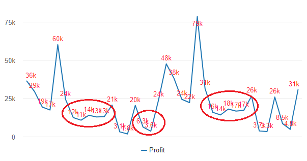

# Data label customization

\

## Use Metric Formatting 

When we activate data labels in any of the Vitara charts, the data labels are displayed in shortened format by default.

<figure><figcaption></figcaption></figure>

To show the data labels in the same format as the metric’s data format, pick the Use Metric Formatting option from the data labels menu. The screenshot below was taken after enabling the Use Metric Formatting option.

<figure><figcaption></figcaption></figure>

**If the metric’s data don’t have currency symbols, then how to display currency symbols in the data labels.**

Lets consider the data as shown in the below screenshot. Here the metric **Sales** does not have dollar sign.

<figure><figcaption></figcaption></figure>

If we wish to display this data using vitara charts and include the dollar symbol in the data labels, we must first add the dollar sign to the data. Edit the metric’s number format in the MicroStartegy and select the appropriate format.\

<figure><figcaption></figcaption></figure>

Below is the screenshot of the data after selecting currency number format with dollar sign.\

<figure><figcaption></figcaption></figure>

Now apply vitara chart, for example, vitara column chart.

<figure><figcaption></figcaption></figure>

When we enable data labels, by default vitara chart will display data labels in its own format i.e. short format. If we want to the values in the MicroStrategy format we have to enable the _use metric formatting_ option.\

<figure><figcaption></figcaption></figure>

Below is the screenshot of the vitara column chart after enabling the _use metric formatting_. Now we can see the dollar sign in the data labels.\

<figure><figcaption></figcaption></figure>

&#x20;**Note:** When we enable the _use metric formatting_ option in the data labels menu, the tooltip also will be displayed in the same format as the data labels.

## **Display axis labels in MicroStrategy number format.**

To display axis labels in MicroStrategy number format, first activate the utilize metric formatting option in the data labels menu, and then enable it in the axis labels menu. The screenshot below shows how to enable metric formatting in the axis labels menu.

<figure><figcaption></figcaption></figure>

<figure><figcaption></figcaption></figure>

## Data label customization

In 4.2 release customization of data, labels has been introduced. We can modify the default data labels using text and dynamic macros for data. Below is the screenshot of the data labels editor window.

<figure><figcaption></figcaption></figure>

Hover the cursor over the ‘i’ symbol to see the available macros for any particular chart. Below is the screenshot.

<figure><figcaption></figcaption></figure>

In the editor window type ‘&’ character and you will see macro suggestions. Select the macros and click on ‘“Apply” tab.

For example, the default macros in the above screenshot is &\[point.value], So the chart shows the metric value at each data-point. See the screenshot below:

<figure><figcaption></figcaption></figure>

Now we will use custom macros in this way &\[point.metricName]: &\[point.value], point.metricname is colored red. And the data labels will display this way now. See the screenshot below:

<figure><figcaption></figcaption></figure>

In this way, users can use either text or other macros or combination of both in many possible ways.

## Show Overlapping Data Labels 

From 4.1 version, all vitara charts are added with the support to show the overlapping data labels. This feature is added in data labels tab with ‘Show Overlapping Labels’ checkbox.

<figure><figcaption></figcaption></figure>

For example, in line chart when you enable data labels, only few labels are shown on the chart respective to the space available between the datapoints. See the screenshot below:

<figure><figcaption></figcaption></figure>

Now, the new feature allows to forcefully show all the data labels. To do this, go to data labels tab and enable the ‘Show Overlapping Labels’ checkbox. See the screenshot below:

<figure><figcaption></figcaption></figure>

## Attribute forms in Data labels 

We may now select a certain attribute form to display on the chart for Data labels. And we can only select the attribute form macros for the chart’s last attribute. For example, suppose there are two attribute forms enabled attributes, ‘category’ and ‘subcategory’. Then, if necessary, we can display the attribute forms for both attributes. Use &\[point.category@DESC] or &\[point.category@ID] or both macros depending on the necessity to display the chart’s default attribute forms in the data labels. Take a look at the image below.&#x20;

<figure><figcaption></figcaption></figure>

To display attribute forms only for a specific attribute, then choose it from data label macros list. e.g, Category@DESC, Category@ID, Subcategory@DESC, Subcategory@ID.
