# Dossiers/Documents differences

\

### Functional Differences using Vitara Charts in Dossiers and Report Service Documents 

#### Introduction 

From 10.3 and higher, the Vitaracharts visualisation library can be used for Report Services as well as Visual Insights/Dossier. The visualisations are compatible with desktop, web, and mobile devices. There are a few functional variations between dossier and document capabilities. These distinctions are highlighted below.

The table below compares and contrasts Dossier and Report Services Documents. The comprehensive part below contains more information on a chart-by-chart basis.

| S.No. | Property                                                           | Dossiers                                                                                     | Documents                                                                                                   |
| ----- | ------------------------------------------------------------------ | -------------------------------------------------------------------------------------------- | ----------------------------------------------------------------------------------------------------------- |
| 1.    | Export to PDF                                                      | Export to PDF is available for the entire dossier and as well as for each chart              | Export to PDF for custom charts is unavailable. Charts get converted to grid.                               |
| 2.    | Hide Vitara Property Editor                                        | When we run the vitara charts in presentation mode, charts don’t show ‘Edit’ button.         | User privileges are used to disable Vitara Property editor in MSTR Documents.                               |
| 3.    | Hide Vitara Property Editor                                        | N/A                                                                                          | User Access control levels to enable Vitara Property editor in Documents.                                   |
| 4.    | Vitara Properties (Play animation,Small multiples, Color by, etc.) | Drag and drop attributes or metrics into respective drop zone to apply any specific property | Open the vitara property editor and enable or disable respective check boxes to enable/disable any property |

#### Tooltip Dropzone: 

**Dossiers**

When we apply a Vitara chart to a visualization in dossiers, the editor panel is updated to reflect the chart. The standard editing panel will appear as shown in the screenshot below. In the editor panel, new drop zones such as Category Axis, Color by, Value, Tooltip, Play axis, Small multiple, and drilling will be visible.

<figure>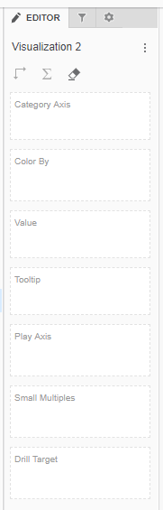<figcaption></figcaption></figure>

To display traits and metrics on the chart, simply drag and drop them into the appropriate drop zone.

The metrics that we place in the ‘Value’ drop zone appear on the graphic.

The metrics we placed in the ‘Tooltip’ drop zone did not appear in the chart, however their values are visible in the tooltip. We can also use the metrics in the ‘Tooltip’ drop zone to establish thresholds in the chart.

<figure>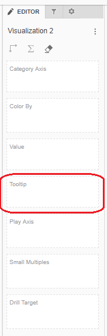<figcaption></figcaption></figure>

**Documents**

This feature is not present in the report services documents. Chart will display all the metrics we place in the grid.

#### Color by, Play Axis, Small Multiples and Drill Target drop zones: 

* Drag and drop the characteristics into the Color By, Play Axis, Small Multiples, and Drill Target Drop Zones in Dossiers.
* Color By Last Attribute and Play By First Attribute can be enabled/disabled in Documents via the property editor box. Hover your mouse over any Vitara chart to reveal the ‘Edit’ button. To launch the Vitara property editor window, click the ‘Edit’ button. Please see the screenshots below for further information.

Example: Vitara Area Chart In Documents and Dossiers

<figure>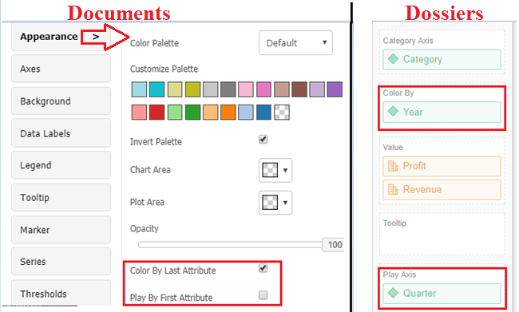<figcaption></figcaption></figure>

**Small Multiples:**

**Dossiers:** Drag and drop any attribute into the ‘Small Multiples’ drop zone to use the small multiples capability in dossiers. **Documents:** To activate Small Multiples in documents, launch the vitara property editor window and navigate to the ‘Small Multiples’ option. The screenshot below shows a modest numerous feature in dossiers and documents. The below screenshot demonstrates small multiple feature in dossiers and in documents.&#x20;

<figure>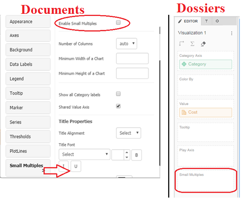<figcaption></figcaption></figure>

**Drill Target:**

The drill feature is available in bar, column, line, and pie charts.

**Dossiers:** In dossiers, drag and drop an attribute into the ‘Drill Target’ drop zone to enable the chart’s drilling capability. When we place an attribute in the ‘Drill Target’ drop zone, the vitara property editor will display the drilling tab.

**Documents:** Place at least two attributes in the grid to enable the drill functionality in the documents. The ‘Drillin’ tab in the docs vitara property editor allows us to enable/disable the drilling feature.

<figure>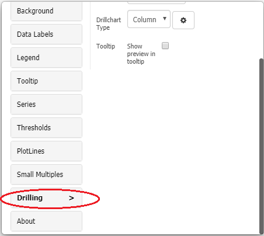<figcaption></figcaption></figure>

#### &#x20;

<figure>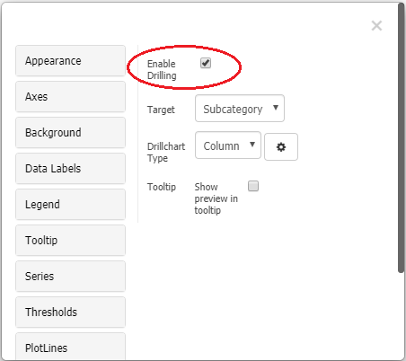<figcaption></figcaption></figure>

#### Chart-wise differences 

Most of the features in Vitaracharts has the same functionality in Report Service Documents and in Dossiers, but the way we enable/disable those features have some differences.

**1. Vitara Stacked Bar/Column charts**

**Dossiers:**

Stacked Bar/Column charts in dossiers will display two drop zones for attributes: ‘Category Axis’ and ‘Break by’. Case 1: If we place one or more attributes in the ‘Category Axis’ drop zone but none in the ‘Break by’ drop zone, the chart will generate a series based on metrics. This signifies that the measures in the chart are layered. Case 2: If we place an attribute in the ‘Break by’ drop zone (whether or not we have attributes in the ‘Category’ drop zone), the chart will construct a series using the attribute in the ‘Break by’ drop zone. Stacking is done in this instance utilising attributes rather than measurements.

**Documents:**

In docs charts, series are always drawn using characteristics. This means that we can only stack attributes. In report services documents, metrics cannot be stacked in stacked bar/column charts. Please see the screenshots below.

<figure>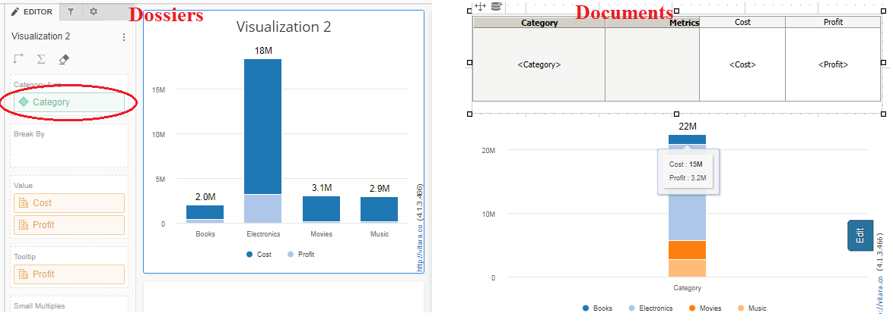<figcaption></figcaption></figure>

<figure>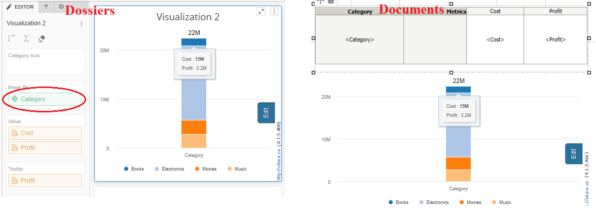<figcaption></figcaption></figure>

**2. Vitara Simple KPI chart**

**Dossiers**: Use Top Label and Sub Label drop zones in dossiers to display KPI metrics. Use the Threshold metrics drop zone to place more than two metrics in the chart and to define thresholds on Top Label and Sub Label metrics. A Small Multiples attribute in the drop zone will enable the Small Multiple functionality.

**Documents**: The first metric in documents will be regarded Top Label, and the second metric will be considered Sub Label. The third metric on the words chart will be Threshold metrics. Using the edit property window, you may enable the Small Multiples functionality.

**3. Vitara KPI Ring Chart**

It is simple to categorise metrics in Dossiers as Ring 1 Value, Ring 2 Value, and Ring 3 Value. We have a property editor option in Documents to show the number of rings to display in the chart. You can see a clear example in the screenshot below.

<figure>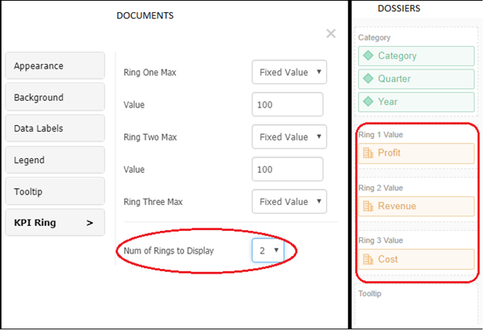<figcaption></figcaption></figure>

In Dossiers just drop an attribute in Small Multiples drop zone to enable Small Multiples feature. In documents Small Multiples feature can be enabled using property editor window.

**4. Vitara Micro Chart**

To view the graphic, you must have a minimum of two attributes and a maximum of one metric.

We must apply two attributes in Dossiers, one in the ‘Category Axis’ drop zone and one in the ‘Trend by’ drop zone. We can only use two qualities at a time.

We can put any number of attributes in the grid in Documents. If we use more than two properties in the grid, the micro chart will only use the top two to create the chart. Metrics are not limited; we can include as many as we like in the graphic.

**5. Vitara ColumnRange, Bullet, Bubble, Funnel and Pie charts**

**A. Column Range chart**

To apply **Colour by** and **Play by** drag & drop attributes into the corresponding drop zones in Dossiers.

**Colour By Last Attribute** and **Play By First Attribute** can be enabled/disabled in Documents via the property editor box. Hover your mouse over any vitara chart to reveal the ‘Edit’ button. To launch the vitara property editor window, click the ‘Edit’ button.

**B. Bullet chart**

In Documents the properties **Color By Last Attribute** and **Play By First Attribute** can be enable/disabled using the property editor window. Hover the cursor over any vitara chart to get ‘Edit’ button. Click on the ‘Edit’ button to open vitara property editor window.

In Dossiers to enable **Color By Last Attribute**, **Play By First Attribute** and **Small Multiples** drag and drop attributes into the respective drop zones.

**C. Bubble chart**

In Documents the properties **Color By Last Attribute**, **Play By First Attribute** and **Small Multiples** can be enable/disabled using the property editor window. Hover the cursor over any vitara chart to get ‘Edit’ button. Click on the ‘Edit’ button to open vitara property editor window. In Dossiers to enable **Color By Last Attribute**, **Play By First Attribute** and **Small Multiples** drag and drop attributes into the respective drop zones.

**D. Funnel chart**

In Dossiers we have **Slice by** drop zone, for each combination of attribute elements one slice will be created. Attributes can be added to Play Axis Drop Zone as well. In Documents the **Play By First Attribute** is enabled using the property editor.

For clear idea you can look at the screenshot below. Below is the screenshot of property editor window of Column Range, Bubble, Funnel and Pie chart.

<figure>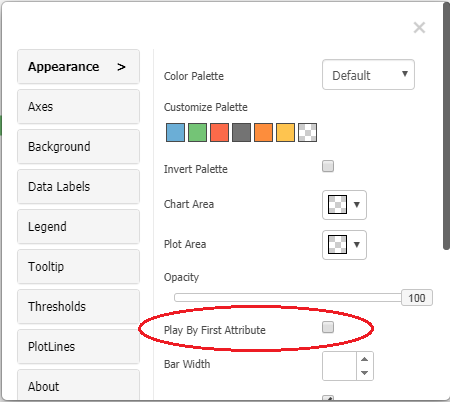<figcaption></figcaption></figure>

**E. Pie chart**

In Dossiers you will have Slice by option where, it creates each combination of attribute elements one slice will be created. Attributes can be added to Play Axis and Small Multiples Drop Zone In Documents the Play By First Attribute and Small Multiples is to enabled in the property editor.

**6. Vitara Dumbbell, Histogram, Trellis charts**

**A. Histogram and Trellis Chart**

Colour can be selected for the Vitara Histogram and Trellis charts. You can easily drop down from the data set in the Colour By Drop Zones in Dossiers. Colour By Last Attribute must be enabled in the Documents property editor.

You can see a clear example in the screenshot below.

<figure>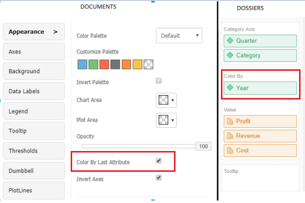<figcaption></figcaption></figure>

**B. Dumbbell Chart**

Colour by and Small Multiples options are available on the Vitara Dumbbell chart. You can easily drop down from the data set in the Colour By Drop Zones in Dossiers. Colour By Last Attribute and Small Multiples must be enabled in the Documents property editor.

**7. Vitara WaterFall Chart**

We can easily drop down the qualities in Dossiers into the Group by and Break by options.

In Documents, if we supply two attributes, the chart will treat one as Group by attribute and the other as Break by attribute, but we don’t have the opportunity to pick only the Break by choice on attribute, although it is simply applicable in Dossier. You can see a clear example in the screenshot below.

<figure>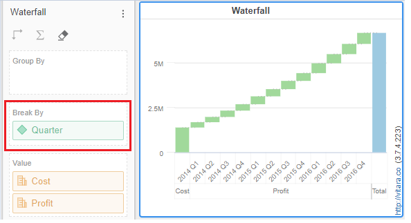<figcaption></figcaption></figure>

**8. Vitara Spacer Chart**

In Dossiers, spacer chart will render without adding any attribute/ metric in the dropzones. In Documents we need to have at least one attribute or metric to render the chart.

**9. Vitara Heat Map**

In documents we can give any number of attributes but in dossiers we can give only two attributes; one attribute in ‘Category Axis’ drop zone and in one ‘Vertical Axis’.

**10. Vitara Slope Chart**

Drop an attribute in Small Multiples drop zone to enable Small Multiples feature. In documents Small Multiples feature can be enabled using property editor window.
