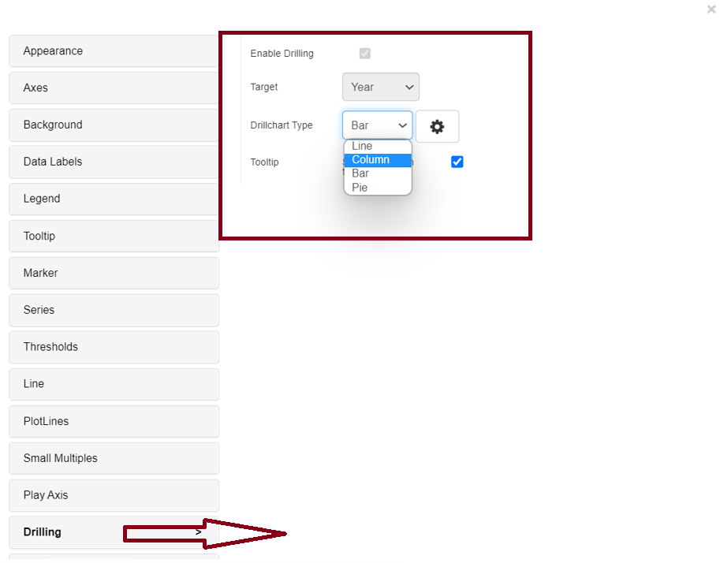
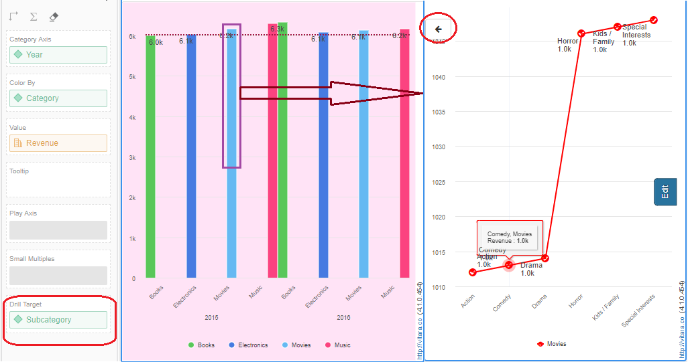

# Drilling

You can now drill down to another attribute level in the chart. We have a drill target dropzone where we can drag an attribute from the dataset and allow drilling by checking the enable drill checkbox. Drilling options allow you to modify the target chart type, which includes bar, line, column, and pie charts. A drilled chart has a back button that allows you to return to the original chart.

Drilling is available for Bar, Column, Pie, Line, and Sparkline charts (web documents).

Drilling target is done subcategory wise, where category movies is selected, and you can view subcategories of movies in Line chart, Column chart, Bar chart, and Pie chart, as shown in the screenshot below.

<figure><figcaption></figcaption></figure>

<figure><figcaption></figcaption></figure>
