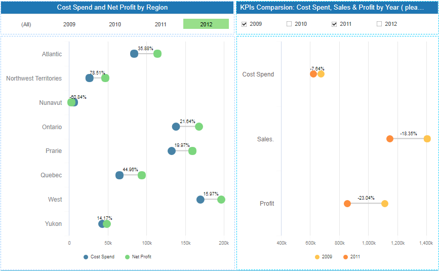
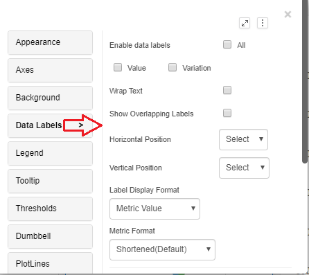
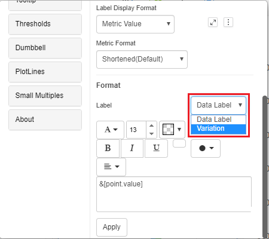
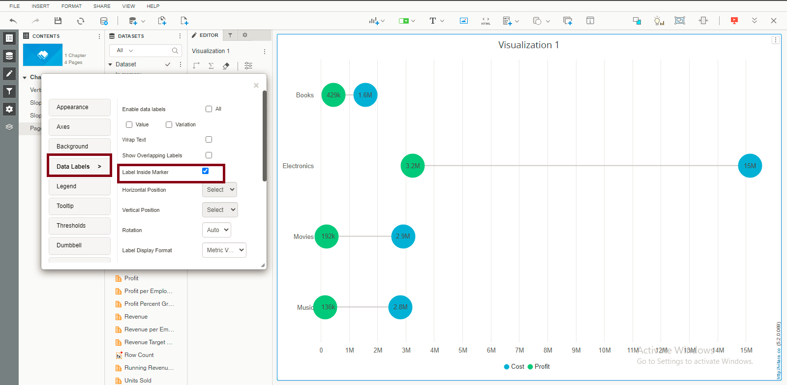
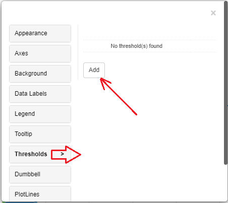
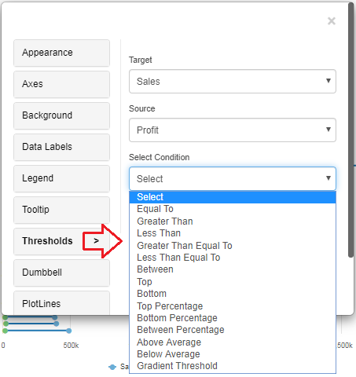
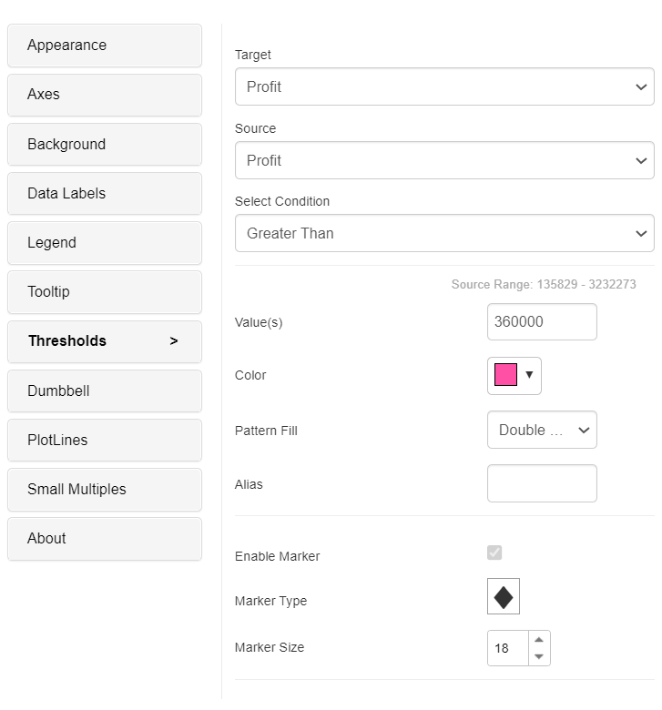
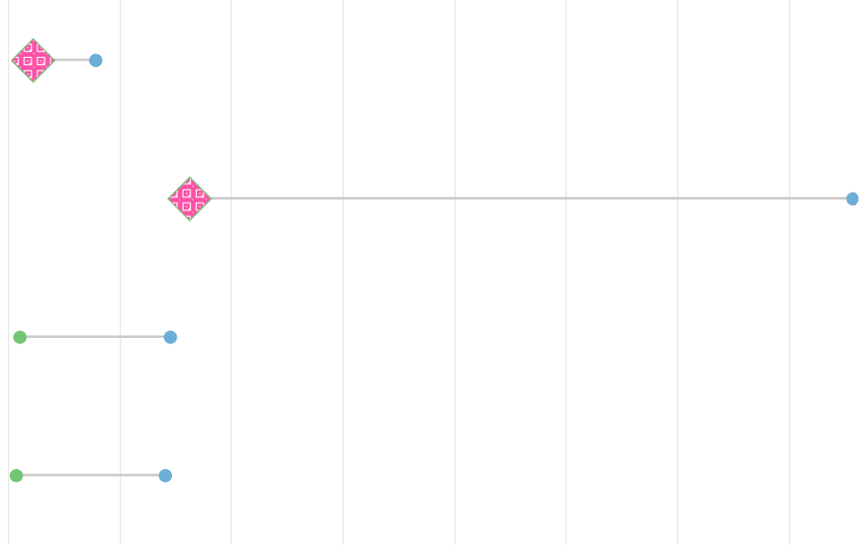

---
layout:
  title:
    visible: true
  description:
    visible: false
  tableOfContents:
    visible: true
  outline:
    visible: true
  pagination:
    visible: true
---

# Dumbbell Chart

A dumbbell chart is a data visualization tool that displays the comparison of two data points or values. It consists of two distinct points (represented as circles or dots) connected by a line. One point represents the starting value, while the other represents the ending value. This chart is useful for illustrating changes or differences between two data sets, making it easy to visualize trends, comparisons, or progress over time, such as before-and-after scenarios or performance comparisons between two entities.The chart can also show the difference between the two data points in the form of a percentage.

## Inputs 

Metrics: 2 metrics re required Attributes: 1 attribute. Use as Filter Option - Available

<figure><figcaption></figcaption></figure>

## Data labels 

We can modify the data labels format for the data labels and variation also. You can see the attached screenshots below.&#x20;

<figure><figcaption></figcaption></figure>

<figure><figcaption></figcaption></figure>

## **Labels inside the Marker**

We can now display data labels inside the marker starting with version 5.2. Labels inside markers in a dumbbell chart improve data comprehension and context. The objective of the chart is clarified by inserting labels within markers, which generally reflect the chart’s initial and final values. This approach allows for the instant identification of data points, allowing viewers to directly compare numbers and understand changes. Labels provide additional information, such as background or explanations, that helps to clarify the relevance of the data being displayed. This method saves space and reduces visual clutter because labels are confined within markers. This functionality can be enabled by going to the editor’s data labels property and checking the “Label inside the marker” check box.

<figure><figcaption></figcaption></figure>

## Thresholds 

In the business point of view, certain part of the chart needs to be highlighted to draw more attention from the desicion makers. For example, highlight the stores where total sales is greater than a specific value or highlight the top 10 products whose sales is high during last year’s winter. Thresholds are very useful objects in these use cases.

Thresholds will display some conditional formatting in a chart to highlight certain data points depending on predefined criteria.The criteria are attribute or metric qualifications. If a qualification’s expression evaluates to TRUE, the report displays the threshold. We can also include markers in thresholds.

To apply thresholds in vitara charts, hover the cursor on the chart. Vitara chart will display an ‘Edit’ button. When you click on this ‘Edit’ button the properties window will pop out. Select the thresholds tab to open threshold editor. In the window you can add a new threshold or delete any existing threshold or modify the existing threshold.

Note: From 4.6 version we can apply thresholds using attributes. The source drop down box in the threshold editor window will list all the attributes and metrics in the chart. we can select an attribute as source and define a threshold condition. The target of the threshold depends on the series of the chart. This means, if the chart series is created using metrics then target drop down box will display the metrics. If we enabled ‘color by’ mode, by adding an attribute to the ‘color by’ drop zone in the dossier’s editor panel, the chart series will be created using attributes. In this case the threshold target drop down box will show all the elements of attribute used in the color by drop zone. In this case we can set threshold target using attribute.

<figure><figcaption></figcaption></figure>

In the threshold editor window apply source, target, threshold condition and the other related information to set a threshold on the chart.

<figure><figcaption></figcaption></figure>

After giving all the inputs click on ‘Apply’ button.

From version 4.9.0, we can use pattern fill in thresholds (Grid/Square/Double Square/Slash), certain part of the chart can be filled with a pattern.

It’s the ability to fill the area between the two data points (typically represented as circles or dots) with patterns or textures instead of solid colors. This feature adds a visual element to the chart, making it easier to distinguish and emphasize the difference or change between the two data values. Pattern fills can include grid,square,double square and slash pattern, providing additional context and enhancing the chart’s clarity, especially when dealing with complex or overlapping data points.

<figure><figcaption></figcaption></figure>

<figure><figcaption></figcaption></figure>

## Background Image 

The steps to set a background image for all Vitara charts are explained in backgroundImage.

## Small Multiples 

Dumbbell chart supports small multiples feature. Small multiples feature is explained in smallMultiples.
