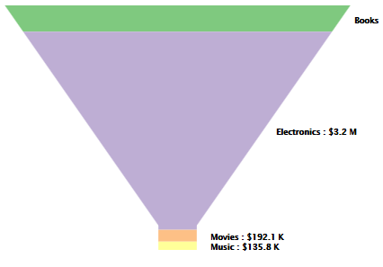
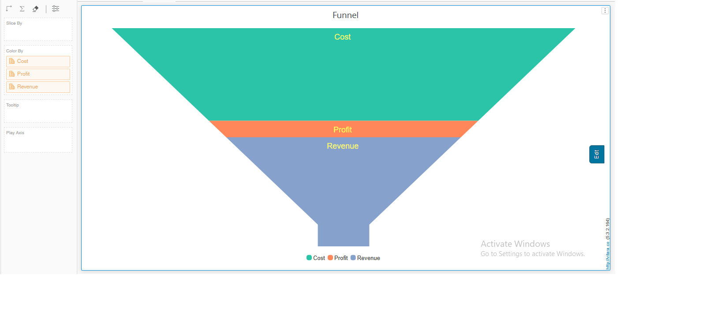

# Funnel Chart

A funnel chart is a data visualization tool commonly used for displaying stages in a process or a sales pipeline. It resembles an inverted pyramid, with each segment representing a stage or category, and the width of each segment corresponds to the quantity or percentage of data it represents. Funnel charts are particularly useful for illustrating the progressive reduction or conversion of data from one stage to the next.

Funnel charts enable analysts to see the percentage contribution of metric data in a dimension. For example, the funnel chart below shows the percentage contribution of Profit by Category. Each area of the funnel represents a separate category, and the size of each section is proportionate to the amount of profit contributed by the category.

## Inputs 

Metrics - 1 or more metrics Attributes - 1 attributes Use as Filter Option - Available

<figure><figcaption></figcaption></figure>

## Multi-Metric Analysis&#x20;

Starting with version 5.3.2, the Funnel chart supports simultaneous analysis of multiple metrics without requiring an attribute. This enhancement streamlines data evaluation, providing businesses with comprehensive insights from multiple metrics within a single view.

<figure><figcaption></figcaption></figure>

## Play-by Animation 

Play by - animation shows the chart for each element of the first attribute. For more details about the play by feature please refer to [play-by](play-animation.md).

## Background Image 

The steps to set a background image for all Vitara charts are explained in [backgroundImage](background-images.md).
