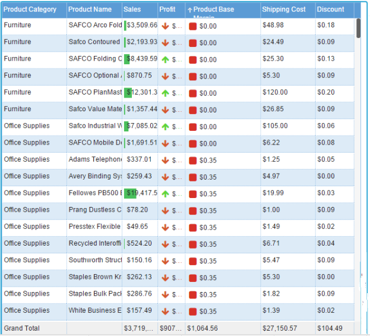
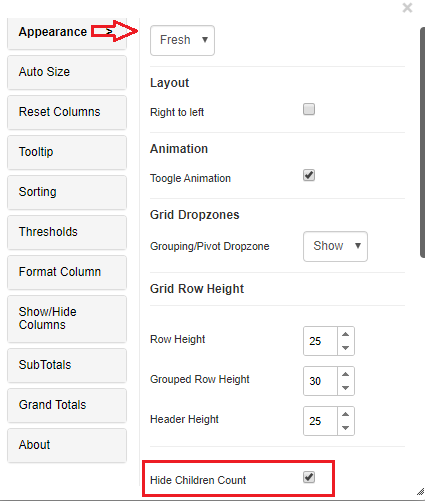

# Grid Chart

**Note**: A separate detailed ‘Grid and MicroChart usage document’ is available.[Click here](https://docs.vitaracharts.com/grid-microchart-guide) to access it

The Vitara grid is the easiest to use grid. With a single click, we can access an infinite number of options. Grid formatting is provided at both the column and row levels, as well as appealing grid themes, the ability to group (Page by) at many levels, metric aggregations (Subtotals) at various grouping levels, column grouping, thresholds with custom icons, and many other features.

## Inputs 

Metrics: 1 metric Attributes: At least 1 attribute Use as Filter Option - Available

<figure><figcaption></figcaption></figure>

Using the Vitara grid chart it’s so easy to apply the following options.

## Grouping 

We can apply to the group, both at column level and row level. Expand/collapse grouping. For group headlines, we can apply aggregations. Further, we can show grand totals for grouped metric aggregated headlines.

## Aggregations 

We can show aggregations (Subtotals) on groupings. Enable or disable grand totals.

## Thresholds 

Apply/remove thresholds easily. In thresholds, we can set the background color, text color, icons, icon color, icon size, icon only and use custom images as icons.

## Sorting 

The column data can be sorted in either ascending or descending order with only one click on the column header. Data will be sorted in ascending order on the first click, descending order on the second click, and sorting on a column will be removed on the third click. There is also a “Clear Sorting” tab that will reverse the sorting that has been performed to every grid column.

## Look and feel 

Auto size fit to the content/ fit to grid width, grid themes, set grid row height, option for clear sorting/clear threshold/clear grouping/clear filter, export grid data into CSV format, pin a column to the right/left side. Text font properties like font style, font size, alignment, text color, bold, underline and italic are available for column headers and body text.

## Filters 

View filters can be created specifically to the grid i.e filter on attribute or metric.

## Show/hide the number of children in a row group: 

Grid/Micro chart’s 3.8 edition added the ability to show or hide the number of children in a row group. The number of children in a row group can be shown or hidden in grid/micro charts. Click the ‘Edit’ button, then select ‘Grid Theme’ and check the ‘Hide Children Count’ checkbox in the properties popup window.

<figure><figcaption></figcaption></figure>
