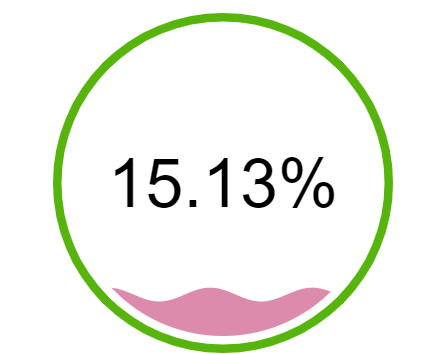
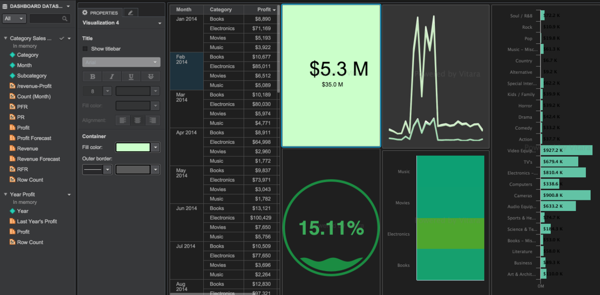
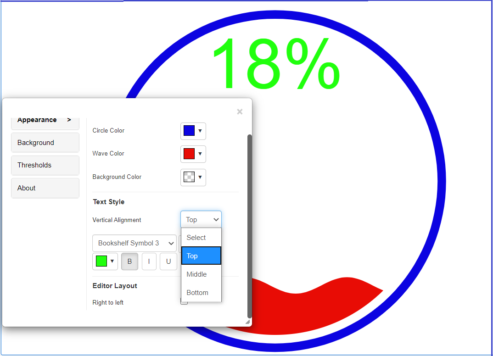
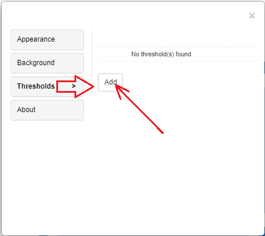
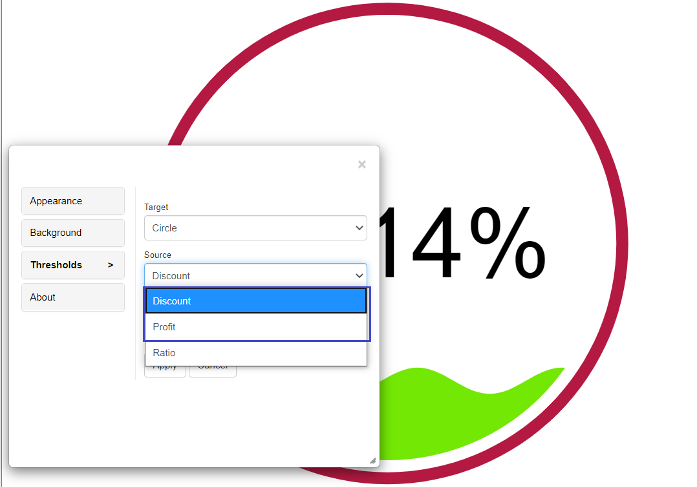
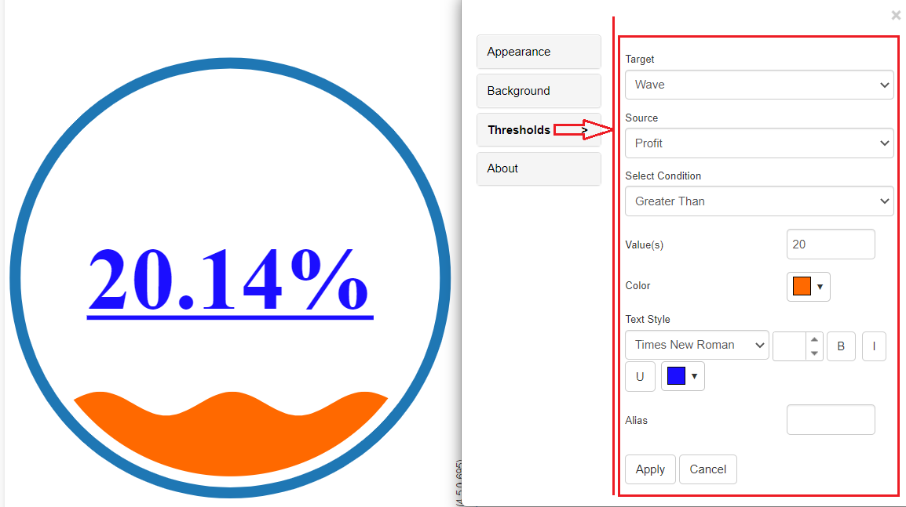

# KPI Animation Chart

Gauges are often used in business to show critical measurements. They typically display a single essential performance metric and are prominently displayed on the dashboard. Custom gauges in VitaraCharts include animated views to increase aesthetics while also drawing the user’s attention to the KPI. A VI dashboard developed with Vitara’s custom visualizations, including the animated gauge, is shown below.

## Inputs 

Metrics - 2 metrics required. Metric 1, M1 will be the numerator and Metric 2 M2 will be the denominator making the displayed value as M1/M2 as a percentage. Attribute - Optional Use as Filter Option - Not available

The screenshot below displays the Profit Margin as a percentage value. The default color shown is blue on a white background but can be altered as desired for gauge or background.

<figure><figcaption></figcaption></figure>

## **Tip 2**

If you already have a single metric formatted as a percentage M1 a derived metric sum(1) to be used as M2 input.

An example dashboard showing various VitaraCharts elements. Note that the dashboard below has been formatted to have a dark theme.

<figure><figcaption></figcaption></figure>

From the 4.5 version of Vitara charts, the text formattings for the KPI animation chart are introduced. We can now format the text and change the vertical alignment of the text. Below is the example, where the alignment is ‘Top’ and some text formattings are done.

<figure><figcaption></figcaption></figure>

## Thresholds 

Based on the ratio of the two metrics we can apply thresholds on ring, wave or on the background of the chart. Hover the cursor on the chart, Click on the ‘Edit’ button and select the ‘Thresholds’ option in the properties window.

Open the property editor by clicking on the ‘Edit’ button and select the ‘Threshold’ tab.

<figure><figcaption></figcaption></figure>

From the 4.5 version of Vitara charts, the target thresholds can be applied on source metrics too. Till 4.4 version, only the ‘Ratio’ option is available in Source threshold, now the metrics can also be sourced.

<figure><figcaption></figcaption></figure>

Below is the example where the Target selected as ‘Wave’ and Source as ‘Profit’ and applied threshold condition as Greater than >20.

<figure><figcaption></figcaption></figure>

## Thresholds Priority

When multiple thresholds are applied to the same metric, the most recently added threshold takes precedence—even if the conditions differ.

For example, if a threshold is applied to the Cost metric with a "greater than" condition and sets a background color, and then another threshold is added to the same Cost metric with a different condition that includes a text color and a marker, the chart will reflect only the styling from the most recently applied threshold.

## Background Image 

The steps to set a background image for all Vitara charts are explained in [backgroundImage](https://docs.vitaracharts.com/readme/background-images).
