# KPI Ring Chart

KPI ring charts are a visual tool to display key performance indicators in a circular format, with each segment representing a specific metric. They’re useful for presenting a comprehensive overview of important data, allowing for easy comparisons and tracking of performance. These charts enhance data communication by utilizing colors and labels, making it simpler for stakeholders to assess progress and make informed decisions. KPI ring charts are particularly valuable for summarizing complex data sets and maintaining a sense of completeness and balance in performance assessment.

## Inputs 

Metrics - Minimum 1 metric required. We can add up to 3 metrics M1, M2 and M3 each representing a percentage value to be shown in the KPI ring circle.

Attributes - Optional.

Use as Filter Option - Not available

In the example below showcases the output of the KPI ring circle with the header.

<figure>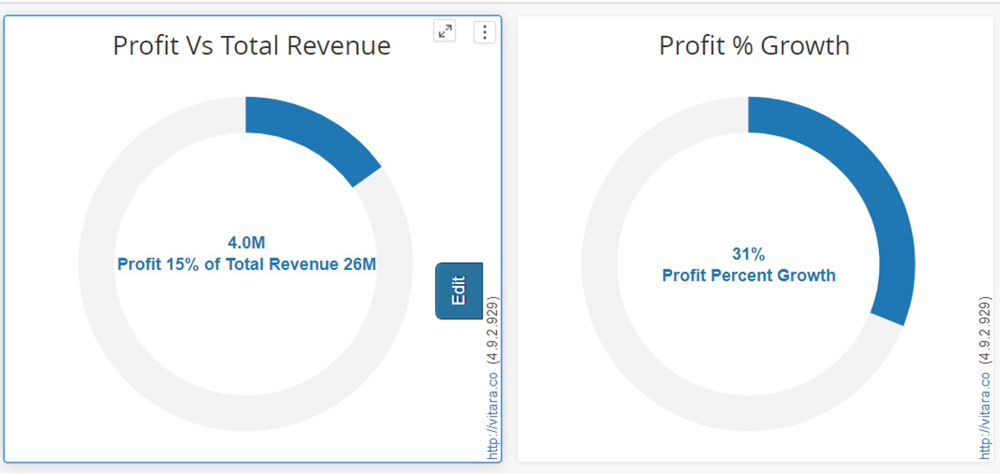<figcaption></figcaption></figure>

We can compare 2 metrics M1 and M2, like, how much percentage contribution of M1 in M2. For example, if I want to show, what is the percentage of profit out of total revenue generated?

<figure>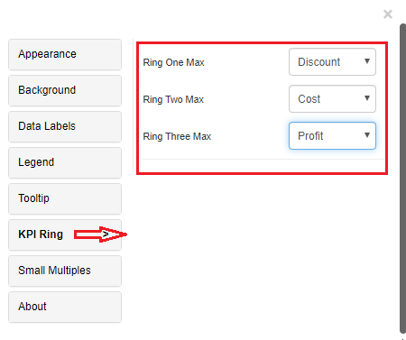<figcaption></figcaption></figure>

<figure>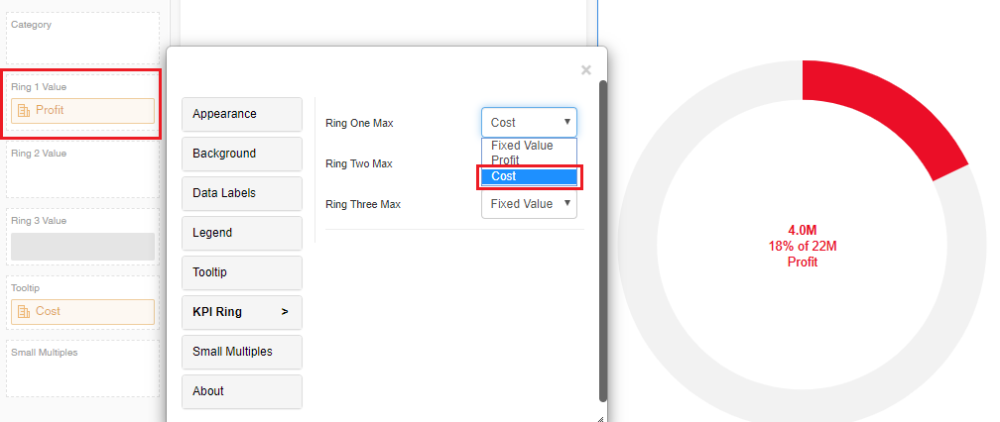<figcaption></figcaption></figure>

## Thresholds 

In the business point of view, certain part of the chart needs to be highlighted to draw more attention from the desicion makers. For example, highlight the stores where total sales is greater than a specific value or highlight the top 10 products whose sales is high during last year’s winter. Thresholds are very useful objects in these use cases.

Thresholds will display some conditional formatting in a chart to highlight certain data points depending on predefined criteria.The criteria are attribute or metric qualifications. If a qualification’s expression evaluates to TRUE, the report displays the threshold. We can also include markers in thresholds.

To apply thresholds in vitara charts, hover the cursor on the chart. Vitara chart will display an ‘Edit’ button. When you click on this ‘Edit’ button the properties window will pop out. Select the thresholds tab to open threshold editor. In the window you can add a new threshold or delete any existing threshold or modify the existing threshold.

From the 4.5 version of vitara charts, adding thresholds is possible in KPI Ring chart.\
This option is available in the thresholds tab of the property editor. See the screenshot below.\

**Note:** From 4.6 version we can apply thresholds using attributes. The source drop down box in the threshold editor window will list all the attributes and metrics in the chart. we can select an attribute as source and define a threshold condition.&#x20;

<figure>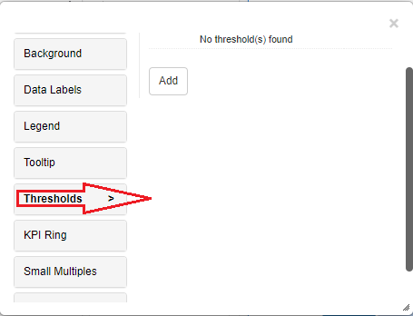<figcaption></figcaption></figure>

Below is the example of the threshold applied on the KPI Ring chart.\

<figure>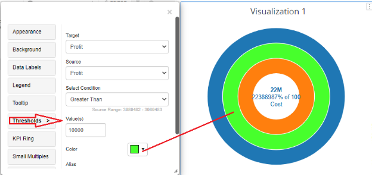<figcaption></figcaption></figure>

## Formatting the Ring 

From 4.5 version of vitara charts, a new feature is added in KPI Ring which helps to set the **Ring thickness, start and end angles** and **Unfilled ring color**.\
All these settings are available in the ‘KPI Ring’ tab. See the screenshot.\

<figure>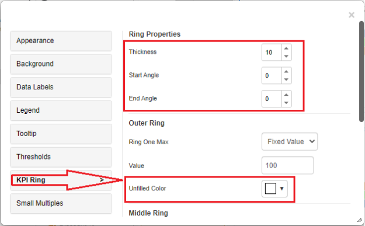<figcaption></figcaption></figure>

Formattings such as Ring thickness, Start and End angles will be applied in common to all rings, whereas unfilled color applies separately for each ring.

Below is the screenshot of a KPI Ring chart with ring thickness, start and end angle formattings applied.\
Thickness - 15\
Start Angle - 300\
End Angle - 240\

<figure>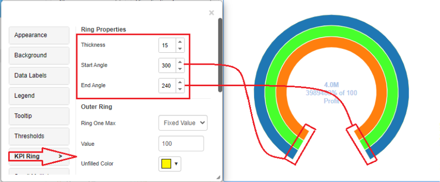<figcaption></figcaption></figure>

Below is the screenshot of a KPI Ring chart with unfilled color applied as “red” for all rings.\

<figure>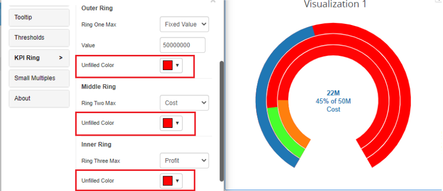<figcaption></figcaption></figure>

## Background Image 

The steps to set a background image for all Vitara charts are explained in [backgroundImage](background-images.md).

## Small Multiples 

KPI Ring chart supports small multiples feature.Small multiples is explained in [smallMultiples](small-multiples.md).

Below are the screenshots where Small multiples is applied.

<figure>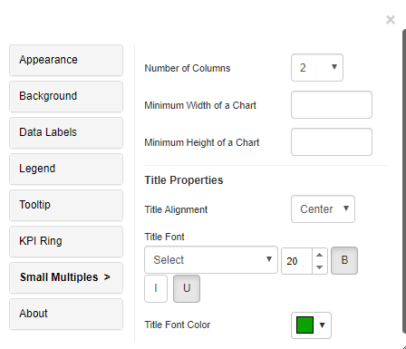<figcaption></figcaption></figure>

<figure>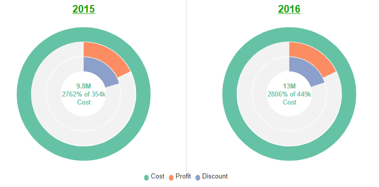<figcaption></figcaption></figure>

## Reference line to a KPI 

Adding a reference line to a KPI (Key Performance Indicator) ring chart involves including a horizontal or vertical line representing a target or benchmark value. This helps users easily compare actual KPI values against the desired or expected level, providing a visual gauge of performance and aiding in decision-making and goal assessment.

The plot option has been introduced to the ‘Kpi’ property in the editor panel as of version 5.2.4. After clicking on it, it will display the default line as per the series(Ring) max value, for user has been given input text which will have range from 0 - 100 as a percent value, user may define value in it so line will appear as a user value, and user can also apply color on it.

<figure><figcaption></figcaption></figure>

<figure>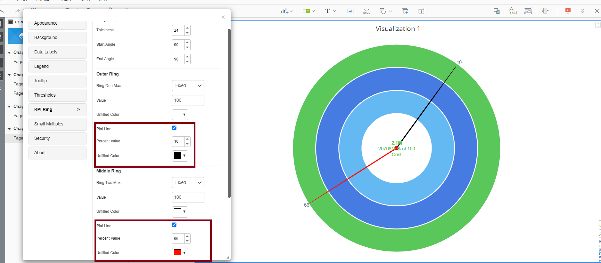<figcaption></figcaption></figure>
