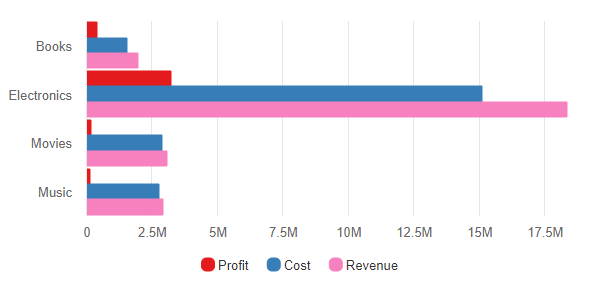
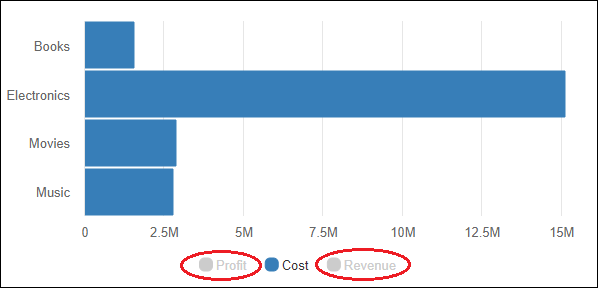
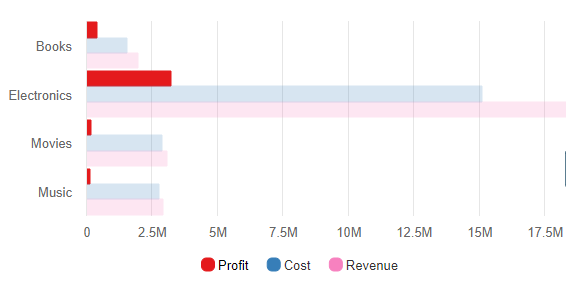
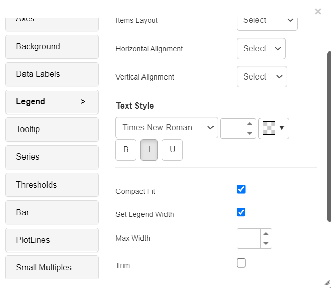
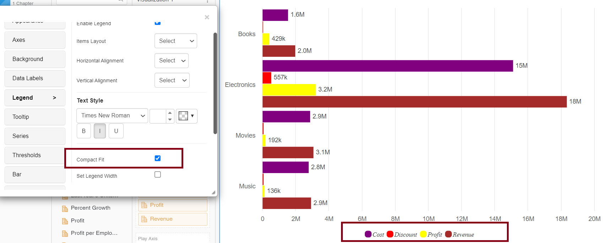
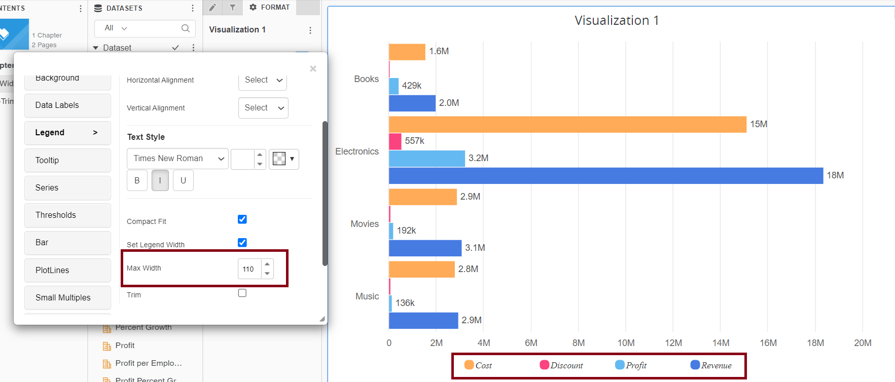
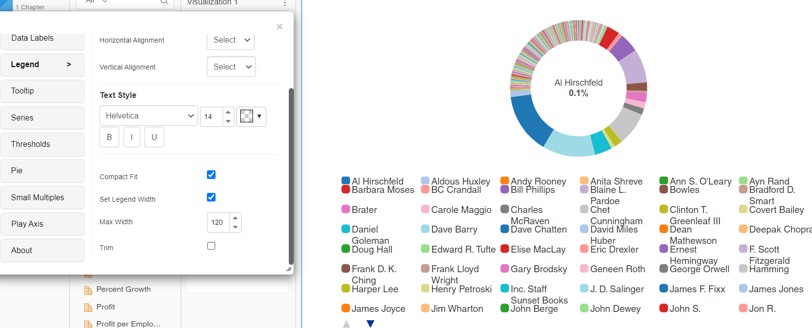
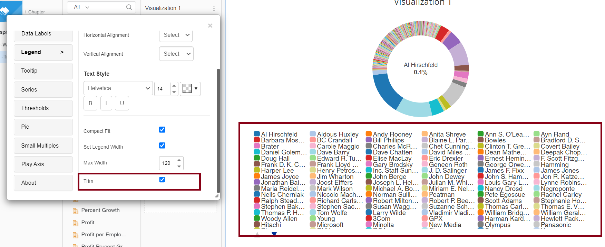

# Legend

\

#### Legend 

The user can interact with legend elements in VitaraCharts to show, hide, or highlight specific category data inside the chart. Except for the ‘Packed bubble’, ‘Waffle’, ‘Calendar heatmap’, and ‘Mekko’ charts, all vitara charts with legend enable this interactive feature. VitaraCharts may allow two types of interactions.

**1. Click to hide**

If the chart has three legend items that reflect three separate data categories, and you need to hide/exclude specific categories from the chart, simply click on that legend element. The screenshot below, for example, illustrates a bar chart with three metrics: profit, cost, and revenue. These three metrics are shown by three different colours on the graph.&#x20;

<figure><figcaption></figcaption></figure>

We will now hide the metrics ‘revenue’ and ‘profit’ from the chart in order to analyze the data exclusively for ‘cost’. To do so, select the legend elements ‘revenue’ and ‘profit’. Take a look at the image below:&#x20;

<figure><figcaption></figcaption></figure>

Once the data has been hidden, the hidden legend category names will be deactivated with grey text. If we need to see the data for’revenue’ and ‘profit’ again, simply click on the corresponding legend parts again.

**2. Hover to highlight**

When you hover your cursor over one of the legend categories, the data for that category is highlighted, and all other legend categories on the chart are presented with less opacity. For example, when we hover over the profit legend category, the colour bars for’revenue’ and ‘cost’ become less opaque. Take a look at the image below:&#x20;

<figure><figcaption></figcaption></figure>

### Formatting capabilities 

We’ve implemented a new feature that lets you format text for legends in version 5.0.2.980. Compact Fit, Max Width, and Trim are the new options added to the legends tab.

1.Compact Fit: This setting minimises the padding between symbols and legend text as well as the space between each legend. It is enabled by default.

<figure><figcaption></figcaption></figure>

<figure><figcaption></figcaption></figure>

2.Max width: will be used to adjust the legend width…if the text is too long, it will wrap to the next line.

<figure><figcaption></figcaption></figure>

3.Trim - when combined with the Max-width option, the overflowing text is trimmed into ellipsis (“…”).

<figure><figcaption></figcaption></figure>

<figure><figcaption></figcaption></figure>
