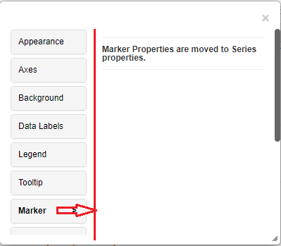
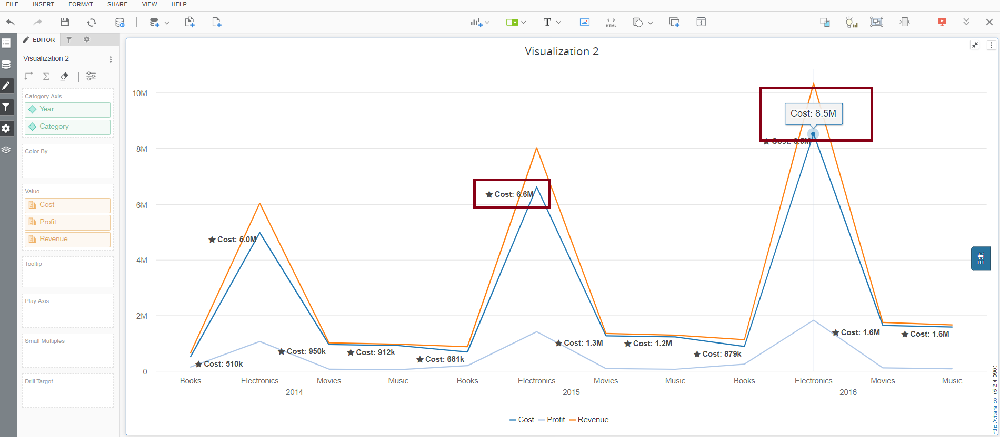

# Line/Area line Chart

A line chart is a graphical representation that uses lines to connect data points, making it ideal for displaying trends over time or continuous data. It is commonly used in data analysis and presentations to visualize changes, patterns, or relationships in data. By plotting points on a grid with a horizontal x-axis (usually representing time or categories) and a vertical y-axis (representing values), line charts provide a clear and concise way to interpret data trends, making them valuable tools in various fields, including finance, science, and business analytics.

## Inputs 

Metrics - 1 or more metrics can be used

Attributes - 1 or more attributes can be used.

Use as Filter Option - Available

<figure><figcaption></figcaption></figure>

<figure><figcaption></figcaption></figure>

## Markers 

Marker properties have been moved to Series properties in Vitara charts since version 4.6. The modified marker characteristics are used by all charts that support Series as Line/Area.

Markers in line/area charts are symbols or shapes placed at data points along the plotted lines. They enhance data visualization by emphasizing specific points, aiding clarity in dense datasets, and enabling data validation. Markers are invaluable for pinpointing exact values and identifying trends, especially when lines overlap. Customizable marker styles and sizes allow users to optimize chart aesthetics and readability. Overall, markers serve as visual aids, enhancing the effectiveness of line/area charts in conveying data trends and patterns to audiences.

By selecting the Series tab and clicking the ‘Edit’ button, you can see the Enable marker, Marker type, and Marker size options to Enable marker properties. There are numerous markers to choose from. Navigate to the marker tab, choose the marker type, and then select the marker. The size of the markings can also be changed. Simply enter a number in the ‘Marker Size’ text input box, or utilise the increase/decrease buttons.

<figure><figcaption></figcaption></figure> <figure><figcaption></figcaption></figure>

In the below example, the line changed to area in series property and ‘Rocket’ marker is applied for the 2015 attribute element. Below is the screenshot with marker applied in the chart.

<figure><figcaption></figcaption></figure>

## Series 

We can turn the line/area chart into the combinational chart by changing the ‘series type’ in the ‘series’ tab.

<figure><figcaption></figcaption></figure>

## **Pattern Fill**

Pattern fill in line and area charts employs various designs to fill the space under or within data lines or areas, enhancing visual differentiation between multiple datasets. This aids in data interpretation, particularly when colors aren’t sufficient or when lines overlap.Additionally, they add aesthetic variety to charts, making them more engaging, and can be strategically employed to highlight specific data points or time periods, adding depth and clarity to data presentations.

From version 4.9.0, this charts have the Pattern fill option (Grid/Square/Double Square/Slash) in the Series tab, which allows us to display data in a more presentable manner.

<figure><figcaption></figcaption></figure>

<figure><figcaption></figcaption></figure>

## Line chart 

Line chart - line type options like dashed line, dotted line.

From the 4.5 version of Vitara charts, the line options are introduced in Line, Area and Sparkline charts. Line width, Line style and Line Color are the 3 options introduced. Below are the screenshots with the line options.

Line Width: Adjusting line thickness or width helps in controlling the prominence of the lines, making them more or less prominent based on your preference or the importance of the data.

Line Style: Line options allow you to choose different line styles such as solid, dashed, or dotted lines. This helps distinguish between multiple data series or highlight specific lines for emphasis.

Line Color: You can customize the color of each line, enabling clear differentiation between various data series. This is especially valuable when dealing with charts containing multiple lines.

Line width - 2 Line width - Blue Line style - ShortDashDot

<figure><figcaption></figcaption></figure>

<figure><figcaption></figcaption></figure>

## Thresholds 

In the business point of view, certain part of the chart needs to be highlighted to draw more attention from the desicion makers. For example, highlight the stores where total sales is greater than a specific value or highlight the top 10 products whose sales is high during last year’s winter. Thresholds are very useful objects in these use cases.

Thresholds will display some conditional formatting in a chart to highlight certain data points depending on predefined criteria.The criteria are attribute or metric qualifications. If a qualification’s expression evaluates to TRUE, the report displays the threshold. We can also include markers in thresholds.

To apply thresholds in vitara charts, hover the cursor on the chart. Vitara chart will display an ‘Edit’ button. When you click on this ‘Edit’ button the properties window will pop out. Select the thresholds tab to open threshold editor. In the window you can add a new threshold or delete any existing threshold or modify the existing threshold.

Note: From 4.6 version we can apply thresholds using attributes. The source drop down box in the threshold editor window will list all the attributes and metrics in the chart. we can select an attribute as source and define a threshold condition. The target of the threshold depends on the series of the chart. This means, if the chart series is created using metrics then target drop down box will display the metrics. If we enabled ‘color by’ mode, by adding an attribute to the ‘color by’ drop zone in the dossier’s editor panel, the chart series will be created using attributes. In this case the threshold target drop down box will show all the elements of attribute used in the color by drop zone. In this case we can set threshold target using attribute.

<figure><figcaption></figcaption></figure>

In the threshold editor window apply source, target, threshold condition and the other related information to set a threshold on the chart.

<figure><figcaption></figcaption></figure>

After giving all the inputs click on ‘Apply’ button.

## **Pattern fill in Threshold**

From version 4.9.0, we can use pattern fill in thresholds, certain part of the chart can be filled with a pattern.

Pattern fill in the threshold feature of a line or area chart is employed to emphasize critical zones where data surpasses preset limits. It’s especially valuable for highlighting when, where, and how data exceeds or falls below specific thresholds, making anomalies or significant deviations instantly noticeable. By applying distinctive patterns to these areas, it aids in pinpointing critical events or conditions, enhancing data interpretation, and guiding decision-making processes in fields such as quality control, financial analysis, and performance monitoring.

<figure><figcaption></figcaption></figure>

<figure><figcaption></figcaption></figure>

## Play-by Animation 

Play by - animation shows the chart for each element of the first attribute. For more details about the play by feature please refer to [play-by](play-animation.md).

## Background Image 

The steps to set a background image for all Vitara charts are explained in [backgroundImage](background-images.md).

## Small Multiples 

Line chart supports small multiples feature. Small multiples feature is explained in [smallMultiples](small-multiples.md).

## Data Markers 

From the version 4.4, data markers feature is introduced in the Line/Area charts. To know about **Data Markers** feature please [click Here.](https://docs.vitaracharts.com/readme/data-markers)

## Gradient Color 

From version 5.0, Gradient color fill can be added where the series property is available.

The gradient color feature in line and area charts is employed to enhance data visualization. It adds depth and dimension to the chart, making it visually engaging. Gradients smoothly transition colors along lines or within areas, highlighting trends and variations. By changing colors based on data magnitude, it effectively communicates information. For instance, it can use warmer colors for higher values and cooler colors for lower values, helping viewers discern patterns and understand data relationships more intuitively, making it a valuable tool for data presentation and analysis.

It can be enabled by selecting options from the ‘Series’ tab for individual series.

<figure><figcaption></figcaption></figure>

It will show the color palette, which will have two selection handles to choose two colors that will render from beginning to end on the series. (From left to right)

<figure><figcaption></figcaption></figure>

<figure><figcaption></figcaption></figure>

## Series based Tooltip and Datalabels 

We introduced in version 5.2.4 ,the “Series-based Tooltip” and “Data Labels” features enhance chart data display. When you hover over a data series, series-based tooltips appear, revealing insights into individual data points. Data Labels, on the other hand, allow you to directly display data values on chart elements, which improves data comprehension. These characteristics are useful for expressing precise information and promoting a deeper comprehension of plotted data, making charts more informative and user-friendly.

This feature will be accessible from the “Series” tab in the chart editor menu. Users can access this tab when editing a bar/column chart. Within the “Series” tab, under the metrics two new option named “Data label and Tooltip “ is added, accompanied by a dropdown menu that allows users to select the desired formatting , by default it will be none.In the below screenshots ,I have made changes for the ‘Cost’ series.

<figure><figcaption></figcaption></figure>

<figure><figcaption></figcaption></figure>
