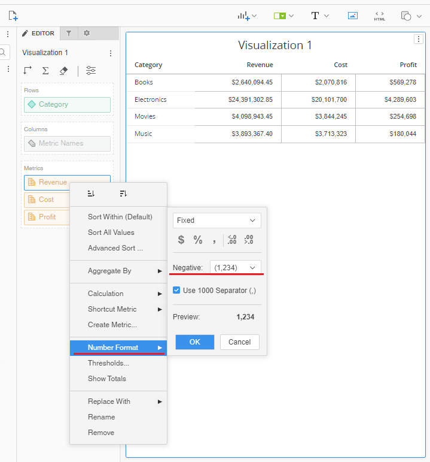
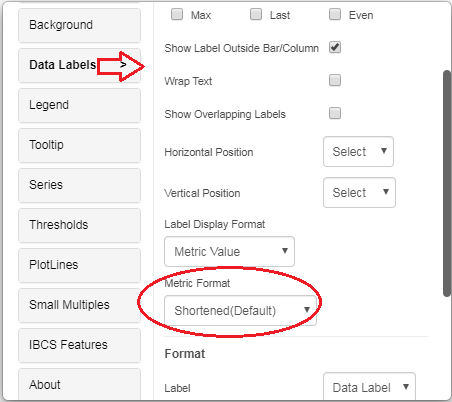
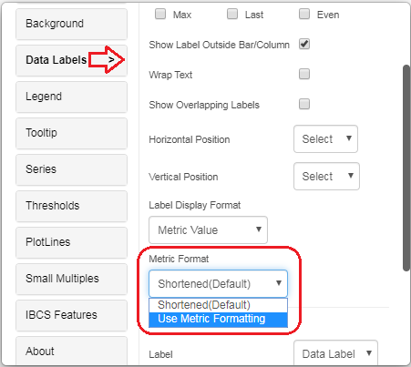
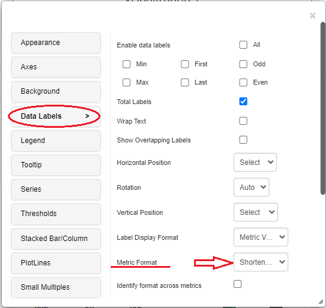
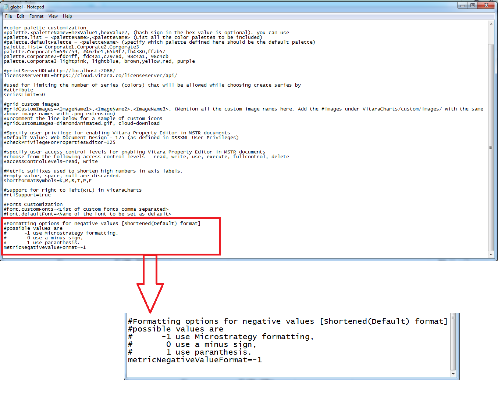

# Negative Sign

## Negative Sign Customization in Vitara Charts <a href="#negative-sign-customization-in-vitara-charts" id="negative-sign-customization-in-vitara-charts"></a>

## Use Metric Formmating in Vitara charts (Tooltip and Data Labels): <a href="#use-metric-formmating-in-vitara-charts-tooltip-and-data-labels" id="use-metric-formmating-in-vitara-charts-tooltip-and-data-labels"></a>

The tooltip and data labels in Vitara charts are displayed in the abbreviated format by default. For example, if MicroStrategy displays a value of $2500, the Vitara charts will display the same value as $2.5K. Furthermore, any specific numerical format for a metric selected in MicroStrategy’s Metric Formatting option is ignored in Vitara charts.

We may, however, customize Vitara charts such that they display numbers in the same style as MicroStrategy.

The methods below illustrate how to modify Vitara charts (Data labels and Tooltip) to display numbers and negative signs in the same way as Microstarategy.

Step 1: In the MicroStrategy grid, apply the required negative sign or number format to all the metrics individually.

<figure><figcaption></figcaption></figure>

Step 2: Create a Vitara chart from the MicroStrategy grid. Hover your mouse over the Vitara chart. The Edit button will appear on the chart. To open the Vitara charts properties window, click the Edit button. Navigate to the Data Labels menu. There will be a Metric Format drop-down box in the Data Labels menu.

<figure><figcaption></figcaption></figure>

Expand this drop-down box and select the option _Use Metric Formatting_.

<figure><figcaption></figcaption></figure>

When we choose Use Metric Formatting, the data labels and tooltips in Vitara charts are displayed in the same format as in MicroStrategy.

This means that if we choose Use Metric Formatting, the sign of negative numbers in Vitara charts will match the sign shown in MicroStrategy.

## Negative sign customization in the Shortened Format: <a href="#negative-sign-customization-in-the-shortened-format" id="negative-sign-customization-in-the-shortened-format"></a>

**Note:** Before modifying the negative signs using this method, the Metric Formatting option in the data labels menu must be set to Shortened Format (as shown in the screenshot below).

<figure><figcaption></figcaption></figure>

Vitara charts will display the numbers in the abbreviated format by default. If I wish to show the numbers in a reduced format (Vitara Charts’ default format) and customise the negative sign, I must configure the Vitara Charts’ global.txt file.

The three instances listed below show how we can customise the Vitara Charts to display a negative sign in a reduced numerical format.

Show the MicroStrategy default sign. Show a negative symbol. Show parenthesis. We must configure the global.txt file to meet our needs. The code is highlighted in the screenshot of the global.txt file below.&#x20;

<figure><figcaption></figcaption></figure>

The global.txt file for the MSTR web application can be found at the following path. webapps\MicroStrategy\plugins\VitaraCharts\custom

The global.txt file for the MSTR Library programme can be found at the path listed below. webapps\MicroStrategyLibrary\plugins\VitaraCharts\custom

Please keep in mind that you must configure the respective global.txt file for web and library apps separately.

### Notations used for negative sign customization: <a href="#notations-used-for-negative-sign-customization" id="notations-used-for-negative-sign-customization"></a>

```
    -1 use MicroStrategy formatting, 
     0 display negative numbers with minus sign, 
     1 display negative numbers in parenthesis.
```

Fill in the below line of the global.txt file with -1, 0, or 1. “metricNegativeValueFormat=-1”

For example, in the vitara charts, if I want to show negative numbers in the paranthesis regardless of whatever microstrategy is displayed, I must enter a 1 in the global.txt file. “metricNegativeValueFormat=1”

The global.txt file customizations can be used to regulate the negative indications in all VitaraCharts included in any dossier or document. In contrast, the Use Metric Formatting property in a certain chart’s Data Labels menu is used to control the negative sign in that specific chart in that unique dossier/document.

**Enhancemen**t: _Starting from version 5.3.6, a new tool called the Customization Tool has been introduced. This tool allows users to easily edit configuration files such as global.txt and customStyles.css through a user-friendly interface._\
For more details, \[click here].
