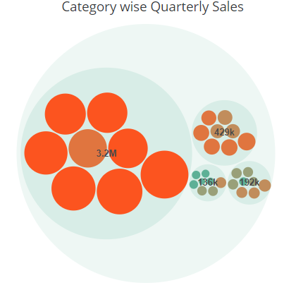
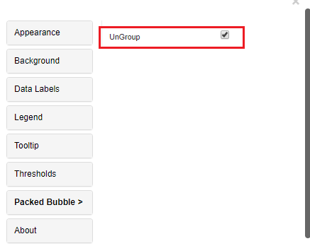
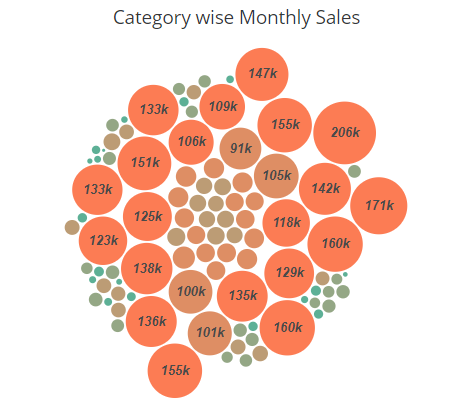
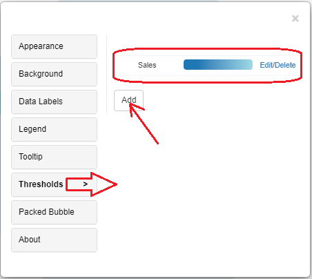
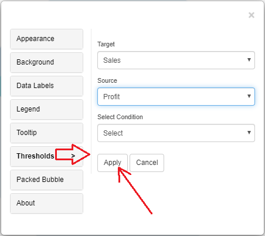
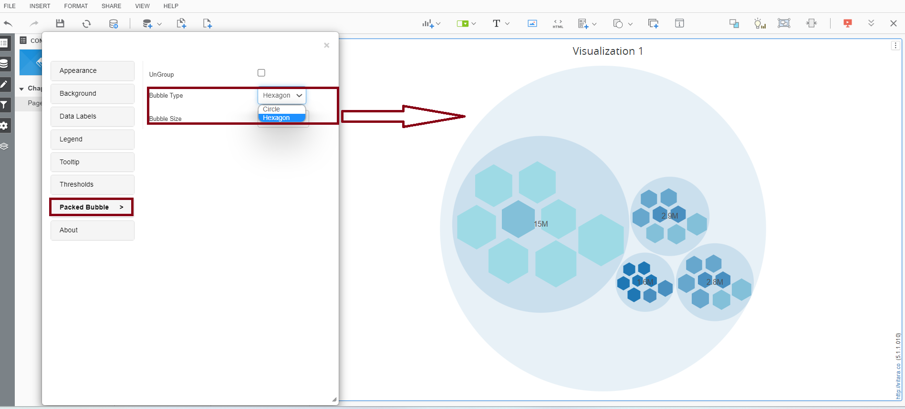
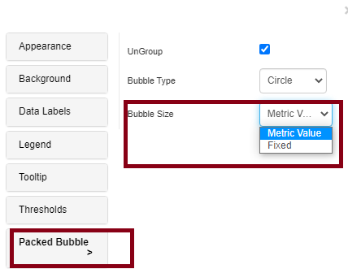
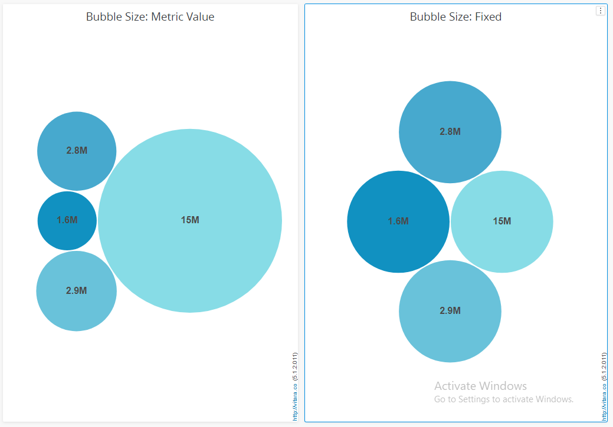

# Packed Bubble Chart

A packed bubble chart is a data visualization that displays information in a hierarchical, circular format. It uses circles, or “bubbles,” to represent data points. Each bubble’s size represents a data value, and the bubbles are grouped hierarchically, with smaller bubbles nested within larger ones. Packed bubble charts are effective for showing data relationships and hierarchies, allowing users to visualize data clusters and compare values within them. They are often used in data analytics, finance, and project management to depict complex data structures and identify trends and patterns.

## Inputs 

Metrics: 1 metrics Attributes: 1 attribute. Use as Filter Option - Available

<figure><figcaption></figcaption></figure>

## UnGroup Bubble 

The “ungroup bubble” feature in a bubble chart separates grouped bubbles into distinct, unconnected entities. This is valuable for achieving data precision and enhancing data comparison, as individual data points can be more accurately represented and compared without visual overlap. It aids in highlighting specific data elements, conducting detailed data analysis, and customizing each bubble independently for better clarity and aesthetics. Ungrouping bubbles offers versatility in visualizing and working with data, making it an essential tool for gaining insights and presenting complex datasets with greater accuracy and detail.

We can enable/disable the ‘UnGroup’ option. Below is the screenshot where we enabled ‘Un Group’ option.

<figure><figcaption></figcaption></figure>

<figure><figcaption></figcaption></figure>

## Thresholds 

In the business point of view, certain part of the chart needs to be highlighted to draw more attention from the desicion makers. For example, highlight the stores where total sales is greater than a specific value or highlight the top 10 products whose sales is high during last year’s winter. Thresholds are very useful objects in these use cases.

Thresholds will display some conditional formatting in a chart to highlight certain data points depending on predefined criteria.The criteria are attribute or metric qualifications. If a qualification’s expression evaluates to TRUE, the report displays the threshold. We can also include markers in thresholds.

To apply thresholds in vitara charts, hover the cursor on the chart. Vitara chart will display an ‘Edit’ button. When you click on this ‘Edit’ button the properties window will pop out. Select the thresholds tab to open threshold editor. In the window you can add a new threshold or delete any existing threshold or modify the existing threshold.

Note: As of version 4.6, we can use characteristics to impose thresholds. All the measurements and attributes in the chart are listed in the source drop-down box in the threshold editing window. We can choose a source attribute and specify a threshold condition. By default, packed bubble establishes a threshold (Gradient threshold) and bases the colours of the plot on the values of this threshold. The packed bubble chart’s threshold editor is seen in the screenshot below. The chart’s default threshold is displayed by the threshold editor. By selecting the ‘Add’ option, we can modify this threshold, delete it, and add a new one.

<figure><figcaption></figcaption></figure>

<figure><figcaption></figcaption></figure>

After giving all the inputs click on ‘Apply’ button.

## Background Image 

The steps to set a background image for all Vitara charts are explained in [backgroundImage](background-images.md).

## Bubble Type 

From version 5.1.1 onward, the packed bubble tab now allows users to switch the bubble’s form from a circle to a hexagonal.

<figure><figcaption></figcaption></figure>

## **Bubble Size**

Starting from version 5.1.1, we can now choose to manage the bubble’s size using either metric or fixed values.

* Metric Value When the bubble size is set to a metric value, the bubble size adjusts from smaller to larger in accordance with the value.
* Fixed Value Similarly, when the bubble size is set to fixed, all bubbles, inspite of their values, are adjusted to standard size.

<figure><figcaption></figcaption></figure>

<figure><figcaption></figcaption></figure>
