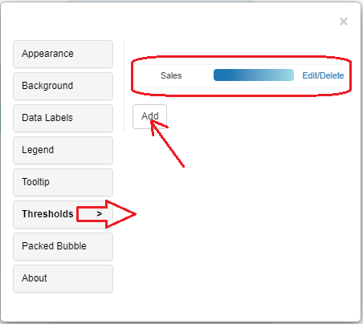
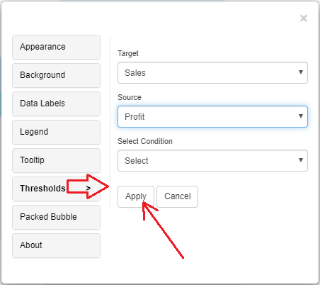
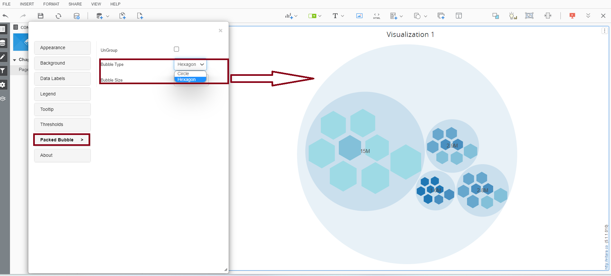
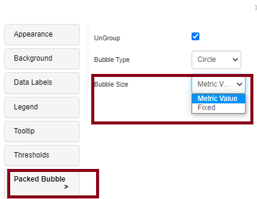

---
layout:
  width: default
  title:
    visible: true
  description:
    visible: false
  tableOfContents:
    visible: true
  outline:
    visible: true
  pagination:
    visible: true
  metadata:
    visible: true
  tags:
    visible: true
  actions:
    visible: true
---

# Packed Bubble Chart

A packed bubble chart is a data visualization that displays information in a hierarchical, circular format. It uses circles, or “bubbles,” to represent data points. Each bubble’s size represents a data value, and the bubbles are grouped hierarchically, with smaller bubbles nested within larger ones. Packed bubble charts are effective for showing data relationships and hierarchies, allowing users to visualize data clusters and compare values within them. They are often used in data analytics, finance, and project management to depict complex data structures and identify trends and patterns.

## Inputs 

Metrics: 1 metrics Attributes: 1 attribute. Use as Filter Option - Available

## **Single Attribute Behavior**

When a packed bubble chart uses only one attribute:

* The chart displays individual bubbles without any hierarchical grouping.
* Bubble sizes are determined solely by the selected metric.

**Note:** Bubble size is directly proportional to the metric value—larger values result in larger bubbles.

<figure><figcaption></figcaption></figure>

### **Hierarchical Grouping**

To enable hierarchical grouping in a packed bubble chart, include at least two attributes along with a metric:

* Attribute 1: Category
* Attribute 2: Subcategory
* Metric: Value (e.g., Cost or Profit)

**How it works:**

* The Category attribute defines the primary (outer) grouping.
* The Subcategory attribute is represented as individual bubbles within each Category group.

Refer to the screenshot below for an example. 

<figure><figcaption></figcaption></figure>

### Ungroup Bubble

The Ungroup option removes hierarchical grouping from the chart and displays all bubbles as independent entities. This feature separates grouped bubbles into distinct, unconnected elements, improving clarity and enabling more precise data analysis.

**Behavior:**

* All bubbles are displayed independently
* No grouping structure is applied

**Key Benefits:**

* Enhances data comparison by eliminating visual overlap
* Improves representation of individual data points
* Highlights specific data elements more effectively
* Allows independent customization of each bubble
* Increases overall readability and clarity of complex datasets

You can enable or disable the Ungroup option as needed. Refer to the screenshot below for an example where the option is enabled.

<figure><figcaption></figcaption></figure>

### Data Labels

Users can customize data labels using the available options under the **Data Labels** section, including text wrapping, label display format, metric format, and other formatting features.

The default data labels can be modified using custom text and dynamic macros to display relevant data values within the Format section.

Refer to the screenshot below for the Data Labels Editor window. [Click here](https://docs.vitaracharts.com/readme/data-label-customization#data-label-customization) for more information.

.png>)

## Thresholds 

In the business point of view, certain part of the chart needs to be highlighted to draw more attention from the desicion makers. For example, highlight the stores where total sales is greater than a specific value or highlight the top 10 products whose sales is high during last year’s winter. Thresholds are very useful objects in these use cases.

Thresholds will display some conditional formatting in a chart to highlight certain data points depending on predefined criteria.The criteria are attribute or metric qualifications. If a qualification’s expression evaluates to TRUE, the report displays the threshold. We can also include markers in thresholds.

To apply thresholds in vitara charts, hover the cursor on the chart. Vitara chart will display an ‘Edit’ button. When you click on this ‘Edit’ button the properties window will pop out. Select the thresholds tab to open threshold editor. In the window you can add a new threshold or delete any existing threshold or modify the existing threshold.

Note: As of version 4.6, we can use characteristics to impose thresholds. All the measurements and attributes in the chart are listed in the source drop-down box in the threshold editing window. We can choose a source attribute and specify a threshold condition. By default, packed bubble establishes a threshold (Gradient threshold) and bases the colours of the plot on the values of this threshold. The packed bubble chart’s threshold editor is seen in the screenshot below. The chart’s default threshold is displayed by the threshold editor. By selecting the ‘Add’ option, we can modify this threshold, delete it, and add a new one.

<figure><figcaption></figcaption></figure>

<figure><figcaption></figcaption></figure>

After giving all the inputs click on ‘Apply’ button.

## Thresholds Priority

When multiple thresholds are applied to the same metric, the most recently added threshold takes precedence—even if the conditions differ.

For example, if a threshold is applied to the Cost metric with a "greater than" condition and sets a background color, and then another threshold is added to the same Cost metric with a different condition that includes a text color and a marker, the chart will reflect only the styling from the most recently applied threshold.

## Background Image 

The steps to set a background image for all Vitara charts are explained in [backgroundImage](background-images.md).

## Bubble Type 

From version 5.1.1 onward, the packed bubble tab now allows users to switch the bubble’s form from a circle to a hexagonal.

<figure><figcaption></figcaption></figure>

## **Bubble Size**

Starting from version 5.1.1, we can now choose to manage the bubble’s size using either metric or fixed values.

* Metric Value When the bubble size is set to a metric value, the bubble size adjusts from smaller to larger in accordance with the value.
* Fixed Value Similarly, when the bubble size is set to fixed, all bubbles, inspite of their values, are adjusted to standard size.

<figure><figcaption></figcaption></figure>

<figure><figcaption></figcaption></figure>
