# Pie Chart

## Pie (Donut) Chart

A pie chart is a circular data visualization tool used to represent data as a whole or a part-to-whole relationship. It divides the circle into sectors, with each sector’s size proportional to the quantity it represents. These sectors are typically colored differently for clarity. Pie charts are effective for showing the composition of a single entity or a dataset’s distribution, making it easy to understand the relative proportions of various categories or components. They are commonly used in business reports, presentations, and statistics to illustrate percentages, share insights, and communicate data in a visually engaging and accessible manner.

The Donut chart is a variant of the Pie chart that can display a single series of data in a two-dimensional circle. It is handy for displaying data as elements of a larger picture.

## Inputs 

Metrics - 1 metric Attributes - 1 or more attributes. For each combination of attribute elements, one slice will be created. For example in the screenshot below for every combination of Month and Category, a slice is created. Use as Filter Option - Available

<figure>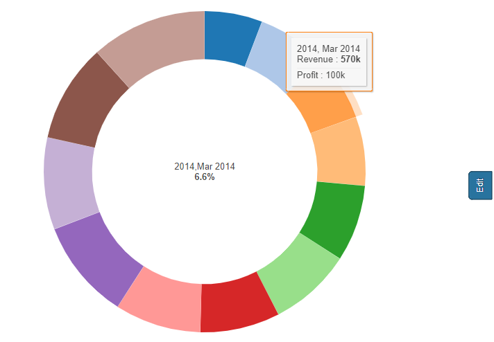<figcaption></figcaption></figure>

## Data labels 

We can modify the data labels for the data labels and centre label also. You can see the attached screenshots below.&#x20;

<figure>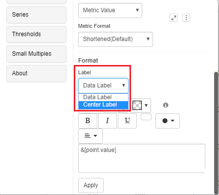<figcaption></figcaption></figure>

We have an option to enable/disable the Show total in Center label in the Pie chart&#x20;

<figure>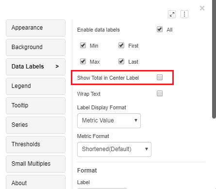<figcaption></figcaption></figure>

From Version 5.1.1, we have added the option ‘Show Overlapping Labels’ in the data labels menu.

<figure><figcaption></figcaption></figure>

## Format Pie 

From the 4.5 version of Vitara charts, a feature is introduced in pie chart to customize inner radius, start and end angles.\
All these customizable properties are available in the ‘Pie’ tab of the property editor. See the screenshot below.\

<figure>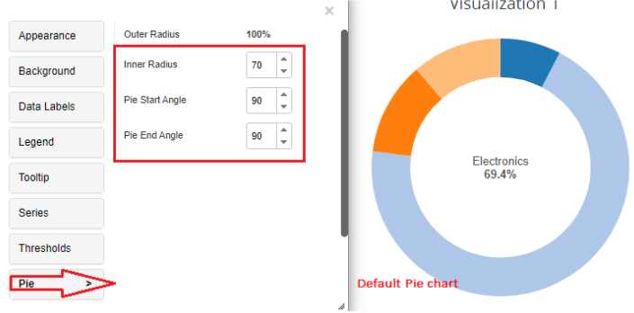<figcaption></figcaption></figure>

As you can see in the above screenshot, the outer radius is 100% which cannot be changed. And the default inner radius is 70, default both pie start and end angles are set to 90.\
Now, let us customize the pie chart with some of these settings.\
Inner radius - 10; Pie start angle - 0; Pie end angle - 90.\

<figure>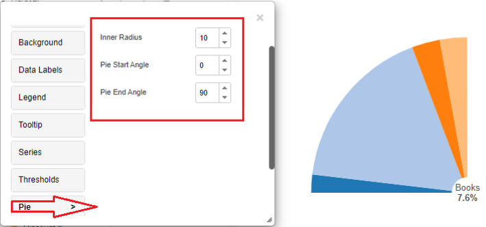<figcaption></figcaption></figure>

Inner radius - 0; Pie start angle - 0; Pie end angle - 360. These settings create a full Pie chart.\

<figure>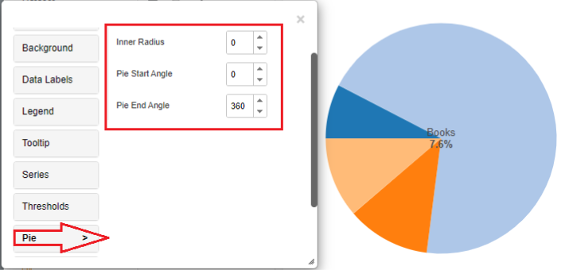<figcaption></figcaption></figure>

Inner radius - 40; Pie start angle - 0; Pie end angle - 180.\

<figure>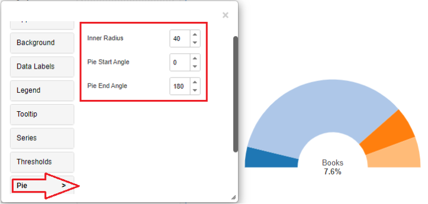<figcaption></figcaption></figure>

## Thresholds 

In the business point of view, certain part of the chart needs to be highlighted to draw more attention from the desicion makers. For example, highlight the stores where total sales is greater than a specific value or highlight the top 10 products whose sales is high during last year’s winter. Thresholds are very useful objects in these use cases.

Thresholds will display some conditional formatting in a chart to highlight certain data points depending on predefined criteria.The criteria are attribute or metric qualifications. If a qualification’s expression evaluates to TRUE, the report displays the threshold. We can also include markers in thresholds.

To apply thresholds in vitara charts, hover the cursor on the chart. Vitara chart will display an ‘Edit’ button. When you click on this ‘Edit’ button the properties window will pop out. Select the thresholds tab to open threshold editor. In the window you can add a new threshold or delete any existing threshold or modify the existing threshold.

Note: From 4.6 version we can apply thresholds using attributes. The source drop down box in the threshold editor window will list all the attributes and metrics in the chart. we can select an attribute as source and define a threshold condition.

<figure>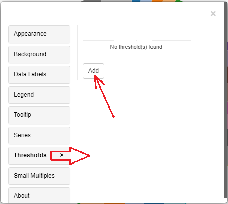<figcaption></figcaption></figure>

In the threshold editor window apply source, target, threshold condition and the other related information to set a threshold on the chart.

<figure>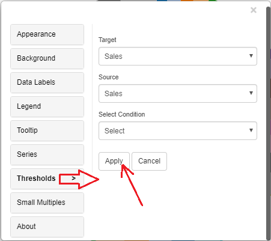<figcaption></figcaption></figure>

After giving all the inputs click on ‘Apply’ button.

## Play-by Animation 

Play by - animation shows the chart for each element of the first attribute. For more details about the play by feature please refer to [play-by](play-animation.md).

## Background Image 

The steps to set a background image for all Vitara charts are explained in [backgroundImage](background-images.md).

## Small Multiples 

Pie chart supports small multiples feature. Small multiples feature is explained in [smallMultiples](small-multiples.md).

## Gradient Color 

From version 5.0, Gradient color fill can be added where the series property is available.

The gradient color feature in a pie chart is used to enhance its visual appeal and depth. Instead of solid colors, it applies a gradual transition of colors to chart segments, typically from the outer edge toward the center of each slice. This creates a 3D-like effect and adds a sense of dimension, making the chart more engaging and visually interesting. Gradient colors can help differentiate segments while maintaining a cohesive color scheme, providing a balance between aesthetics and data representation in presentations and reports.

It can be enabled by selecting options from the series tab for individual series.

<figure><figcaption></figcaption></figure>

It will show the color palette, which will have two selection handles to choose two colors that will render from beginning to end on the series. (From left to right)

<figure>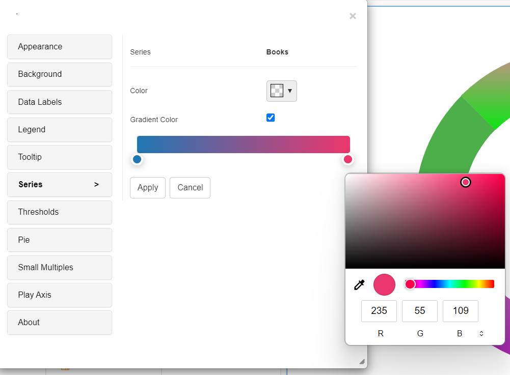<figcaption></figcaption></figure>

<figure>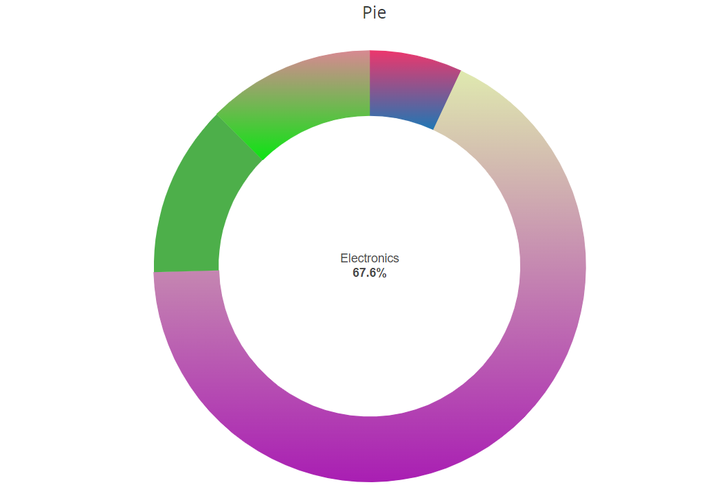<figcaption></figcaption></figure>

## Pattern Fill 

From version 5.1 , we have added pattern fill options that can be enabled under the series tab.

<figure>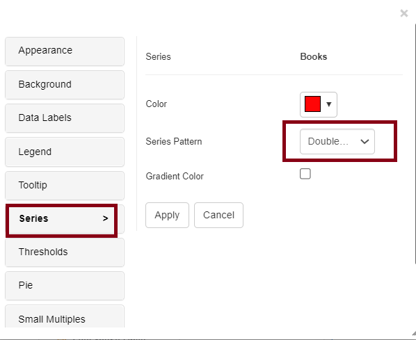<figcaption></figcaption></figure>

<figure><figcaption></figcaption></figure>
