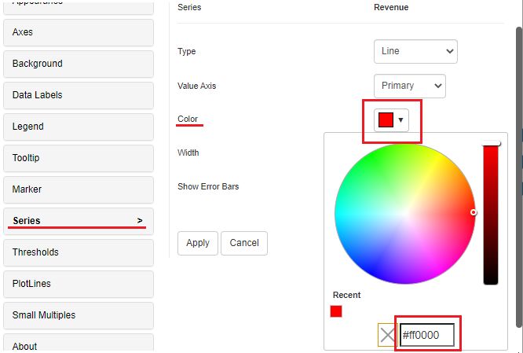
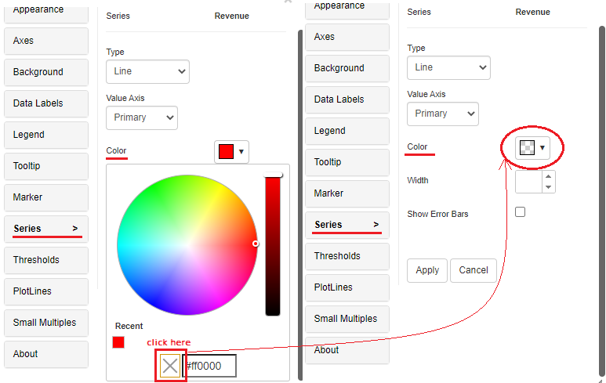

# Reset color property

\

### Resetting color property 

In Vitara charts, a color picker is used to assign colors to fonts, markers, series, and so on. Assume we change the color of one of the series on a chart to ‘red’ (#ff0000). Take a look at the screenshot.&#x20;

<figure><figcaption></figcaption></figure>

Now to reset this series color to ‘Auto’ i.e. to the default color, just remove the color for that series as in the screenshot below:

<figure><figcaption></figcaption></figure>

The color attributes of the color palette, thresholds, chart backdrop, series, label, line, and marker colors can all be reset in this way.
