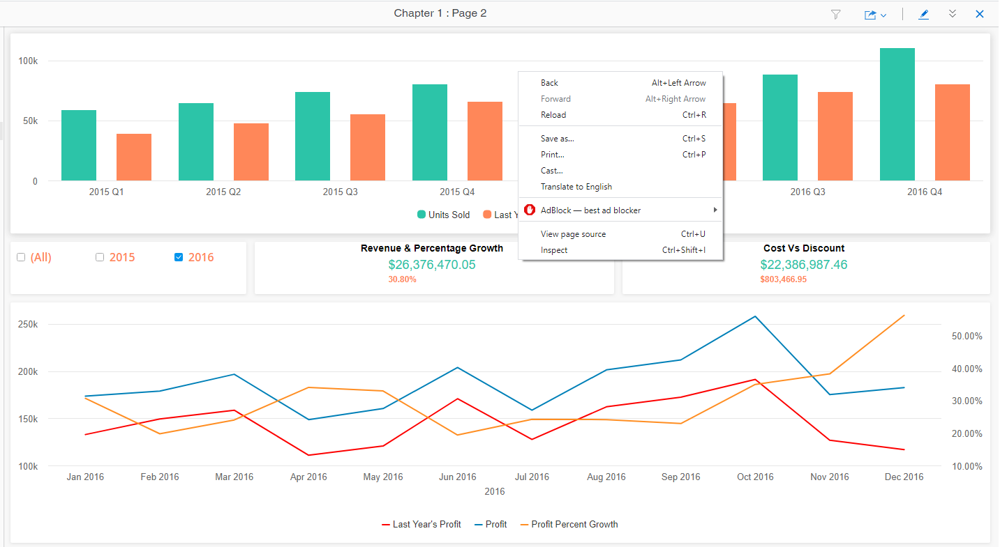
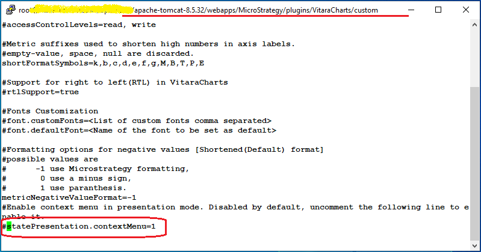
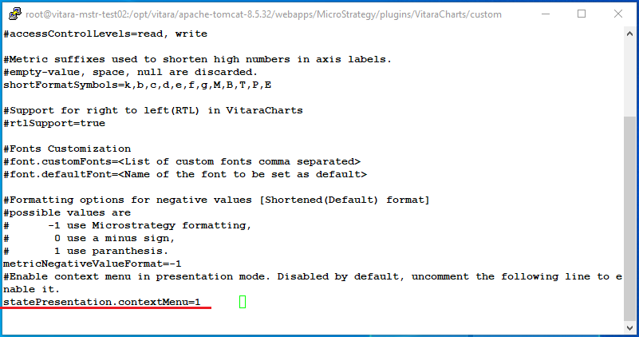
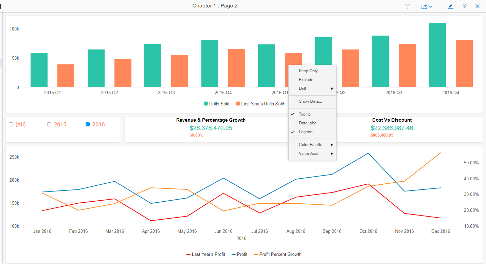

# Right Click Menu

## Right Click Menu in MicroStrategy 2020 Presentation Mode <a href="#right-click-menu-in-microstrategy-2020-presentation-mode" id="right-click-menu-in-microstrategy-2020-presentation-mode"></a>

When we run a dossier in the presentation mode, by default vitara charts will not show the right click menu options.

<figure><figcaption></figcaption></figure>

To enable this feature we have to configure the “global.txt” file in the below given path.

```
/apache-tomcat-8.5.32/webapps/MicroStrategy/plugins/VitaraCharts/custom
```

Edit the ‘global.txt’ file. At the bottom of this file, you will find the following line “#statePresentation.contextMenu=1”.

<figure><figcaption></figcaption></figure>

Uncomment this line by deleting the # at the starting of this line.

<figure><figcaption></figcaption></figure>

After uncommenting save the ‘global.txt’ file.

Delete the browser cache and reload the MicroStrategy web page. Now the right click menu will show the options when we run the dossier in the presentation mode.

<figure><figcaption></figcaption></figure>

Add the same flag in the _global.txt_ file in vitara charts library plugins.\
Below is the path of _global.txt_ file related to vitara charts library plugins.

```
/apache-tomcat-8.5.32/webapps/MicroStrategylibrary/plugins/VitaraCharts/custom
```

Edit the ‘global.txt file and insert the flag _“statePresentation.contextMenu=1”_ at the bottom of the _‘global.txt’_ file, save and close the file.

#### From latest version  onwards, the right-click menu is enabled by default across all visualizations. This menu allows users to enable or disable features as needed.

Below is a screenshot showing this property in the global.txt file:\


<figure><figcaption></figcaption></figure>

To disable this feature, set the following property in the global.txt file:\
statePresentation.contextMenu=0

📌**Note:** The respective `global.txt` file must be configured **separately** for both **Web** and **Library** applications.\
After making changes, users must **clear their browser cache** to ensure the updates are reflected in any Vitara charts
