---
layout:
  title:
    visible: true
  description:
    visible: false
  tableOfContents:
    visible: true
  outline:
    visible: true
  pagination:
    visible: true
---

# Sankey Chart

A Sankey chart is a data visualization tool used to represent the flow or distribution of resources, energy, or values between multiple entities or stages. It consists of interconnected arrows or flow paths, with the width of each path proportional to the quantity it represents. Sankey charts are commonly used in fields like energy management, economics, and process engineering to illustrate the transfer of resources or information, making it easier to understand complex systems, identify inefficiencies, and optimize processes.

## Inputs <a href="#inputs" id="inputs"></a>

Metrics: 1 metric Attributes: 2 or more attribute Use as Filter Option - Available

<figure>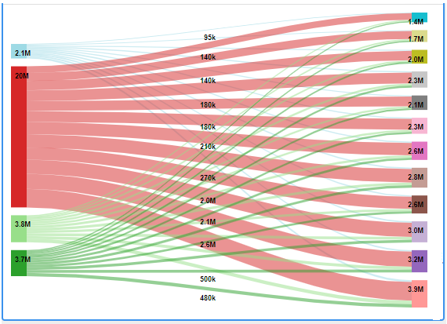<figcaption></figcaption></figure>

## Data labels <a href="#data-labels" id="data-labels"></a>

We can enable or disable the node labels and link labels. You can see the attached screenshots below.

<figure>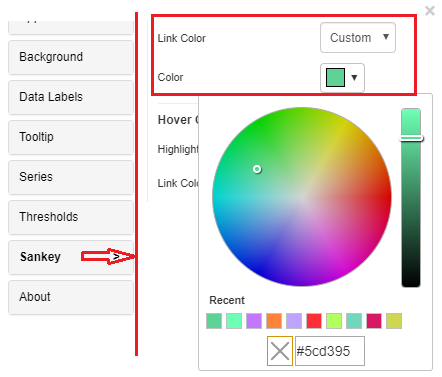<figcaption></figcaption></figure>

We can format the links and nodes accordingly.

<figure>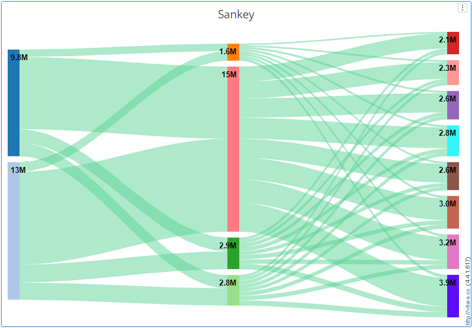<figcaption></figcaption></figure>

## Thresholds <a href="#thresholds" id="thresholds"></a>

In the business point of view, certain part of the chart needs to be highlighted to draw more attention from the desicion makers. For example, highlight the stores where total sales is greater than a specific value or highlight the top 10 products whose sales is high during last year’s winter. Thresholds are very useful objects in these use cases.

Thresholds will display some conditional formatting in a chart to highlight certain data points depending on predefined criteria.The criteria are attribute or metric qualifications. If a qualification’s expression evaluates to TRUE, the report displays the threshold. We can also include markers in thresholds.

To apply thresholds in vitara charts, hover the cursor on the chart. Vitara chart will display an ‘Edit’ button. When you click on this ‘Edit’ button the properties window will pop out. Select the thresholds tab to open threshold editor. In the window you can add a new threshold or delete any existing threshold or modify the existing threshold.

Note: As of version 4.6, we can use characteristics to set thresholds. All the measurements and attributes in the chart are listed in the source drop-down box in the threshold editing window. We can choose a source attribute and specify a threshold condition.

<figure>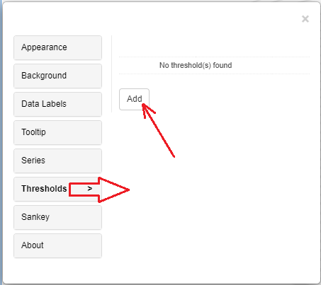<figcaption></figcaption></figure>

In the threshold editor window apply source, target, threshold condition and the other related information to set a threshold on the chart.

<figure>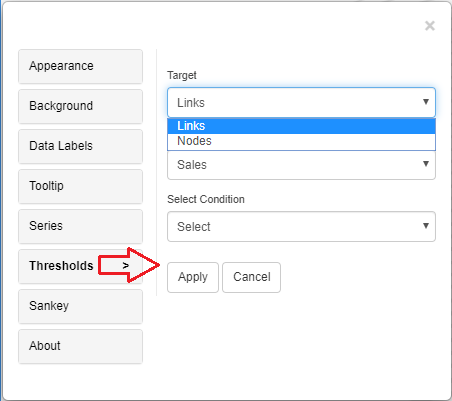<figcaption></figcaption></figure>

We can set the threshold for either links or nodes. We can also set a threshold at the node or chart level. For example, if we set the threshold to top 1, we can apply the red colour to each node or to the entire chart.

After entering all of your information, click the ‘Apply’ button.

## Sankey property <a href="#sankey-property" id="sankey-property"></a>

Sankey chart have the ability to set custom colors for links. Links can be given custom color palette using their colors options.

Here, we select a ‘Caribbean Green Pearl’ color for links.

<figure><figcaption></figcaption></figure>

<figure><figcaption></figcaption></figure>

## Highlight links from end to end <a href="#highlight-links-from-end-to-end" id="highlight-links-from-end-to-end"></a>

We have a new update in Sankey chart from 4.4.1 version of Vitara charts where we can highlight path of the linkages end to end. This makes it much easier to picture.

When you hover on a link, you may see the entire relationship of that particular link. Here’s an example of a link highlight from start to finish.

The NodeOffset option is to move the nodes vertically and horizontally. The positive value moves it to the right/ bottom and the negative value moves it to the left/top.

<figure>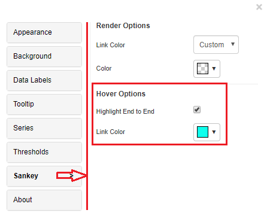<figcaption></figcaption></figure>

<figure>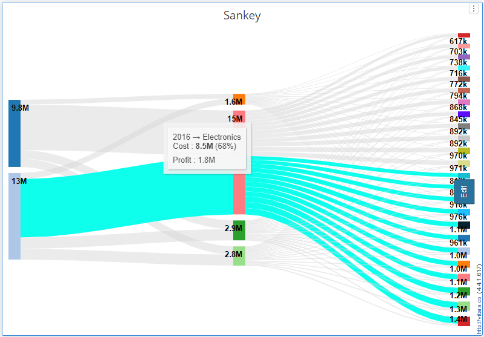<figcaption></figcaption></figure>

## **Node Padding and Node Width**

From Version 5.2 we have introduced a new feature of altering node padding and node width in the Sankey chart.

Node padding and node width are important layout factors in Sankey charts that affect chart reading and visual balance. The distance between nodes is defined by node padding, which reduces clutter and prevents overlapping flows. Node width adjusts the size of nodes, balancing the visual aspect of the chart. In a supply chain Sankey chart, for example, bigger nodes could indicate broad categories such as “Manufacturing,” while thinner nodes could detail specific goods or components. This design enables viewers to understand both the overall flow pattern and the specific relationships. Adjusting these settings results in a clean, organized chart with clear flows and correctly sized nodes, allowing for effective data transmission and insight extraction.

Navigate to the Sankey tab in the property editor and enter the desired range into the input box to view the output on the chart.

<figure>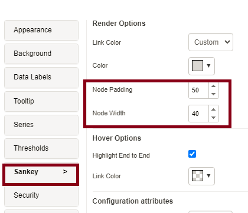<figcaption></figcaption></figure>

<figure>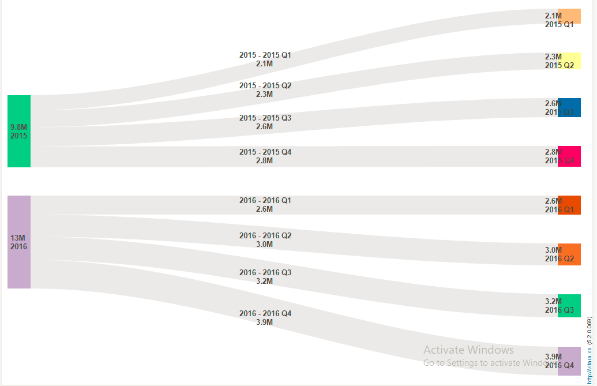<figcaption></figcaption></figure>

## Background Image <a href="#background-image" id="background-image"></a>

The steps to set a background image for all Vitara charts are explained in [backgroundImage](bar-column-chart.md).

## New data model - Introduced in 4.5 release <a href="#new-data-model---introduced-in-45-release" id="new-data-model---introduced-in-45-release"></a>

The data in the existing Sankey diagram flows along the columns from source node to target node. The newly proposed structure addresses the shortcomings of the previous structure and provides a more natural representation for directed graphs like Sankey.

## **Difference between the existing model and the new model:**

### **Example 1:**

\
There are three attributes in the screenshot below: year, category, and subcategory. The vitara sankey chart will create nodes for each of these attribute items in normal mode.The links will go from Year to Category, and then from Category to Subcategory.

```
                                    Year → Category → Subcategory
```

<figure>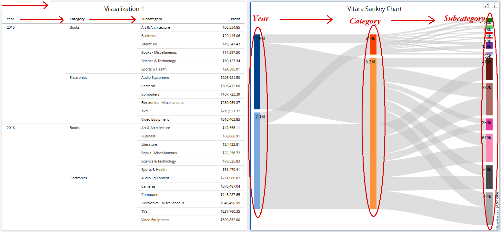<figcaption></figcaption></figure>

## **Example 2:**

To represent the flow from A to B and B to C, the difference between the existing data model and new data model is as follows:

<figure>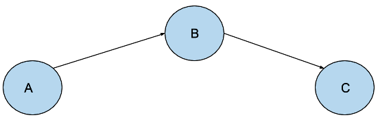<figcaption></figcaption></figure>

**Existing Model:**\
Existing model will need three attribute columns to represent the nodes.

| Attr1 | Attr2 | Attr3 | Metric |
| ----- | ----- | ----- | ------ |
| A     | B     | C     | 10     |

**New data model:**\
The new data model requires two attribute columns as source and target. The Attr1 should be configured as the source and Att2 should be configured as the target.

| Attr1 | Attr2 | Metric |
| ----- | ----- | ------ |
| A     | B     | 10     |
| B     | C     | 10     |

## **Configuring Source and Target:**

### **Example 3:**

**Shopping flowchart data**\
There are two properties in the screenshot below: Navigation Source and Navigation Target. This data depicts the flow of actions from one point on an online shopping page to the next. In an online buying portal, for example, the user will be at several stages of action until final payment.

<figure>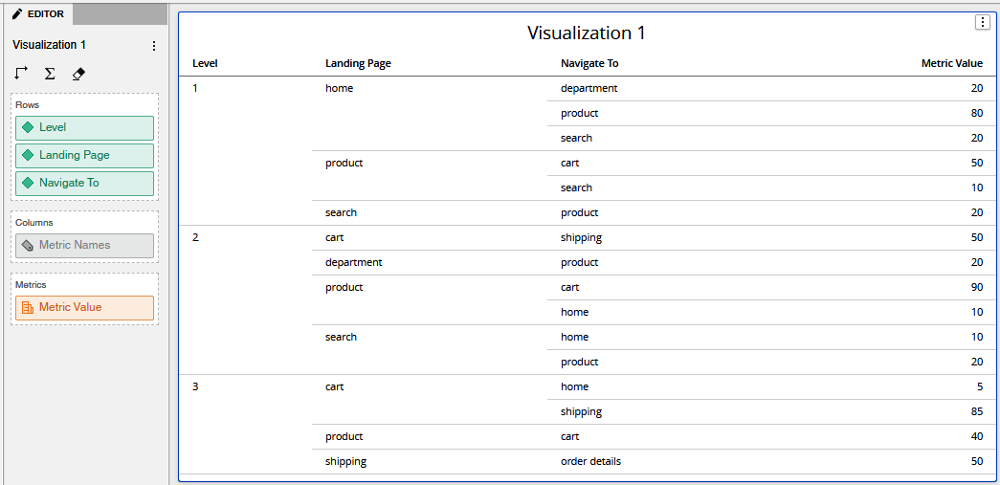<figcaption></figcaption></figure>

In this example, let’s consider the flow of data in one branch as shown below:

```
     Online Order → Order Submitted → Payment Verification → Credit approved/Credit Denied/Credit Review/Order Prepaid/Payment Denied/Processing Payment. 
```

<figure>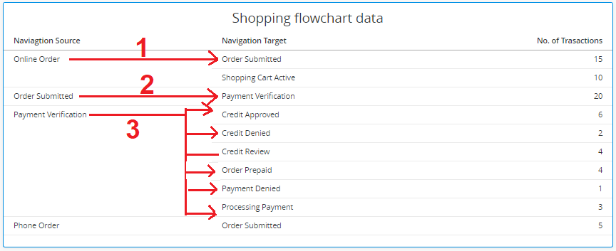<figcaption></figcaption></figure>

The Vitara Sankey chart in normal mode is not appropriate for this type of data format, where the linkages commence in one attribute column and end in another. The sankey chart in normal mode is shown below, with linkages drawn from the Navigation Source element to the Navigation Target attribute.

<figure>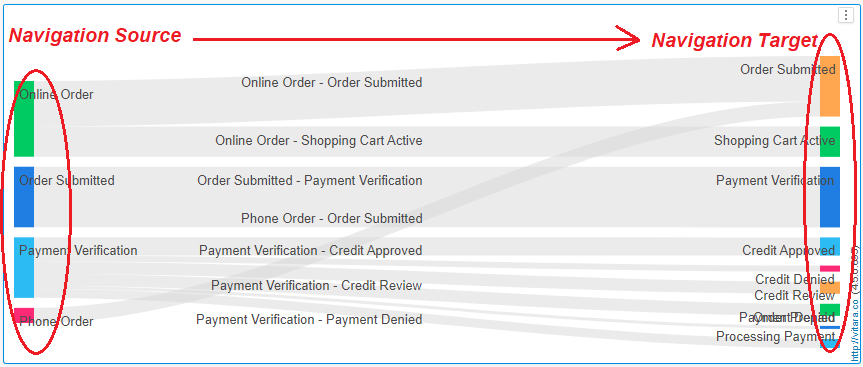<figcaption></figcaption></figure>

The new data model is helpful for these kinds of data, where the information is presented in rows. By clicking the “Edit” button and expanding the Sankey menu, you can configure the Vitara Sankey to operate in the row data model. There are three drop-down menus in the Configuration attributes section: Source, target, and depth/direction. All of the attributes that are seen in the chart are listed in these drop-down boxes. The appropriate qualities for each drop-down box must be chosen.

<figure>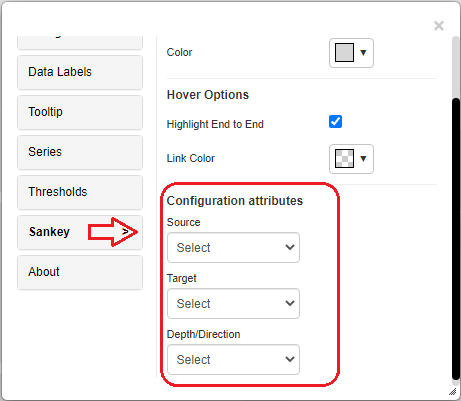<figcaption></figcaption></figure>

<figure>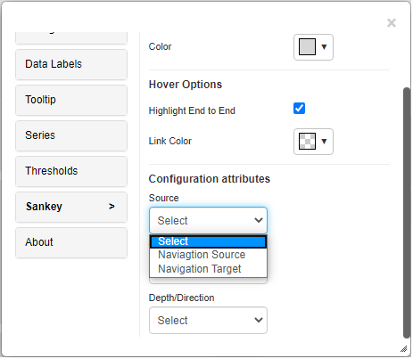<figcaption></figcaption></figure>

We don’t have any attribute components that repeat more than once in the present example, therefore we don’t need to use the third attribute - Depth/Direction. The Depth/Direction option will be discussed more in this document.

In the current example, the attribute ‘Navigation Source’ represents the source node and the attribute ‘Navigation Target’ represents the target node.

<figure>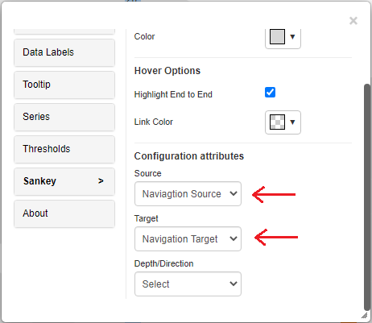<figcaption></figcaption></figure>

The Sankey chart will appear in the row data flow model as soon as we choose the source and target properties. The Sankey chart with source and target attributes configured is shown in the screenshot below.

In the Sankey chart, we can see the branch that was previously mentioned.\
_Online Order → Order Submitted → Payment Verification → Credit approved/Credit Denied/Credit Review/Order Prepaid/Payment Denied/Processing Payment_

<figure>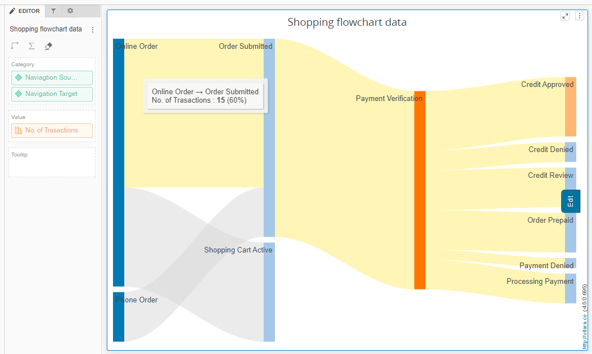<figcaption></figcaption></figure>

In addition to source and target options Depth/Direction attribute can be used to describe the flow of sankey. Depth can be used to make a node distinct within the flow path.

**Configuring Depth/Direction:**

**Example 4:**

Website navigation data indicating users landing and navigation between different pages in a website.\
In this example there are three attributes - Landing Page, Navigate To, and Level.

<figure><figcaption></figcaption></figure>

We can configure the attribute ‘Landing Page’ as the source of navigation and the attribute ‘Navigate To’ as the destination for the given use case. The limitation of this strategy is that the same transaction occurs on numerous levels. For example, as seen in the below screenshot, ‘Product → Cart’ navigation can happen in level 1,2 and 3.

<figure>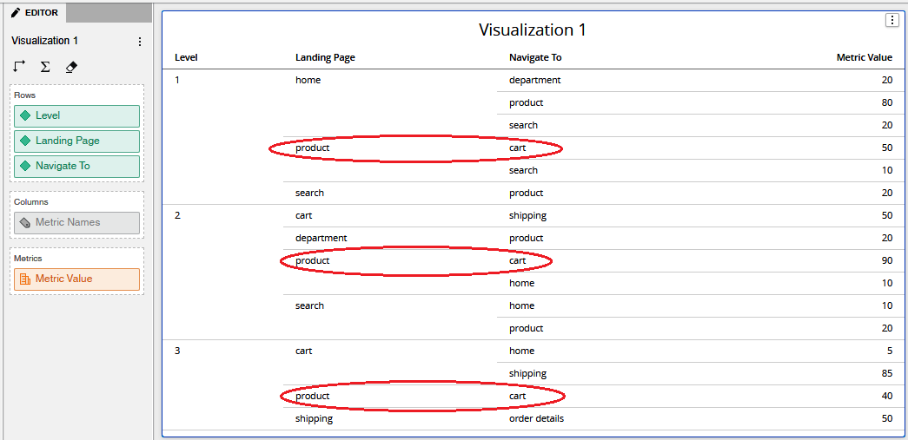<figcaption></figcaption></figure>

If we don’t have the level attribute,Microstrategy will aggregate the row ‘product → cart’. Below are the possible flow paths that use ‘product to cart’ navigation.

```
                       1. Home → product, product → cart (Level-2), and cart → to home/shipping.
                       2. Product → cart (Level-1), cart → shipping, and shipping → order details.
                       3. Home → department, department → product, product → cart (Level-3).
```

Therefore to identify all these transitions uniquely at different levels, along with source and target attributes we need another attribute which will have information regarding depthness.

Below is the screenshot of sankey chart configuration with all these three attributes.

<figure>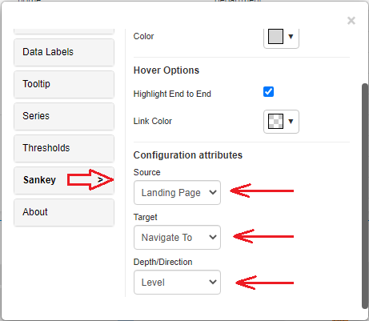<figcaption></figcaption></figure>

Sankey chart with web navigation example:

<figure>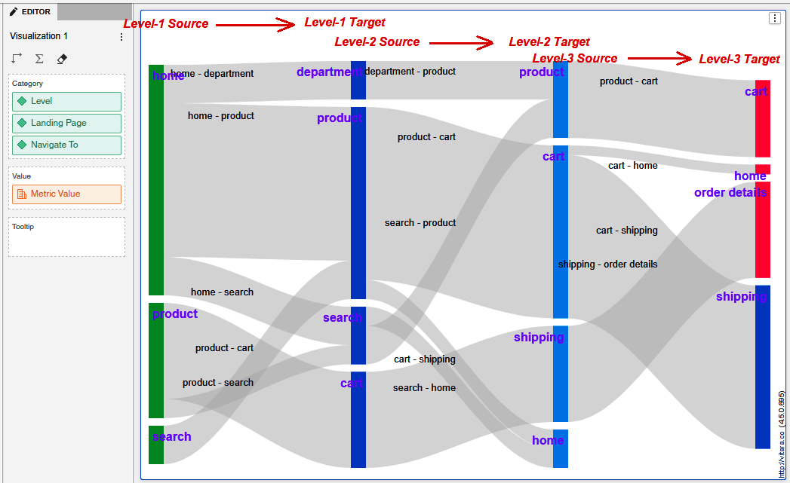<figcaption></figcaption></figure>

In the below screenshot, the ‘product → cart’ navigation is highlighted in all the three levels.

<figure>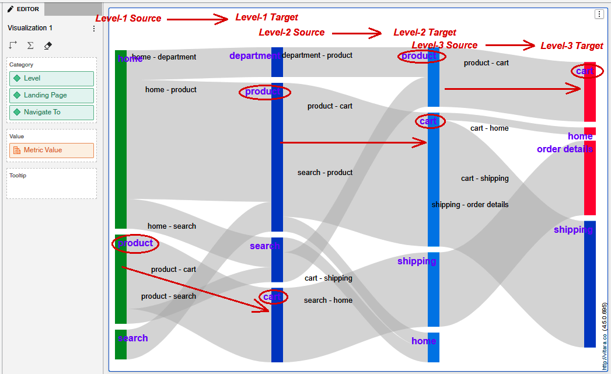<figcaption></figcaption></figure>

## **Order of Source, Target, and Depth attributes in the editor panel:**

When we add an attribute to a visualization, MicroStrategy sorts the attributes alphabetically ascending. As a result, the natural order of events can be disrupted. By creating a new attribute form and sorting the attribute using the newly added attribute form, the natural order of the events can be preserved. The new attribute form should be designed in such a way that the order of events is preserved.

### **Example 5:**

Let’s examine closely the above web navigation example.\
As per the given use case, below is the screenshot of the correct order of the occurrence of the events.

<figure><figcaption></figcaption></figure>

If we change the order of the attributes in the editor panel, the order of events will be disturbed.\
In the below screenshot the position of the attribute ‘Level’ is changed, due to which the order of events will affect.

<figure><figcaption></figcaption></figure>

Microstrategy will sort the attribute elements using the attribute ‘Navigate To’ when I insert the attribute ‘Level’ in the third position in the editor panel drop zone. As a result, the natural order of events will be disrupted. If we use this table to construct the Sankey chart in the new data model, the result will be as seen in the screenshot below.

<figure>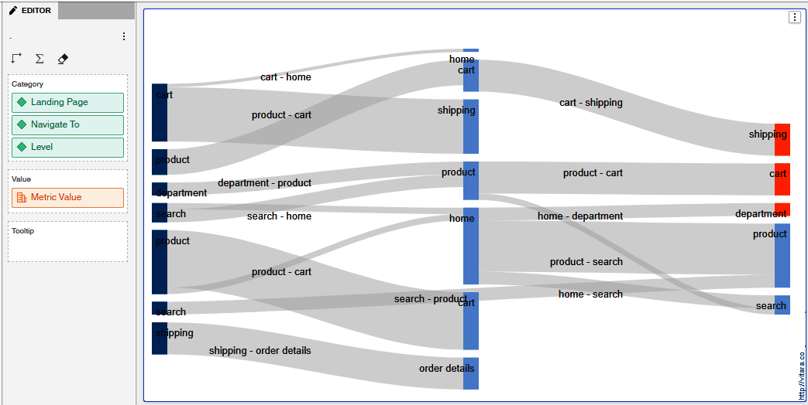<figcaption></figcaption></figure>

Instead the correct flow of events should be as shown below.

<figure><figcaption></figcaption></figure>

To achieve this, according to the data in the above example, either the attribute ‘Level’ should be the first attribute in the drop zone so that Microstrategy by default will sort by ‘Level’ attribute or we should sort the attribute ‘Level’ in the ascending order.

<figure><figcaption></figcaption></figure>

The conclusion is that we should evaluate the order of the events before producing the sankey chart. The events should be in the correct order according to the natural flow of our use case. Insert your data into a visualisation. Check the order of the properties you’ll be configuring as Source, Target, and Depth in the editor panel. The sequence of attributes should not disrupt the flow of events.

#### Sankey Chart Vertically <a href="#sankey-chart-vertically" id="sankey-chart-vertically"></a>

From the version 5.0, Sankey chart now stands an ability to use the charts in vertical orientation. The following can be turned ON from the appearance tab from the property editor window. Just toggling on the Invert Axis feature we can change the orientation of the chart.

<figure><figcaption></figcaption></figure>

## Series <a href="#series" id="series"></a>

**Horizontal and Vertical Offset**

With version 5.2, two new properties are added to the series tab in the property editor, allowing us to manage the horizontal and vertical offset of any given series (Nodes).

In a Sankey chart, horizontal and vertical offsets refer to the positioning of flows or links between nodes Horizontal offset governs the distance between source and target nodes along the x-axis, whereas vertical offset governs their positioning along the y-axis. By eliminating overlaps, minimizing clutter, and guiding the viewer’s focus, these offsets can increase clarity in complex Sankey charts.Proper offsets in a Sankey chart serve to express the desired linkages between categories or processes, supporting the successful communication of data-driven explanations.

To use this function, navigate to the series tab in the editor and choose the series (Node) that we want to alter horizontally and vertically by entering numbers in the positive or negative range.

<figure>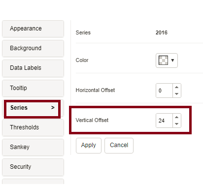<figcaption></figcaption></figure>

<figure>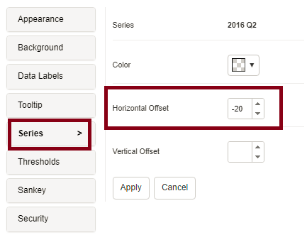<figcaption></figcaption></figure>

<figure>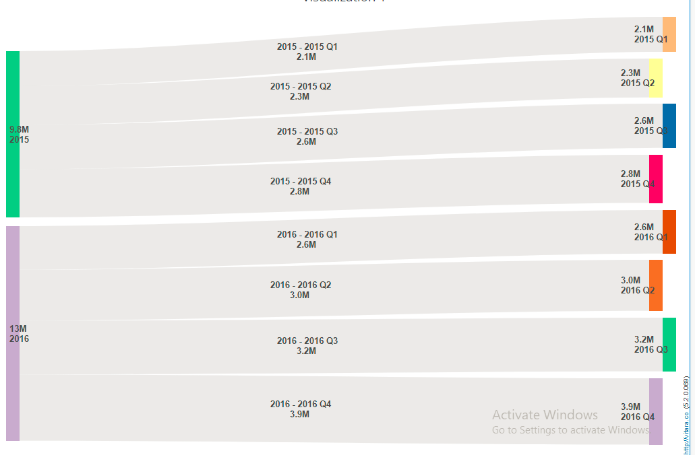<figcaption></figcaption></figure>

#### Sankey Visualization Enhancement: Support for Negative Values <a href="#sankey-visualization-enhancement-support-for-negative-values" id="sankey-visualization-enhancement-support-for-negative-values"></a>

The Sankey feature has been enhanced to support the representation of negative values. This improvement includes the addition of an option in the Sankey tab that allows users to visualize and distinguish negative values through color-coded elements.

**Key Features:**

Color Differentiation: When the “Show Negative Values” option is enabled in the Sankey tab, links representing negative values will be highlighted in red, providing a visual cue for quick identification.

Negative Node Highlighting: Nodes with a total or overall negative value will be displayed in red, ensuring that users can easily spot areas where the cumulative value is negative. This is particularly useful for understanding the overall direction and impact of negative contributions.

Mixed Link Colors: Red-colored links may connect to nodes with non-negative values. This occurs when only a portion of the data contributing to the node is negative, while the rest is positive. The node itself is considered positive in such cases. As seen in image 2 below (pencils),

Consistent Negative Values: The children of nodes with negative values will consistently display negative values, maintaining coherence in the visualization and aiding in the interpretation of hierarchical relationships.

**How to use:**

To activate these enhanced visualization features, follow these steps:

* Navigate to the Sankey tab in your application.
* Locate the “Show Negative Values” option.
* Toggle the option to “On” to enable the visualization of negative values with the specified color-coded elements.

<figure><figcaption></figcaption></figure>

**Image 1: Highlighting Negative Values**

In Image 1, the Sankey diagram introduces a visual distinction for negative values:

Red Links: Links corresponding to negative values are highlighted in red. This allows users to easily trace and analyze the flow of negative contributions within the dataset.

Red Nodes: Nodes with an overall negative total value are prominently displayed in red. This provides insights into areas where the cumulative impact is negative, facilitating a deeper understanding of the directional flow of negative values.

<figure><figcaption></figcaption></figure>

**Image 2: Handling Mixed Values in Nodes**

In Image 2, the Sankey visualization addresses scenarios where nodes contain both positive and negative values:

In the Sankey diagram, negative values are shown with red links. These red links may connect to nodes that have a mix of positive and negative values. If a node mostly contains positive values, even with a small negative segment, it is considered positive. For example, in the image, nodes like “Pencils” and “Shoes” are not fully red because they have both positive and negative values, but the positive values dominate.

<figure>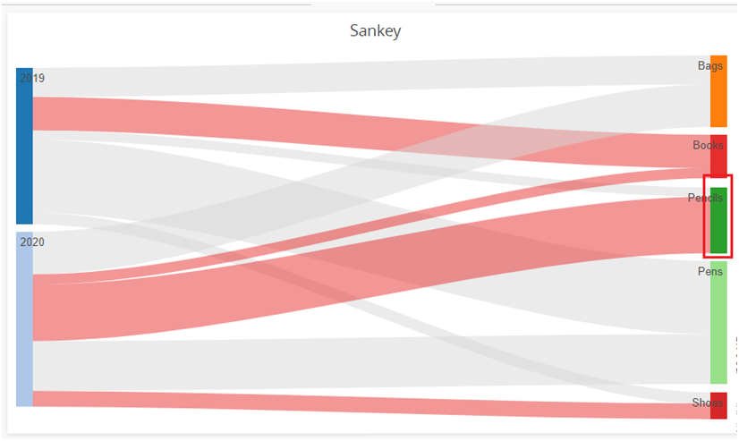<figcaption></figcaption></figure>

**Note:**

* The introduced color-coded elements significantly improve the interpretability of Sankey diagrams, especially when dealing with datasets containing negative values.
* Users can seamlessly integrate this feature into their workflow, gaining insights into the flow and impact of negative contributions within their data.

#### New Macros for Sankey Chart Tooltips: node.source and node.target <a href="#new-macros-for-sankey-chart-tooltips-nodesource-and-nodetarget" id="new-macros-for-sankey-chart-tooltips-nodesource-and-nodetarget"></a>

In the latest release 5.2.7, a new feature has been introduced in the tooltip section for Sankey charts: the addition of two new macros, node.source and node.target. These macros provide valuable information about the source and target nodes of the flows displayed in the Sankey diagram tooltips.When using node.source in a tooltip , it will dynamically populate with the name or label of the source node from which the flow originates. Similarly, node.target will display the name or label of the target node to which the flow leads.For example, when adding a tooltip for a Sankey chart, you can include these macros to enhance the tooltip’s formatting. Here’s a basic illustration of how you might use these macros:

<div>

<figure>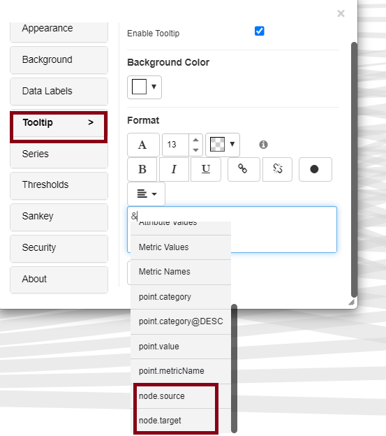<figcaption></figcaption></figure>

 

<figure>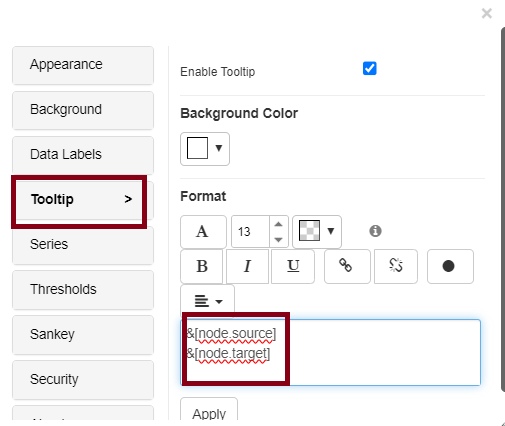<figcaption></figcaption></figure>

</div>

This enhancement adds granularity and clarity to the tooltips, offering users more detailed insights into the flow paths within the Sankey chart visualization.

<figure>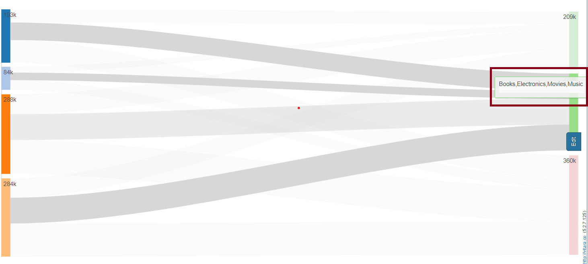<figcaption></figcaption></figure>

<figure>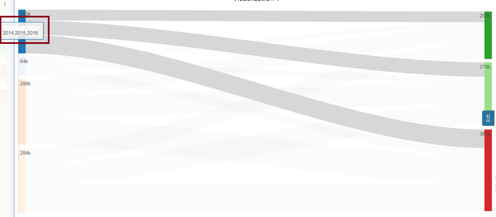<figcaption></figcaption></figure>
