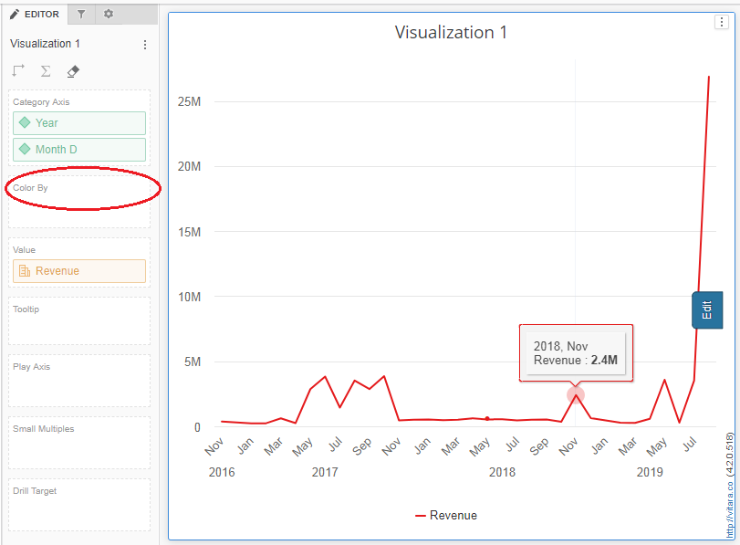
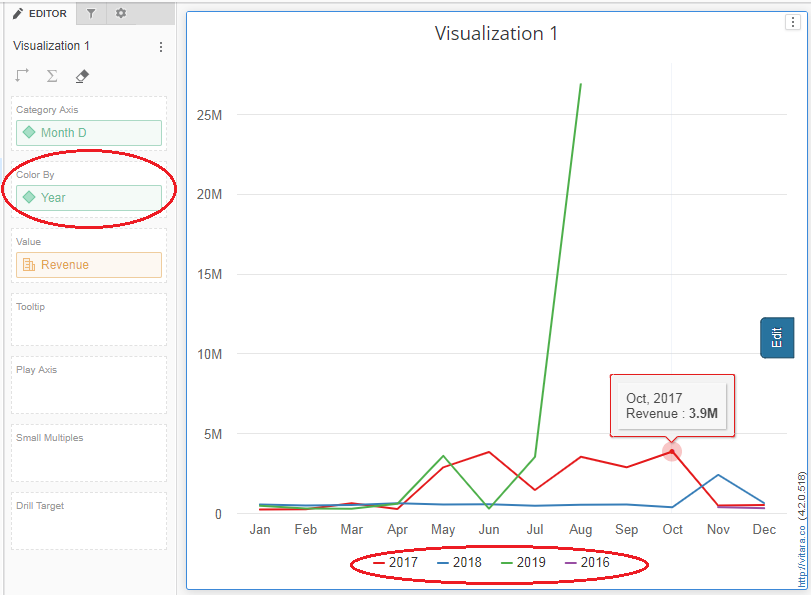
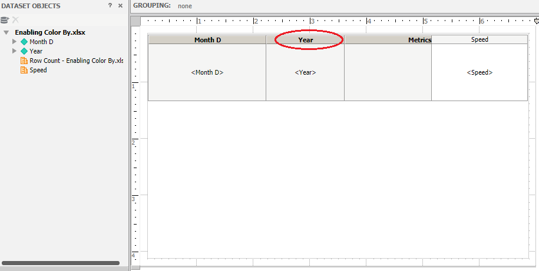
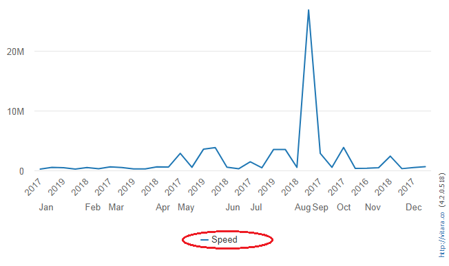
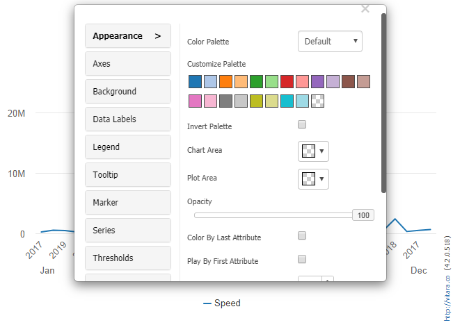
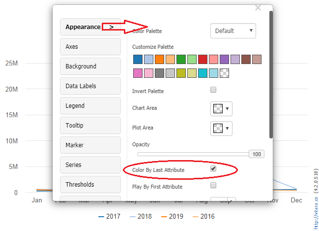
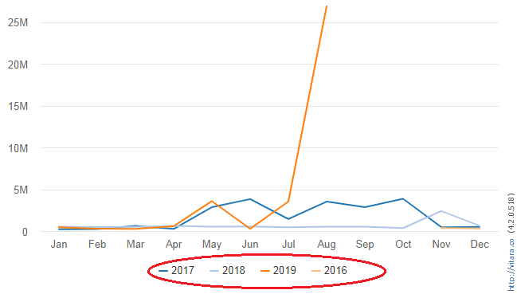

# Series using Attribute

## Draw Chart Series Using Attribute 

By default, all Vitara charts are formed as series utilizing metrics. However, we can use attributes to draw series on the Vitara chart.

## Dossiers 

The attribute that we want to generate a series in the chart must be placed in the “Color Drop” zone in dossiers. In the screenshot below, a line chart displays the details of the Revenue metric over month and year dimensions. That is, the series is created using the Revenue metric.

<figure><figcaption></figcaption></figure>

The similar graph can be used to show yearly income figures. We must draw the series using the year attribute for this. Simply drag and drop the Year attribute from the Category drop zone to the Color by drop zone, as seen in the screenshot below.

<figure><figcaption></figcaption></figure>

Now chart series is drawn using Year attribute.

## Report Services Documents 

The following steps will explain how to form series using attributes in RSD.

**Step 1:** The attribute which you want to form the series should be in the right most row position in the grid. In the below screenshot the attribute “Year” is used to form series in the line chart.

<figure><figcaption></figcaption></figure>

**Step 2:** Run the document in the presentation mode. Hover the curser on the chart to get “Edit” properties button of the Vitara line chart. As you can see in the below screenshot, by default series is formed using the metric “Speed”.

<figure><figcaption></figcaption></figure>

**Step 3:** Click on “Edit” button to open Vitara line chart properties window.

<figure><figcaption></figcaption></figure>

**Step 4:** Under the “Appearance” tab, there is a check box called “Color By Last Attribute”. This check box will be in the disabled mode by default. Click on the check box to enable.

<figure><figcaption></figcaption></figure>

**Step 5:** Click on the cross symbol on the properties window to close the properties window. As a result the line chart will draw series using year attribute.

<figure><figcaption></figcaption></figure>

The following Vitara charts supports the “Color By Last Attribute” feature: Area chart, Bar chart, Column chart, Dumbbell chart, HC Trellis chart, Histogram chart, Line chart, Sparkline chart, and Tornado chart.
