# Simple KPI Chart

A simple KPI (Key Performance Indicator) chart is a graphical representation of key performance metrics or indicators, designed to provide a quick and easy-to-understand overview of an organization’s performance. It typically consists of basic visual elements like bars, lines, or numbers, with each KPI displayed individually. Simple KPI charts are often used to track and communicate critical performance data, such as sales revenue, customer satisfaction scores, or production efficiency, in a straightforward and easily digestible format, making it easier for decision-makers to assess performance at a glance and take timely actions when needed.

This visualisation is perfect for expressing vital figures in VI Dashboards and Documents alike.

## Inputs 

Metrics - 3 metrics, with a minimum of one required. The first metric M1 will be displayed as a large number (Main label), while the second metric M2 will be displayed as a smaller number (Sublabel). The third measure, M3, will be utilised to set background colour thresholds. Metrics can be regular or derived, and they can be formatted as %, Fixed, Currency, and so on.

Attributes - Optional Use as Filter Option - Not available

## Tip1 

The screenshot below showcases the KPI widgets formatted with different colors of text and also using metric values formatted as currency and % respectively. By default KPI widget will show the name of the first metric (Main label) as the title of the widget, but we can modify this with our own text input in Appearance ? Text Label ? Label-text input box.

<figure>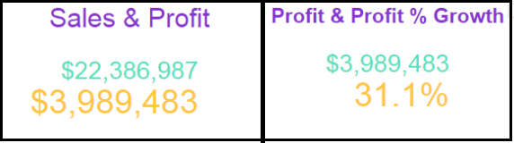<figcaption></figcaption></figure>

KPI widgets can be effectively combined with VitaraCharts’ Sparkline to show the trend of the key number for the executive dashboard. See the example below.

<figure>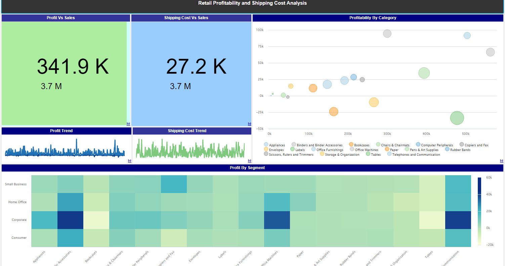<figcaption></figcaption></figure>

## Autoscaling the labels 

By default, all three labels \[main label, sub label, and title] on the Simple KPI chart are auto-scaled. The way the labels are scaled has changed as of version 4.3. So, if we modify the font-size of the Main label, the font-sizes of the Title and Sub label will be scaled proportionately. If you modify the font size for either the Sub label or the Title, the other two labels will not be auto-scaled. Take a look at the image below:

<figure>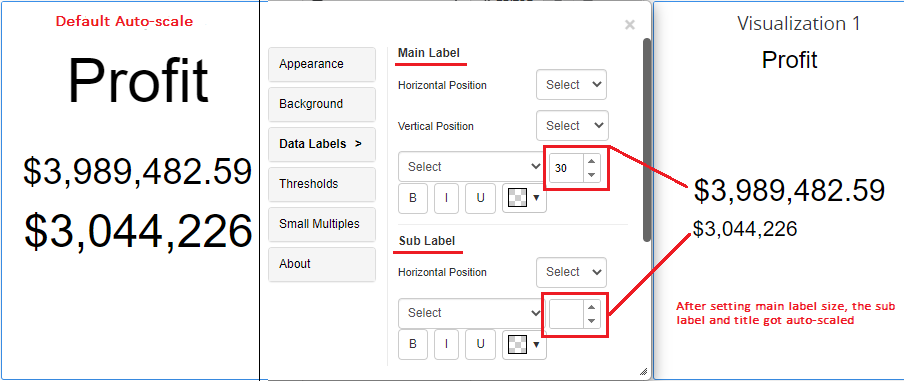<figcaption></figcaption></figure>

If you don’t want the Sub label and Title to be auto-scaled with the Main label font-size, just specify the font-size for Sub label and Title. If you want to return any font-size to the default auto-scale, just leave the font-size texbox empty. Take a look at the image below:&#x20;

<figure>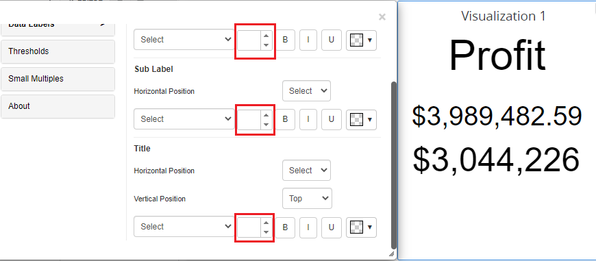<figcaption></figcaption></figure>

## Thresholds 

In the KPI widget, you can set panel colours and icons using thresholds. Aside from the ‘Top Label’ and ‘Sub Label’ drop zones in the editor panel of a dossier, there is a third metric drop zone called ‘Threshold Metric’ that will be used exclusively for applying thresholds in Simple KPI chart.

<figure>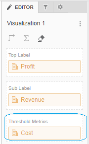<figcaption></figcaption></figure>

Open the property editor by clicking on the ‘Edit’ button and select the ‘Threshold’ tab. In the threshold, the editor window applies source, target, threshold condition, and other related information. In the below screenshot, for Simple KPI charts panel colors and icons are set using thresholds.

<figure>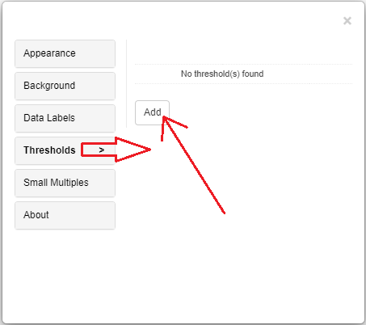<figcaption></figcaption></figure>

<figure>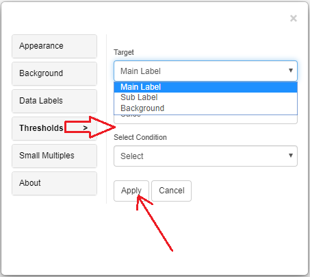<figcaption></figcaption></figure>

<figure>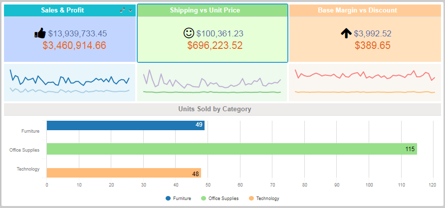<figcaption></figcaption></figure>

## Thresholds Priority

When multiple thresholds are applied to the same metric, the most recently added threshold takes precedence—even if the conditions differ.

For example, if a threshold is applied to the Cost metric with a "greater than" condition and sets a background color, and then another threshold is added to the same Cost metric with a different condition that includes a text color and a marker, the chart will reflect only the styling from the most recently applied threshold.

## Background Image 

The steps to set a background image for all Vitara charts are explained in [backgroundImage](background-images.md).

When used in combination with small multiples, the basic kpi chart enables for the insertion of a distinct background image based on attribute in addition to the usual background image.

Steps

* Drag attribute into Small Multiple.
* Add the name of the attribute in background Image path: &\[Category].gif (jpg and png are also supported)

<figure>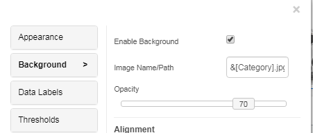<figcaption></figcaption></figure>

* Add the images in images folder (Tomcat\webapps\MicroStrategy\plugins\VitaraCharts\custom\images) with names as the value of Category like books.jpg, electronics.jpg, music.jpg etc
* The names of the images should be in lowercase letters. For example, movies.jpg.
* As a result, you will find each small multiple plot with respective image.

<figure>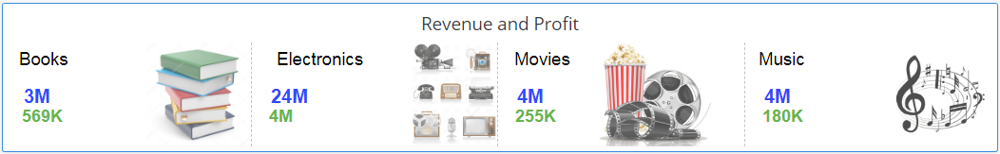<figcaption></figcaption></figure>

## Small Multiples 

Simple KPI chart supports small multiples feature. Small multiples feature is explained in [smallMultiples](small-multiples.md).

## Tooltip 

Since Version 5.1.2, a new tooltip option has been introduced.

The tooltip feature in a simple KPI chart offers extra information when users hover over or click on a KPI value. It provides context, explanations, and deeper insights, enhancing user understanding and supporting informed decision-making in performance analysis without cluttering the chart.

It can be found in the property editor’s below Data Labels tab, where users can add various macros based on the information they want to show in the tooltip box.

<figure>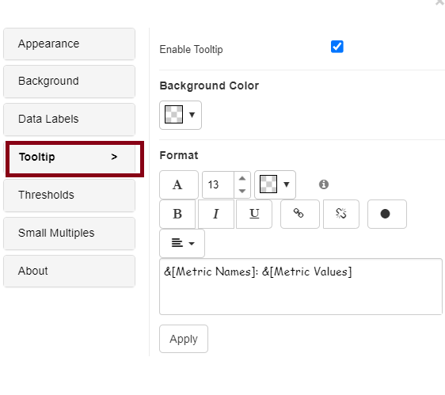<figcaption></figcaption></figure>

<figure>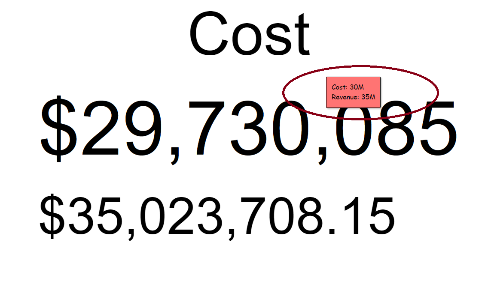<figcaption></figcaption></figure>

Starting with version **5.3.10,** the **tooltip** has been enhanced to improve readability. The tooltip size has been increased, allowing users to view information more clearly.

Furthermore, the tooltip is now displayed outside the chart area, preventing it from overlapping with chart elements or data points. This improvement ensures better visibility and a smoother user experience. Refer to the screenshot below for further details.

.

<figure><figcaption></figcaption></figure>

 
