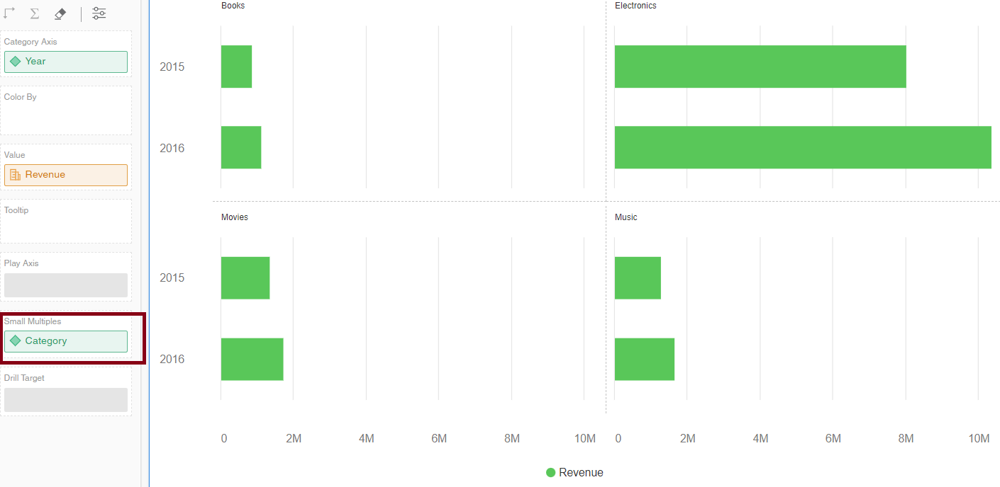
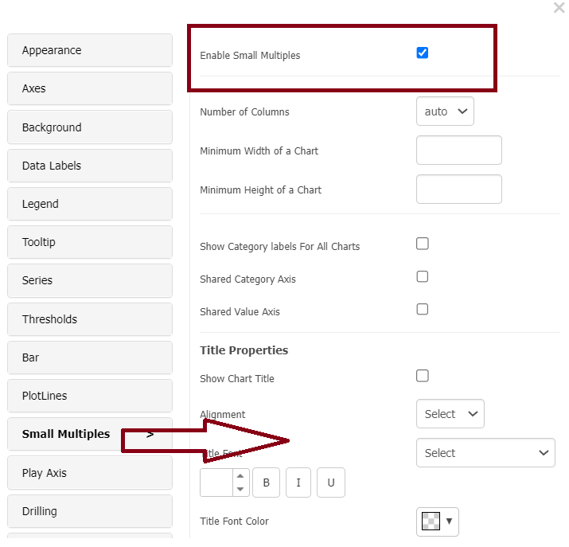
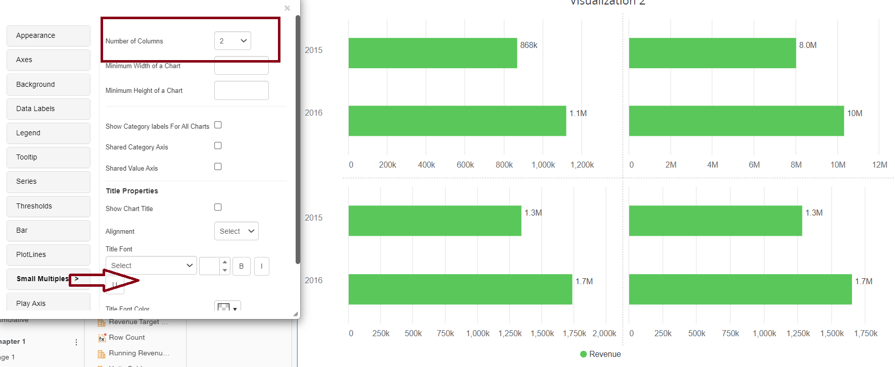
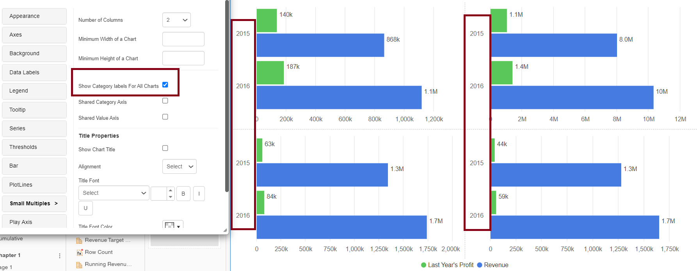
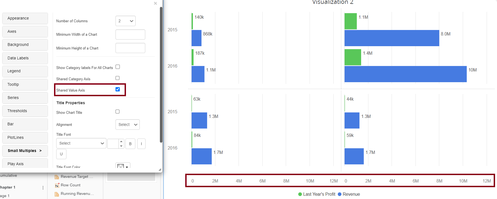
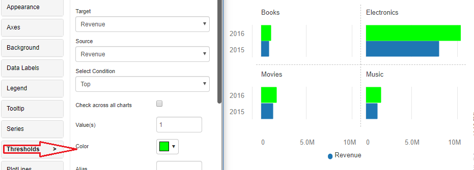
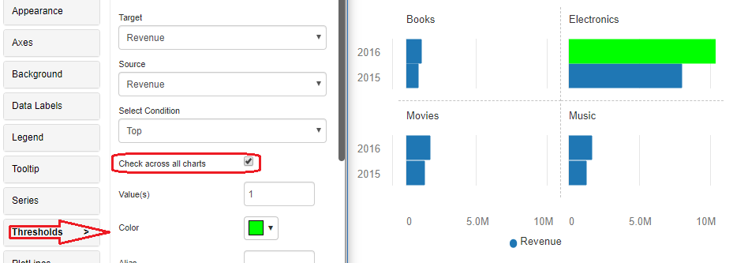

---
layout:
  title:
    visible: true
  description:
    visible: false
  tableOfContents:
    visible: true
  outline:
    visible: true
  pagination:
    visible: true
---

# Small Multiples

Small Multiples displays data from numerous small, interconnected graphs in a single display. Because they use the same axes and scales, the user may compare trends across dimensions in a single view. This property is now available in the following charts: Bar, Column, Area, Line, Bubble, Bullet, KPI Ring, Stacked Bar, Stacked Column, Slope, Pie, Simple KPI, Waterfall, Tornado, Dumbbell, and Sparkline.

## Enabling small multiples 

In dossiers, drag and drop an attribute into small multiples dropzone. See the screenshot.

<figure><figcaption></figcaption></figure>

To enable small multiples in documents, at least one attribute in the chart must be present. Navigate to the tiny multiples tab in the property editor. Now check the ‘enable tiny multiples’ box. The first property in the chart/grid will then permit small multiples. Take a look at the screenshot.&#x20;

<figure><figcaption></figcaption></figure>

When small multiples are enabled for a chart, then play animation and drilling cannot be enabled.\

## Number of columns 

The number of columns is set to ‘auto’ by default, and in most charts, this will be ‘2’. Depending on your needs, you can modify the number of columns to any number. Take a look at the screenshot.&#x20;

<figure><figcaption></figcaption></figure>

## Category axis labels 

The category axis labels are displayed by default for all tiny multiples in the first/left column. That is, if the number of columns for the chart is ‘2’, category axis labels for small multiples in the second column will be hidden. Simply click the’show all category labels’ option to activate the category axis labels for all columns. This option will be useful if each multiple contains separate data categories. Take a look at the screenshot.&#x20;

<figure><figcaption></figcaption></figure>

## Shared value axis 

All multiples in each column are shared by default, with a common value axis presented at the bottom of the chart. This is due to the ‘shared value axis’ checkbox being selected. Take a look at the screenshot. \

<figure><figcaption></figcaption></figure>

If we require a value axis for every small multiple, simply uncheck the’shared value axis’ checkbox. This option not only displays the axes for all multiples, but it also scales them individually, making the data easier to analyse. Take a look at the screenshot.

<figure><figcaption></figcaption></figure>

#### Thresholds 

A new feature named ‘Check across all charts’ is introduced to the ‘top’, ‘bottom’, ‘top percentage’, and ‘bottom percentage’ thresholds starting with version 4.3. This feature aids in the calculation of thresholds over all multiples.

For example, suppose there are four little multiples ‘books’, ‘electronics’, ‘movies’, ‘music’ in the chart with a metric ‘Revenue’. For the revenue indicator, we will now use the ‘top 1’ level in green. The top 1 revenue in each multiple is then applied to the threshold. Take a look at the screenshot.&#x20;

<figure><figcaption></figcaption></figure>

However, if we only want the threshold to apply to one small multiple that has the greatest income among all small multiples in the chart, we must enable the ‘Check across all charts’ checkbox while applying the threshold. Take a look at the screenshot.&#x20;

<figure><figcaption></figcaption></figure>
