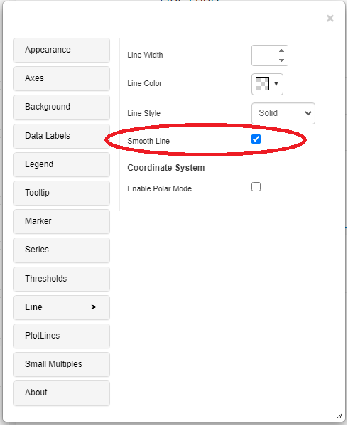
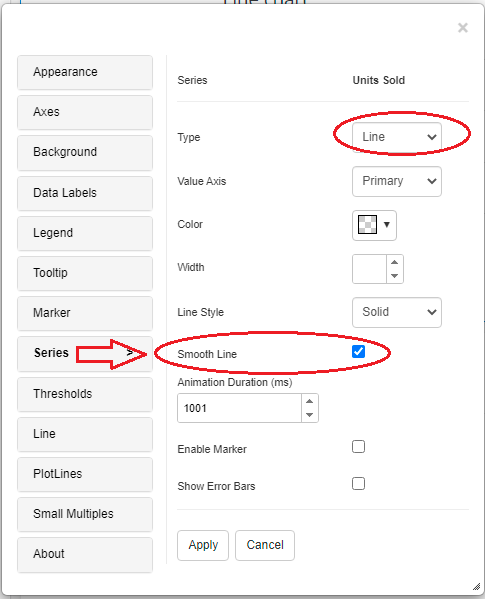
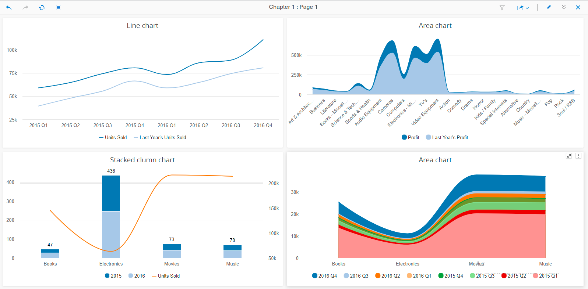

# Smooth Line

The Line Smoothening feature is added in the Vitara charts 4.8 edition. Instead of sharp curve lines, we can now use this new capability to create line charts that represent smooth curves.

## List of charts support this feature: 

* Line/Area/Sparkline charts
* Combination chart using Bar/Column charts
* Combination chart using Stacked bar/column charts

## How can we enable Smooth line feature 

Smooth Line will be available in the line settings menu in line/area/spartline charts.

<figure><figcaption></figcaption></figure>

If we use a line/area chart in the combination chart for a given series, the Smooth Line option is available in the same series option menu.

<figure><figcaption></figcaption></figure>

Below is the screenshot of charts with smooth line feature

<figure><figcaption></figcaption></figure>
