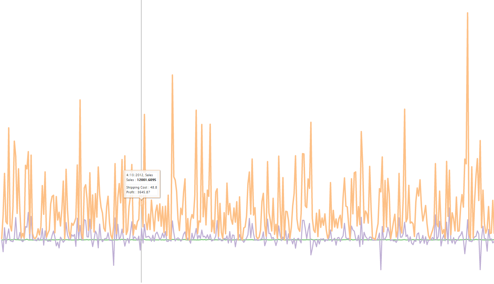
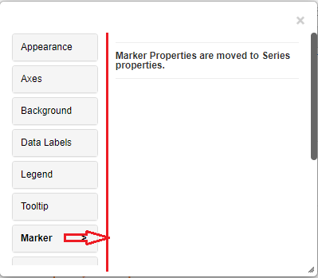
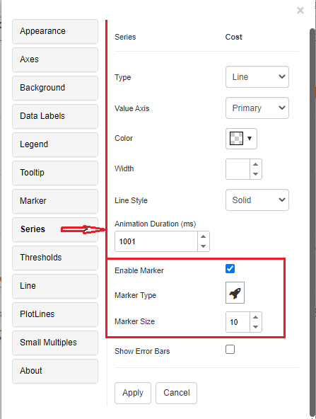
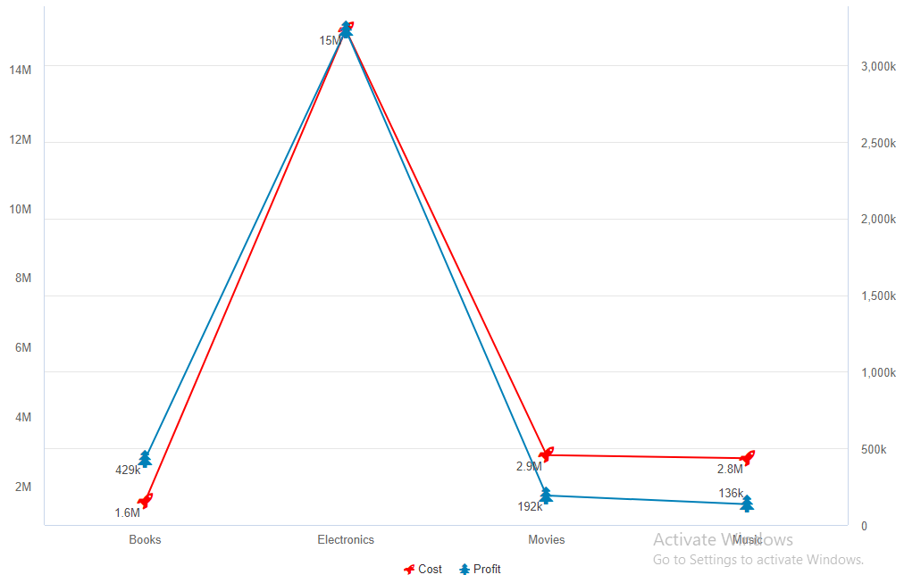
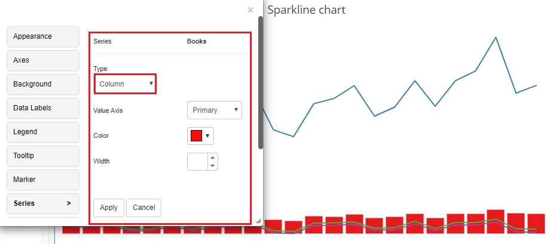
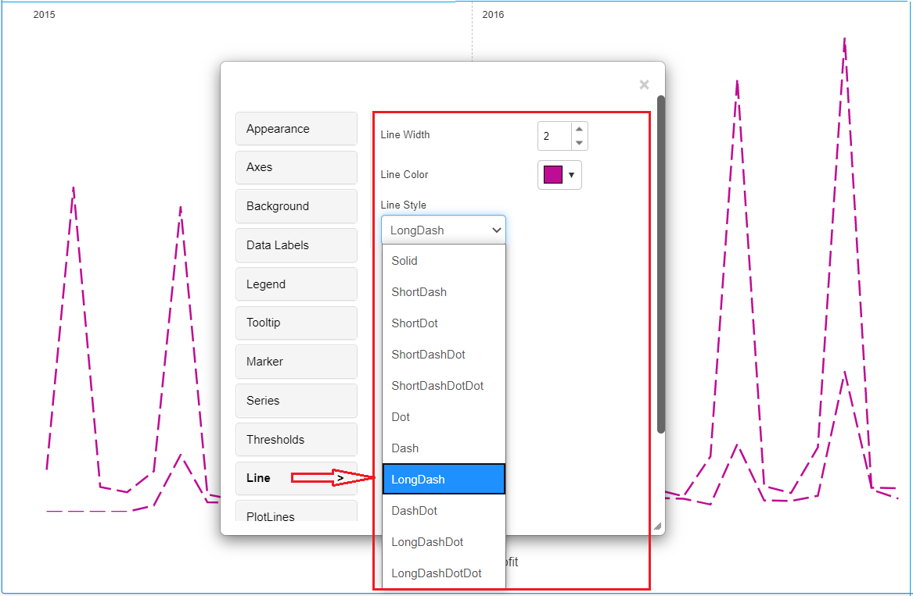
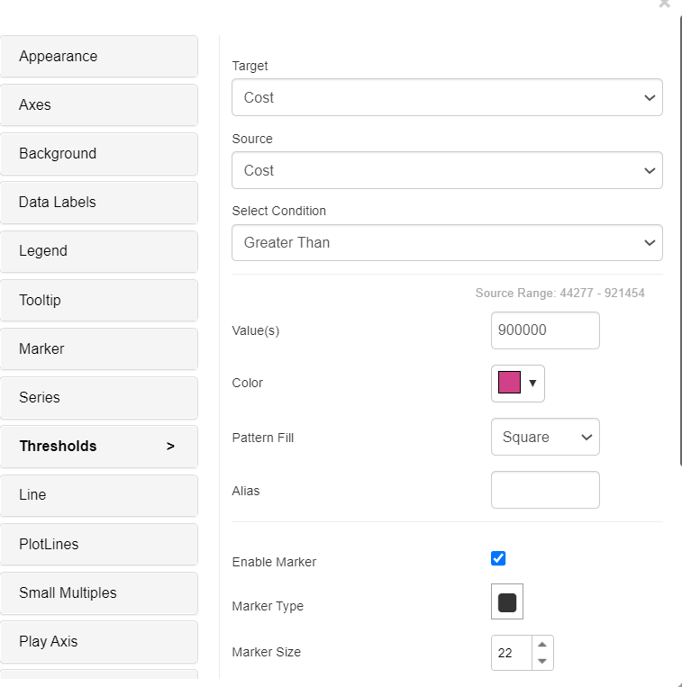
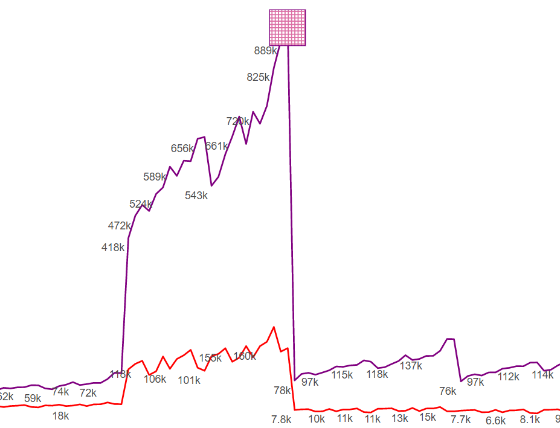
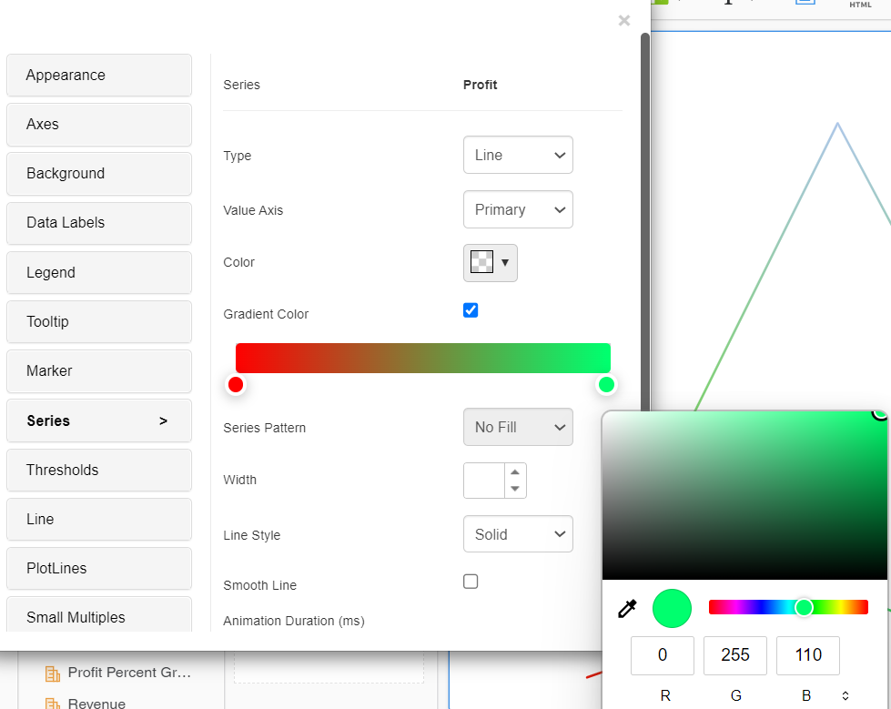
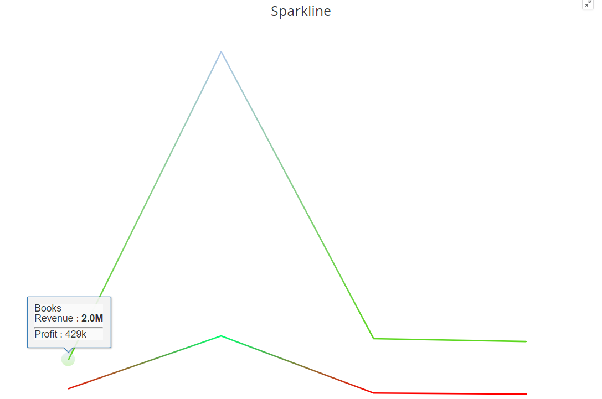

---
layout:
  title:
    visible: true
  description:
    visible: false
  tableOfContents:
    visible: true
  outline:
    visible: true
  pagination:
    visible: true
---

# Sparkline Chart

A Sparkline is a short graphic that displays trend information and is aligned with rows of some tabular data. Without taking up a lot of room, sparklines (also known as micro-charts) can provide sophisticated visualisation capabilities to tabular data.

## Inputs 

Metrics - 1 or more metrics can be added to this visualization Attributes - Minimum one attribute is required. We recommend adding one time-based attribute as a trend over time is best represented by a sparkline. However, any other attribute can also be used. Use as Filter Option - Available

<figure><figcaption></figcaption></figure>

## Markers 

Markers in sparkline charts are data points or symbols added to the line or bar graph to highlight specific values or events. They aid in pinpointing key information, such as peaks, troughs, or significant data points, making it easier for viewers to interpret and understand the trends or variations within the chart.

Marker properties have been moved to Series properties in Vitara charts as of version 4.6. The modified marker characteristics are used by all charts that support Series as Line/Area. Enable marker, Marker type, and Marker size choices are available to enable marker properties when the property editor is opened by clicking the “Edit” button and selecting the Series tab.

There are several different markers to choose from. Navigate to the “Marker” tab, select the marker type, and then click “select.” The markers’ size can also be changed. Simply type a number into the text input field labelled “Marker Size” or use the increase/decrease buttons.

Below are the screenshots with the marker options.

<figure><figcaption></figcaption></figure>

<figure><figcaption></figcaption></figure>

In the below example, the Profit metric’s line changed to line secondary axis in series property and ‘Tree’ marker is applied for the profit metric. Below is the screenshot with the marker applied in the chart.

<figure><figcaption></figcaption></figure>

## Series 

We can turn the sparkline chart into the combinational chart by changing the series type in the series tab.

<figure><figcaption></figcaption></figure>

## Line Options 

Line, Area, and Sparkline charts now have line options as of Vitara chart version 4.5. The three new options are line width, line color, and line style.

Line Width : Line width in line charts refers to the thickness or boldness of the lines used to represent data points. A wider line indicates a stronger emphasis on the data, making it more visible and easier to interpret. It can help convey trends and patterns clearly within the chart, aiding in data analysis and visualization.

Line Style: Line style in line charts refers to the specific pattern or design used for the lines connecting data points. Common line styles include solid, dashed, or dotted lines. These styles help differentiate multiple data series and convey information about the data’s characteristics, such as continuity or variability.

Line Color: Line color in line charts refers to the choice of colors used to represent different data series or lines connecting data points. It is a visual encoding technique to distinguish between various datasets, making it easier for viewers to identify and compare trends, patterns, or individual data lines within the chart.

The screenshots with the line options are shown below.

Line width - 2 Line width - Violet Line style - LongDash

<figure><figcaption></figcaption></figure>

## Thresholds 

In the business point of view, certain part of the chart needs to be highlighted to draw more attention from the desicion makers. For example, highlight the stores where total sales is greater than a specific value or highlight the top 10 products whose sales is high during last year’s winter. Thresholds are very useful objects in these use cases.

Thresholds will display some conditional formatting in a chart to highlight certain data points depending on predefined criteria.The criteria are attribute or metric qualifications. If a qualification’s expression evaluates to TRUE, the report displays the threshold. We can also include markers in thresholds.

To apply thresholds in vitara charts, hover the cursor on the chart. Vitara chart will display an ‘Edit’ button. When you click on this ‘Edit’ button the properties window will pop out. Select the thresholds tab to open threshold editor. In the window you can add a new threshold or delete any existing threshold or modify the existing threshold.

Note: From 4.6 version we can apply thresholds using attributes. The source drop down box in the threshold editor window will list all the attributes and metrics in the chart. we can select an attribute as source and define a threshold condition. The target of the threshold depends on the series of the chart. This means, if the chart series is created using metrics then target drop down box will display the metrics. If we enabled ‘color by’ mode, by adding an attribute to the ‘color by’ drop zone in the dossier’s editor panel, the chart series will be created using attributes. In this case the threshold target drop down box will show all the elements of attribute used in the color by drop zone. In this case we can set threshold target using attribute.

<figure><figcaption></figcaption></figure>

In the threshold editor window apply source, target, threshold condition and the other related information to set a threshold on the chart.

<figure><figcaption></figcaption></figure>

After giving all the inputs click on ‘Apply’ button.

From version 4.9.0, we can use pattern fill in thresholds, certain part of the chart can be filled with a pattern.

Pattern fill in a sparkling chart is employed to highlight data points that meet a predefined threshold. By applying distinct patterns to these points, users can quickly spot values above or below the set limit.

<figure><figcaption></figcaption></figure>

<figure><figcaption></figcaption></figure>

## Play-by Animation 

Play by - animation shows the chart for each element of the first attribute. For more details about the play by feature please refer to [play-by](play-animation.md).

## Background Image 

The steps to set a background image for all Vitara charts are explained in [backgroundImage](background-images.md).

## Small Multiples 

Spark Line chart supports small multiples feature. Small multiples feature is explained in [smallMultiples](small-multiples.md).

## Data Markers 

From the version 4.4, data markers feature is introduced in the Sparkline chart. To know about **Data Markers** feature please [click Here](https://docs.vitaracharts.com/readme/data-markers).

## Gradient Color 

Gradient color in line charts is a visualization technique that employs a gradual transition of colors along the lines connecting data points. It adds depth and visual interest to the chart, helping to convey additional information. For example, a gradient might represent the intensity or magnitude of a data variable. This can make it easier for viewers to perceive subtle variations and trends within the data, enhancing the overall clarity and aesthetics of the chart while providing more insights into the dataset’s nuances.

From version 5.0, Gradient color fill can be added where the series property is available.

It can be enabled by selecting options from the series tab for individual series.

<figure><figcaption></figcaption></figure>

It will show the color palette, which will have two selection handles to choose two colors that will render from beginning to end on the series. (From left to right)

<figure><figcaption></figcaption></figure>

<figure><figcaption></figcaption></figure>

## Series based Tooltip and Datalabels 

We introduced in version 5.2.4 ,the “Series-based Tooltip” and “Data Labels” features enhance chart data display. When you hover over a data series, series-based tooltips appear, revealing insights into individual data points. Data Labels, on the other hand, allow you to directly display data values on chart elements, which improves data comprehension. These characteristics are useful for expressing precise information and promoting a deeper comprehension of plotted data, making charts more informative and user-friendly.

This feature will be accessible from the “Series” tab in the chart editor menu. Users can access this tab when editing a bar/column chart. Within the “Series” tab, under the metrics two new option named “Data label and Tooltip “ is added, accompanied by a dropdown menu that allows users to select the desired formatting , by default it will be none.In the below screenshots ,I have made changes for the ‘Cost’ series.

<figure><figcaption></figcaption></figure>

<figure><figcaption></figcaption></figure>
