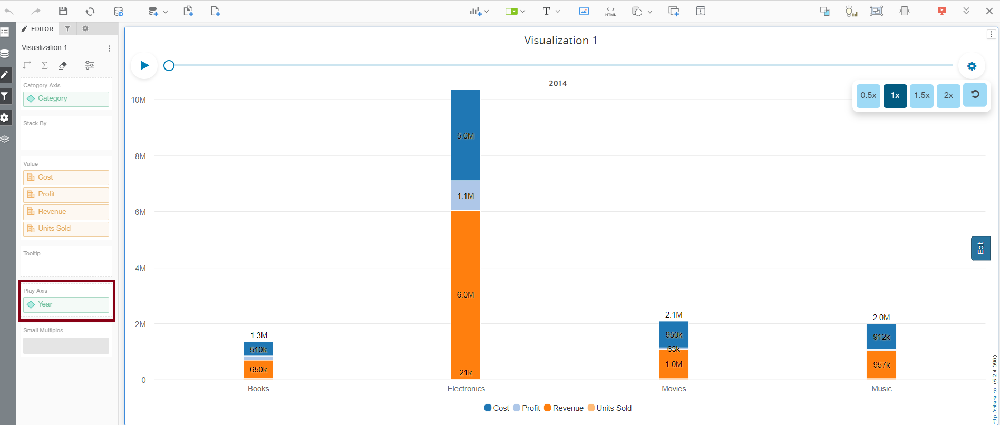
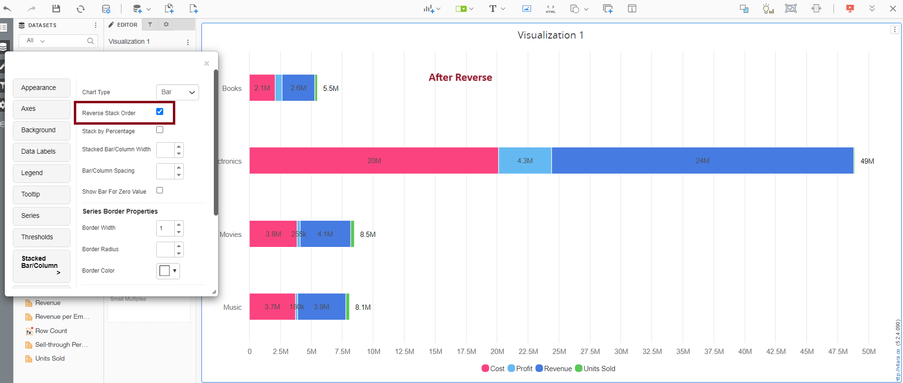

---
layout:
  title:
    visible: true
  description:
    visible: false
  tableOfContents:
    visible: true
  outline:
    visible: true
  pagination:
    visible: true
---

# Stacked Column/Bar

A stacked bar/column chart is a graphical representation where individual data values are segmented into sections, and each section is stacked on top of another, making up the total value for a specific category. It’s used to illustrate the composition and comparison of data categories while showing their cumulative total.

In stacked bar and column charts, the second attribute groups on the first attribute instead of the traditional bar and column charts, which display a separate bar or column for each element of the attribute.

There are two attributes in the sample below: Category and Quarter. The quarter attribute is grouped on the category attribute; as a result, all the quarter attribute elements are shown one above the other for each element of the Category attribute.

Metric inputs: 1 metric Attribute: A minimum of two attributes. Available Use as Filter Option.

Inputs Metrics: 1 metric Attribute: At least 2 attributes. Use as Filter Option - Available

<figure><figcaption></figcaption></figure>

## Stack by Percentage 

By default, stacked bar/column charts stack the bars based on their values. Using the ‘Stack by %’ option, we can adjust the height of the stacked bars based on their % contribution to the total stack value.

<figure><figcaption></figcaption></figure>

## Stack by Metrics 

In 4.2 release the major change in stacked bar/column is, in web documents now we can stack using metrics. Please refer the below screenshot to enable this feature.

<figure><figcaption></figcaption></figure>

## Adding a line series along with stacked bars/columns 

With the 4.5 edition of the Vitara charts, a new feature in the Stacked bar/column charts allows the user to build a metric series by stacking the attribute values on the same or separate axes. Metric series can be created in three ways: line, area, and data markers. The screenshot below shows a layered Column chart with attributes layered on one axis and a metric series \[line] produced on the other.&#x20;

<figure><figcaption></figcaption></figure>

To utilize metric series, the chart must have two attributes \[one as a category and the other as a break by] and at least two metrics \[the first metric is always used to establish the value of the bars/columns, and other metrics can be used to make the metric series]. Let’s look at how to make a metric series in the basic steps below.

### **Step 1**

Create a stacked bar/column chart with 2 attributes and metrics. Stack by attribute values \[i.e drag an attribute into ‘break by’ dropzone]. See the sample screenshot below.

<figure><figcaption></figcaption></figure>

### **Step 2**

Open the property editor and go to series tab

### **Step 3**

Scroll down to see metric selection drop-down at the bottom of the editor. Select a metric with which the series needs to be formed and click on the ‘add’ button next to it, then the series options menu will be opened. See the screenshot.\

<figure><figcaption></figcaption></figure>

### **Step 4**

Select all required options for that series and click on ‘Apply’ See the screenshot below.\

<figure><figcaption></figcaption></figure>

Then metric series will be applied on the chart in the form of ‘line graph’. See the screenshot below.\

<figure><figcaption></figcaption></figure>

## **Remove the Metric Series**

The applied series can be removed if the metric respective to that series is removed from the metric dropzone.

## Pattern Fill in Series 

Pattern fill feature in a stacked bar/column chart is utilized to enhance data differentiation. By applying unique patterns to each segment of the bars/columns, it aids in distinguishing individual components or categories within the chart. This visual enhancement is particularly helpful when dealing with multiple data series or to highlight specific data elements.

From version 4.9.0, this charts have the Pattern fill option (Grid/Square/Double Square/Slash) in the Series tab, which allows us to display data in a more presentable manner.

<figure><figcaption></figcaption></figure>

<figure><figcaption></figcaption></figure>

#### Polar Mode 

From the 4.6 version of VitaraCharts, a new feature is added in the Stacked charts where users can enable ‘Polar mode’ i.e, Stacked bar/column chart with a radial value axis. This way of using axes is called Polar coordinate system.

Let’s see how to enable ‘polar mode’ in simple steps.

**Step 1:**\
Create a Stacked Bar/Column chart with a minimum of one attribute and one metric. See the sample screenshot below.\

<figure><figcaption></figcaption></figure>

**Step 2:**\
Open the property editor and go to the ‘Stacked Bar/Column’ tab. Enable the checkbox ‘Enable Polar Mode’. See the screenshot.\

<figure><figcaption></figcaption></figure>

Then the value axis of the chart will be converted into Polar coordinates. Below screenshot shows the default behaviour of the chart with Polar coordinates.\

<figure><figcaption></figcaption></figure>

## Vertical Polar Mode 

From Version 5.2, we have introduced the new feature of Vertical Stacked Column.

Vertical polar mode in stacked column charts arranges data points in a circular pattern while using vertical columns for value representation. It’s valuable for visualizing cyclical trends across categories or time periods, enhancing insight into contributions of each segment. This technique is especially useful for showcasing cyclic data distributions and relationships in a distinctive manner.

Below are the steps to enable it. Go to the Stacked Column/Bar tab in the property editor and turn on polar mode to observe that the columns are now vertically aligned in polar mode.

<figure><figcaption></figcaption></figure>

<figure><figcaption></figcaption></figure>

**Polar Mode settings**\
Polar mode comes up four settings which include Start angle, end angle, Outer Pane Size, Inner Pane Size.\
The default settings of Polar mode are\
Start Angle: 90, End Angle: 360, Outer Pane Size: 85, Inner Pane Size:20.\
We can modify these settings anytime according to our preference. Let’s see some of the settings below\
Start angle : 0\
End angle : 270\
Outer Pane Size : 100\
Inner Pane Size : 15\
Then chart looks like the below screenshot\

<figure><figcaption></figcaption></figure>

All the axes settings available for normal Bar chart are also applicable to Polar coordinate system.

## Data labels 

We can format the data labels and Stack totals indepently. Below is the screenshots of this option.

<figure><figcaption></figcaption></figure>

From 4.6.1 version of Vitara charts, a new option ‘Identify format across the metrics’ is introduced in Data labels tab.

The number format of stack totals in stacked charts will be the same as the number format of the first statistic in the chart. If the first metric’s value is zero or nulls, the stacked chart fails to display the stack totals in the specific number format applied to the metrics.

To get over this limitation, we need to enable the ‘Identify format across metrics’ option. When we enable this attribute, the stacked chart will not rely on the number format of the first metric when establishing the number format for stack totals, but will instead examine all the metrics available in the chart.

Example:\
In the below example, all the metrics in the a stacked chart are formated to a number format to show all numbers in Millions, and everything below the million should be ‘0’.

<figure><figcaption></figcaption></figure>

 

<figure><figcaption></figcaption></figure>

In this example, the values of Profit metric are below 1 Million, so all the values of the profit metric become zeros. As a result, stacked chart fails in indentifying the number format that should be applied to the stack totals.\
Hence chart will display stack total in default number format.

Below is the screenshot when the option ‘Identify format across the metrics’ is not enabled.

<figure><figcaption></figcaption></figure>

In this use scenario, the chart should take into account not just the first metric but also the number format of other metrics in the chart to establish the number format of the stack totals. The screenshots that demonstrate how to enable the “Identify format across the metrics” option and the stacked chart that results from doing so are shown below.

<figure><figcaption></figcaption></figure>

<figure><figcaption></figcaption></figure>

## Thresholds 

In the business point of view, certain part of the chart needs to be highlighted to draw more attention from the desicion makers. For example, highlight the stores where total sales is greater than a specific value or highlight the top 10 products whose sales is high during last year’s winter. Thresholds are very useful objects in these use cases.

Thresholds will display some conditional formatting in a chart to highlight certain data points depending on predefined criteria.The criteria are attribute or metric qualifications. If a qualification’s expression evaluates to TRUE, the report displays the threshold. We can also include markers in thresholds.

To apply thresholds in vitara charts, hover the cursor on the chart. Vitara chart will display an ‘Edit’ button. When you click on this ‘Edit’ button the properties window will pop out. Select the thresholds tab to open threshold editor. In the window you can add a new threshold or delete any existing threshold or modify the existing threshold.

Note: From 4.6 version we can apply thresholds using attributes. The source drop down box in the threshold editor window will list all the attributes and metrics in the chart. we can select an attribute as source and define a threshold condition. The target of the threshold depends on the series of the chart. This means, if the chart series is created using metrics then target drop down box will display the metrics. If we enabled ‘color by’ mode, by adding an attribute to the ‘color by’ drop zone in the dossier’s editor panel, the chart series will be created using attributes. In this case the threshold target drop down box will show all the elements of attribute used in the color by drop zone. In this case we can set threshold target using attribute.

<figure><figcaption></figcaption></figure>

In the threshold editor window apply source, target, threshold condition and the other related information to set a threshold on the chart.

<figure><figcaption></figcaption></figure>

After giving all the inputs click on ‘Apply’ button.

From version 4.9.0, we can use pattern fill in thresholds, certain part of the chart can be filled with a pattern.

<figure><figcaption></figcaption></figure>

<figure><figcaption></figcaption></figure>

## Background Image 

The steps to set a background image for all Vitara charts are explained in [backgroundImage](background-images.md).

## Small Multiples 

Stacked bar/column chart supports small multiples feature. Small multiples feature is explained in [smallMultiples](small-multiples.md).

## Gradient Color 

A stacked bar/column chart’s gradient color feature lets you to apply a gradual transition of colors to the segments within each stacked bar or column. This results in a smooth transition of color from one end of the section to the other. Gradient colors can be utilized to provide the chart depth, style, and visual interest. They can also help convey additional information by highlighting key segments or data points within the chart. Gradient colors can improve the chart’s looks and make it more appealing to viewers.

From version 5.0, Gradient color fill can be added where the series property is available.

It can be enabled by selecting options from the series tab for individual series.

<figure><figcaption></figcaption></figure>

It will show the color palette, which will have two selection handles to choose two colors that will render from beginning to end on the series. (From left to right)

<figure><figcaption></figcaption></figure>

<figure><figcaption></figcaption></figure>

## Zero Value Bar 

The “zero value bar” feature in a stacked bar/column chart helps represent categories or data points with zero values. While these segments have no height, they are included in the chart to maintain proper category alignment, ensuring a complete and accurate visualization of the data.

In Version 5.1.1.010, we included a new feature that allows users to show zero value bars. This feature can be enabled under the “Stacked Bar/Column” tabs, where it can be used to display metrics, whose values are zero.

<figure><figcaption></figcaption></figure>

<figure><figcaption></figcaption></figure>

## Play Axis 

In stacked bar/column charts, we have added the “play axis” option as of version 5.2.4. This feature enables dynamic presentation of data changes across time or categories. This interactive tool illustrates the contributions made by data series to each category or time period. This is excellent for displaying dynamic insights and comprehending trends.

The play axis feature will be accessible/enabled from ‘Play axis’ tab as well as the dropzone available.User can access this when editing staked bar/column chart.Within the tab user can enable/disable data label and apply text style accordingly.User can also set speed of the cog setting available on the play axis.

<figure><figcaption></figcaption></figure>

<figure><figcaption></figcaption></figure>

## Series based Tooltip and Datalabels 

We introduced in version 5.2.4 ,the “Series-based Tooltip” and “Data Labels” features enhance chart data display. When you hover over a data series, series-based tooltips appear, revealing insights into individual data points. Data Labels, on the other hand, allow you to directly display data values on chart elements, which improves data comprehension. These characteristics are useful for expressing precise information and promoting a deeper comprehension of plotted data, making charts more informative and user-friendly.

This feature will be accessible from the “Series” tab in the chart editor menu. Users can access this tab when editing a bar/column chart. Within the “Series” tab, under the metrics two new option named “Data label and Tooltip “ is added, accompanied by a dropdown menu that allows users to select the desired formatting , by default it will be none.In the below screenshots ,I have made changes for the ‘Cost’ series.

<figure><figcaption></figcaption></figure>

<figure><figcaption></figcaption></figure>

## Reorder or Reverse 

From version 5.2.4 we have added new feature of the “reorder” or “reverse” functionality in stacked column and bar charts allows users to change the order in which data series are displayed. Reordering helps emphasize specific data categories, making it easier to focus on critical information. It is a useful feature for customization and improving the clarity of data presentation.

This feature will be accessible from the “Stacked Bar/Column” tab in the chart editor menu. Users can access this tab when want to reverse stack order in chart.

<figure><figcaption></figcaption></figure>

<figure><figcaption></figcaption></figure>

## Removing Spaces between Stacked Column 

From Version 5.2.5, removing spaces between columns in a chart is feasible through adjusting the “gap width” or “distance” parameter. By adjusting this feature, one can create a more compact visual representation with a seamless alignment of columns , allowing for a clearer and more impactful presentation of the data.

This option is available in the property editor under the ‘Stacked Bar/Column’ tab and is titled Bar/Column Spacing.

<figure><figcaption></figcaption></figure>

In the screenshot below, the spacing of columns is clearly visible in the before and after shots, however in the after image, the spacing is adjusted to ‘0’ among the columns.

<figure><figcaption></figcaption></figure>

## Adding Grid lines over Stacked Columns/Bars 

From veraion 5.2.5, we have introdcued a new feature of adding grid lines over bar/column ,stacked bar/column chart,this feature enhances clarity by aligning gridlines with the bars, aiding in precise data interpretation. Adjust the gridline appearance to suit preferences. By overlaying gridlines over the bars in polar mode, it facilitates a clearer representation of data and assists in analysis within the circular chart structure.

You may enable this functionality in the property editor by going to the ‘Axes’ tab, then ‘Value Axis’ under the ‘Other’ option and checking the ‘Show Grid Lines over Bar’ checkbox.

<figure><figcaption></figcaption></figure>

<figure><figcaption></figcaption></figure>
