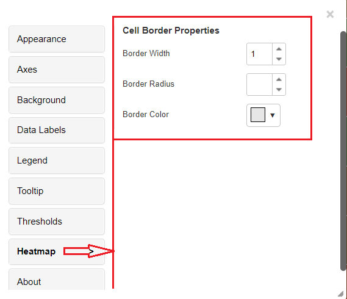
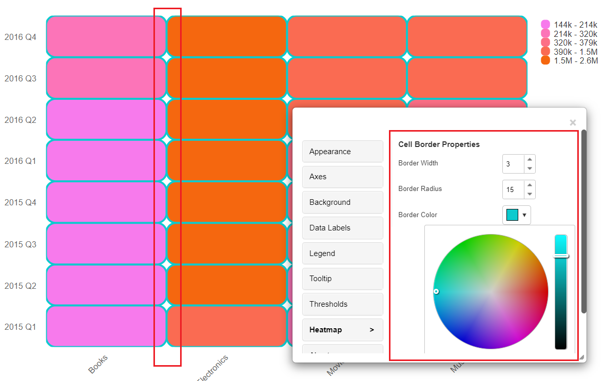
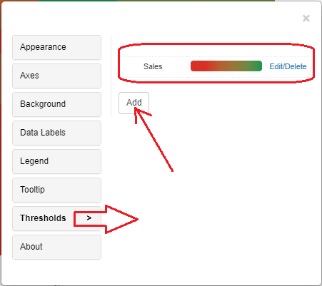
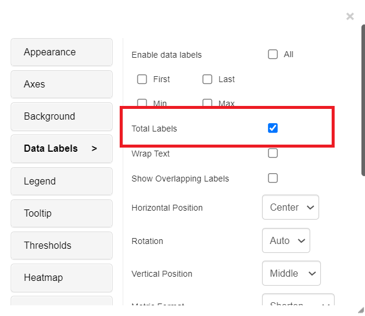
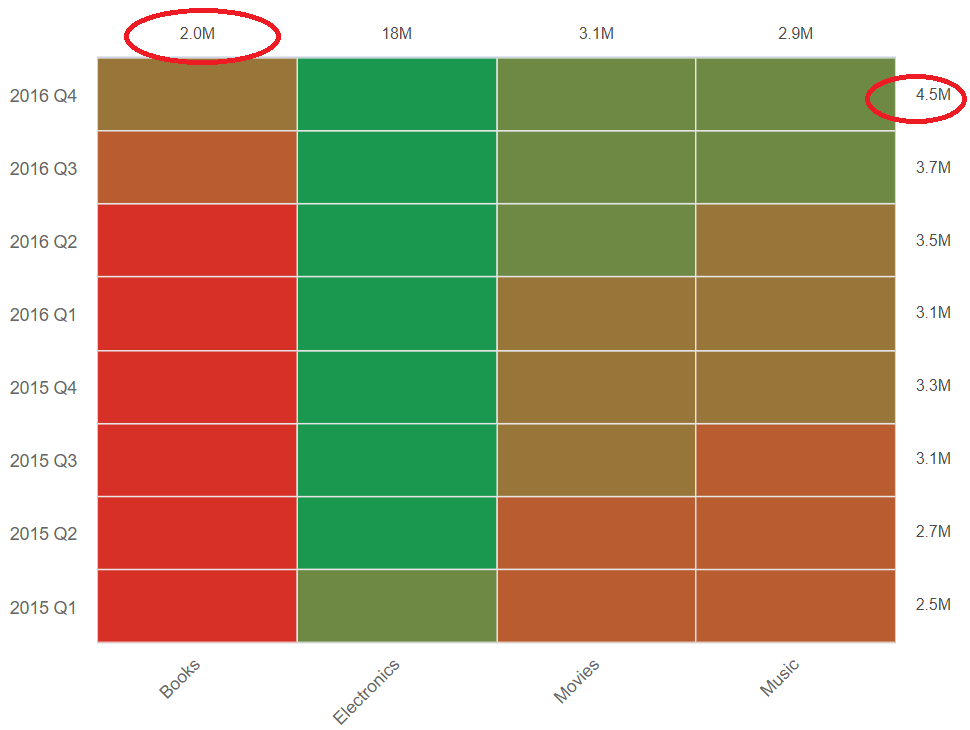

---
layout:
  title:
    visible: true
  description:
    visible: false
  tableOfContents:
    visible: true
  outline:
    visible: true
  pagination:
    visible: true
---

# Table heatmap

A heatmap is a graphical representation of data that shows a metric at the intersection of two attribute values. The custom table heatmap in VitaraCharts allows you to insert numerous attributes on the columns (axis and y-axis) and illustrate the differences in the measures at a glance. Below is an example table heatmap.

#### Inputs 

Metrics: The minimum 1 metric is required.

Attributes: A minimum of 2 attributes are required. The first attribute A1 is used for the x-axis and the second attribute A2 is used for the Y axis.

Use as Filter Option - Available

Thresholds Option - Available

<figure><figcaption></figcaption></figure>

## Heatmap 

From the 4.5 version of Vitara charts, the cell border properties are added to the heatmap chart. Border width, Border radius and Border color are the three options added in the cell border properties.

The “border radius” feature in a heatmap chart allows users to adjust the curvature of cell corners within the heatmap grid. This feature enhances visual aesthetics by providing control over the roundness of cell edges, improving the overall appearance and customization options in heatmap-based data visualizations.

The “border width” feature in a heatmap chart lets users adjust the thickness of the lines separating cells. It aids in enhancing readability, highlighting cell boundaries, and providing customization options to optimize the heatmap’s appearance, making data visualization and analysis more effective.

The “border color” feature in a heatmap chart enables users to customize the color of the lines or borders that separate individual cells or squares in the heatmap grid. This feature enhances visual distinction and allows for further customization of the heatmap’s appearance, aiding data interpretation and analysis.

<figure><figcaption></figcaption></figure>

Below is the example where the applied border properties are shown Border width - 3 Border radius - 15 Border color - Sky blue

<figure><figcaption></figcaption></figure>

## Thresholds 

In the business point of view, certain part of the chart needs to be highlighted to draw more attention from the desicion makers. For example, highlight the stores where total sales is greater than a specific value or highlight the top 10 products whose sales is high during last year’s winter. Thresholds are very useful objects in these use cases.

Thresholds will display some conditional formatting in a chart to highlight certain data points depending on predefined criteria.The criteria are attribute or metric qualifications. If a qualification’s expression evaluates to TRUE, the report displays the threshold. We can also include markers in thresholds.

To apply thresholds in vitara charts, hover the cursor on the chart. Vitara chart will display an ‘Edit’ button. When you click on this ‘Edit’ button the properties window will pop out. Select the thresholds tab to open threshold editor. In the window you can add a new threshold or delete any existing threshold or modify the existing threshold.

Note: As of version 4.6, we can use characteristics to impose thresholds. All the measurements and attributes in the chart are listed in the source drop-down box in the threshold editing window. We can choose a source attribute and specify a threshold condition.

By default, Heatmap establishes a threshold (Gradient threshold) and bases the plot colours on it. The heatmap’s threshold editor is seen in the screenshot below. The chart’s default threshold is displayed by the threshold editor. By selecting the ‘Add’ option, we can modify this threshold, delete it, and add a new one.

<figure><figcaption></figcaption></figure>

<figure><figcaption></figcaption></figure>

## Total Labels 

As of Vitara charts version 4.9.2, the heatmap chart by default shows vertical and horizontal totals.The data labels menu has an option for this feature. The data labels menu’s ‘Total Labels’ option can be enabled or disabled independently of the ‘All’ selection for the heatmap chart.

<figure><figcaption></figcaption></figure>

<figure><figcaption></figcaption></figure>

## Background Image 

The steps to set a background image for all Vitara charts are explained in backgroundImage.
