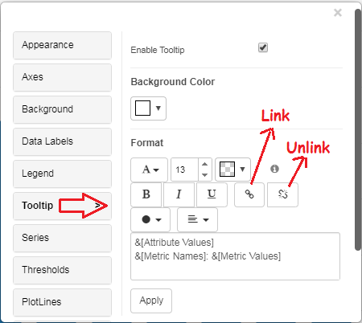
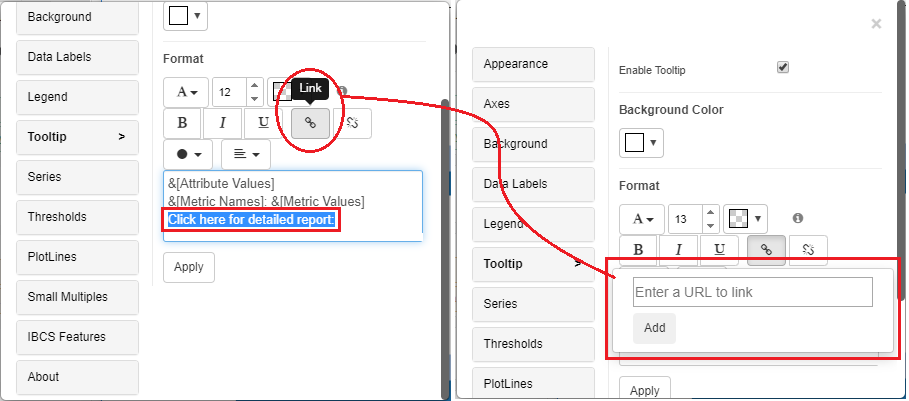
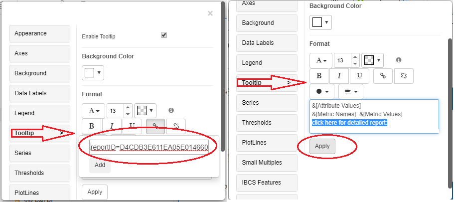
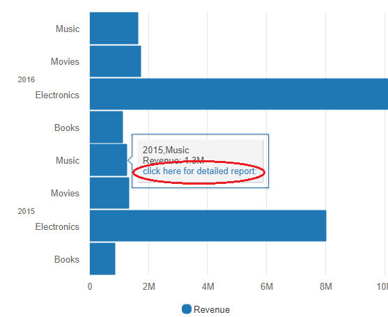
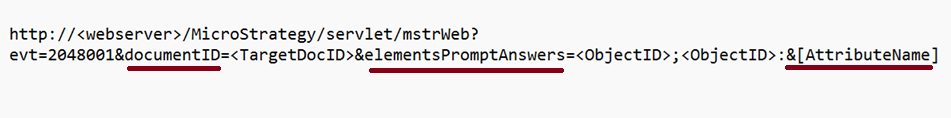
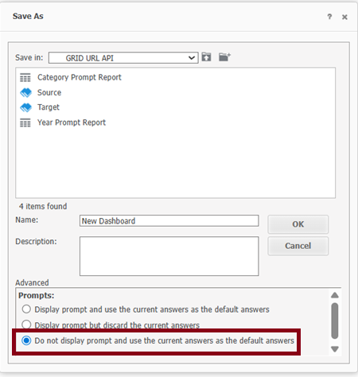
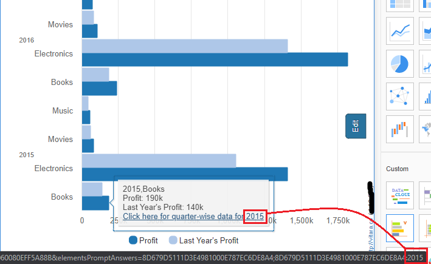
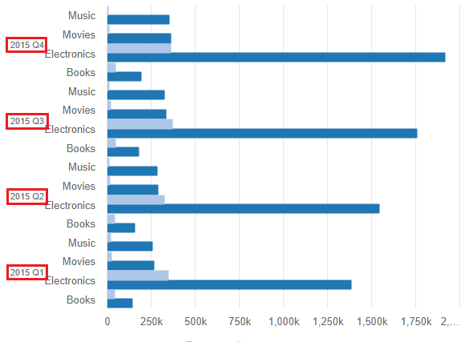
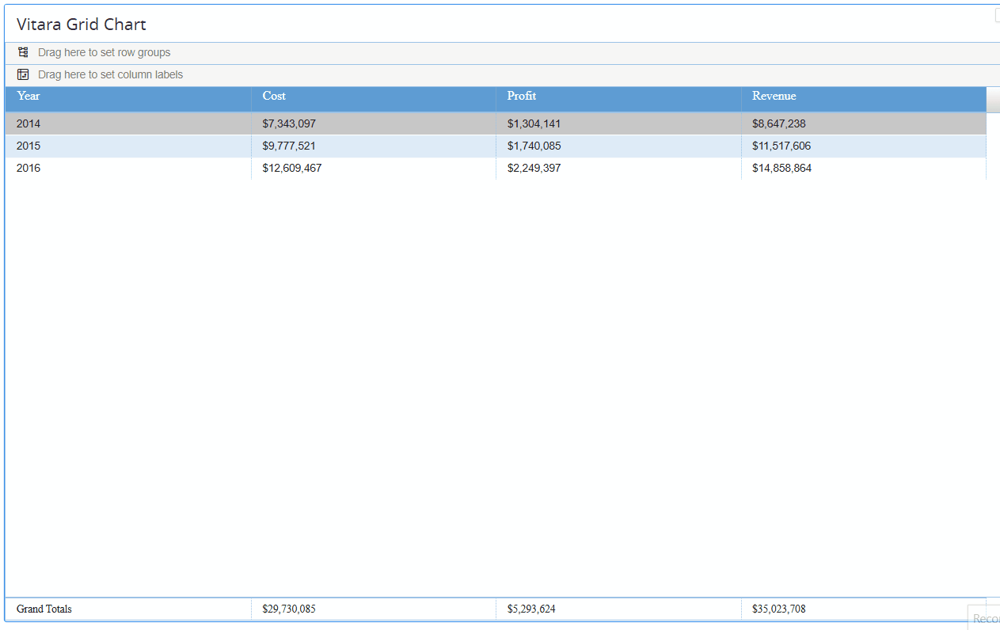

# Tooltip Links

We may now specify Tooltip Links in the Vitara Charts as of version 4.3. A tooltip will appear on any Vitara chart when the cursor is hovered over it. Links can be created to the text that appears in the tooltip. All Vitara charts—aside from the KPI Ring, Grid, and Micro Charts—support the tooltip links functionality.

## Steps to set Tooltip Links in Vitara Charts 

### **Step 1:**

Hover the pointer over any of the vitara charts to reveal the Edit button. To access the properties window, click the Edit button.

### **Step 2:**

Activate the Tooltip menu. Two icons for the link and unlink features are present in the tooltip menu, as seen in the screenshot below.&#x20;

<figure><figcaption></figcaption></figure>

Select the tooltip text for which the link needs to be included in the tooltip editor box. Alternatively, manually insert text in the tooltip window (for example, ‘click here for detailed report’), select the text, and click on the link icon, as seen in the screenshot below. After that, a new ‘Enter a URL to link’ window will appear.&#x20;

<figure><figcaption></figcaption></figure>

### **Step 3:**

Enter the link URL in the ‘Enter a URL to link’ field. The URL can point to a report, a document/dossier, or a website. Now, click the Add button, followed by the Apply button. In the screenshot below, for example, a link to a microstrategy report has been added.&#x20;

<figure><figcaption></figcaption></figure>

### **Step 4:**

Hover the mouse over the chart to reveal the tooltip, then click on the words for which the link was created. The URL of the link will then be accessed in a new browser tab. This allows the user to add as many links as they want.&#x20;

<figure><figcaption></figcaption></figure>

## Tooltip links support for URL API

The URL API in MicroStrategy allows you to pass parameters, prompts, or filters dynamically through a URL and control how  documents, or dossiers open in MicroStrategy .

For example, a user may want to pass the Year value from one dashboard to another. By doing so, when a specific Year is selected in the Source dashboard, the Target dashboard will automatically open and display the corresponding quarterly statistics for that Year

URL API link as follows:

<figure><figcaption></figcaption></figure>

### Example Scenario: Steps to Create a URL API

#### 1. Create an Element Prompt

* Create an Element Prompt (attribute element list) using the Year attribute.
* Build a report using this Year element prompt, including all required attributes and metrics

#### 2. Create a ‘Source’ Dashboard

* Create a dashboard from this report and save it as **Source**.
* Add the Year attribute and any required attributes and metrics.
* While saving, make sure to select the highlighted option in the screenshot.

This option ensures that prompts are not displayed when navigating between dashboards

<figure><figcaption></figcaption></figure>

#### 3. Create a ‘Target’ Dashboard

* Using the same report, create another dashboard and save it as **Target**.
* Add the Quarter attribute and any other required attributes and metrics that should appear in the Target dashboard.
*   &#x20;From the Target Dashboard:\
    Right-click → Properties → Copy Document ID\

    Below is the screenshot for reference

<figure><figcaption></figcaption></figure>

#### 4. Get Object IDs

* Copy the Object ID for the respective attribute (in this example, Year) from the project.
* This Object ID will be used in the URL API structure to map the selected attribute value to the Target dashboard.

<figure><figcaption></figcaption></figure>

#### 5. Form the URL API

**URL API** structure:

http://\<webserver>/MicroStrategy/servlet/mstrWeb?evt=2048001\&documentID=\<TargetDocID>\&elementsPromptAnswers=\<ObjectID>;\<ObjectID>:&\[AttributeName]

**With example IDs** filled in:

http://\<webserver>/MicroStrategy/servlet/mstrWeb?evt=2048001\&documentID=3C7CB37A11EA1D9732060080EFF5A888\&elementsPromptAnswers=8D679D5111D3E4981000E787EC6DE8A4;8D679D5111D3E4981000E787EC6DE8A4:&\[Year]

#### 6. Add the URL API Link

* In the **Source** dashboard, add this **URL API** link to the tooltip link.
* Save the Source dashboard.\

When you hover over the tooltip link for a specific Year (e.g., 2015), the Year value in the URL API is automatically updated to reflect the selected Year. This ensures that the correct filter value is dynamically passed to the Target dashboard.

<figure><figcaption></figcaption></figure>

After clicking on the year:2015 tooltip link, the quarterly statistics for 2015 will be displayed in the target document/dossier

<figure><figcaption></figcaption></figure>

## Unlink: 

There are two methods for removing the linkages.

1. Select the text on which the link is applied in the tooltip editing box, then click the Unlink icon. This eliminates the link that was applied specifically to that text.
2. Click the unlink button without first selecting the tooltip text. This removes all of the links that were previously applied. Select the Apply button.

### Define URL API in Column Data

Instead of using a tooltip, you can also configure the URL API link directly on column values in a Grid chart.

For example:

* When a user clicks on the Year "2014" in the Grid chart, they will be redirected to the Target dashboard showing quarterly data for that year.\

**Steps**

1. Open the Grid Chart Custom Editor in the Source dashboard.
2. Select the Year column, hold down the Ctrl key and left-click on the attribute header to activate the Custom Editor Panel.
3. Click Insert Link and paste the URL API link (created in the earlier steps).
4. Save the dashboard.

Now, clicking on the Year value in the Grid chart will redirect the user to the Target dashboard, with the selected Year passed as a filter.

&#x20;Refer to the attached GIF file for visual reference.

<figure><figcaption></figcaption></figure>

