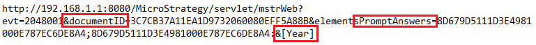
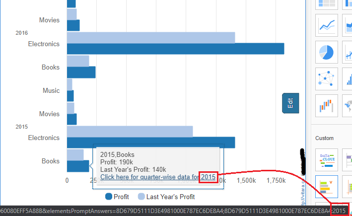
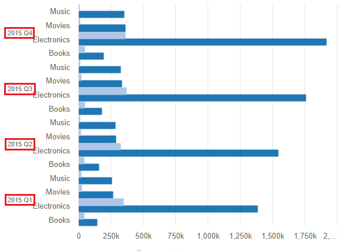

# Tooltip Links

We may now specify Tooltip Links in the Vitara Charts as of version 4.3. A tooltip will appear on any Vitara chart when the cursor is hovered over it. Links can be created to the text that appears in the tooltip. All Vitara charts—aside from the KPI Ring, Grid, and Micro Charts—support the tooltip links functionality.

## Steps to set Tooltip Links in Vitara Charts 

### **Step 1:**

Hover the pointer over any of the vitara charts to reveal the Edit button. To access the properties window, click the Edit button.

### **Step 2:**

Activate the Tooltip menu. Two icons for the link and unlink features are present in the tooltip menu, as seen in the screenshot below.&#x20;

<figure><figcaption></figcaption></figure>

Select the tooltip text for which the link needs to be included in the tooltip editor box. Alternatively, manually insert text in the tooltip window (for example, ‘click here for detailed report’), select the text, and click on the link icon, as seen in the screenshot below. After that, a new ‘Enter a URL to link’ window will appear.&#x20;

<figure><figcaption></figcaption></figure>

### **Step 3:**

Enter the link URL in the ‘Enter a URL to link’ field. The URL can point to a report, a document/dossier, or a website. Now, click the Add button, followed by the Apply button. In the screenshot below, for example, a link to a microstrategy report has been added.&#x20;

<figure><figcaption></figcaption></figure>

### **Step 4:**

Hover the mouse over the chart to reveal the tooltip, then click on the words for which the link was created. The URL of the link will then be accessed in a new browser tab. This allows the user to add as many links as they want.&#x20;

<figure><figcaption></figcaption></figure>

## Tooltip links support for URL API 

Tooltip links can be upgraded to support URL API with dynamically changing urls by using macros.

To add the links, repeat steps 1, 2, 3, and 4 from the previous section.

For instance, suppose you have a dossier with the attributes year, category, and metrics profit, last year’s profit. And if you want to see the quarterly statistics for a specific year in another document/dossier, the link that needs to be included should be as follows.

<figure><figcaption></figcaption></figure>

\
In the above URL, macros for the year property are utilized, so that clicking on the tooltip link of a certain data point will transmit the associated year value to answer the ‘year prompt’ in the target document/dossier.

When we hovered over the year:2015 tooltip link in the screenshot below, the year in the URL API was also modified to 2015.&#x20;

<figure><figcaption></figcaption></figure>

After clicking on the year:2015 tooltip link, the quarterly statistics for 2015 will be displayed in the target document/dossier.&#x20;

<figure><figcaption></figcaption></figure>

## Unlink: 

There are two methods for removing the linkages.

1. Select the text on which the link is applied in the tooltip editing box, then click the Unlink icon. This eliminates the link that was applied specifically to that text.
2. Click the unlink button without first selecting the tooltip text. This removes all of the links that were previously applied. Select the Apply button.
