# Tornado Chart

Tornado diagrams or charts are a subset of Bar charts in which the data categories are listed vertically rather than horizontally, and the categories are ordered so that the largest bar appears at the top of the chart, the second largest appears second from the top, and so on when sorted descendingly. They are so named because the final chart looks like one half of a complete tornado. They are excellent for representing two values that must be compared across any dimension.

#### Inputs 

Metrics: 2 metrics are required. Attributes: 1 or more attributes are required. Use as Filter Option - Available

In the example below Profit and Profit Forecast are represented by the bars over time attribute Month. Also, the chart below is sorted by Profit in descending order in the editor section.

<figure>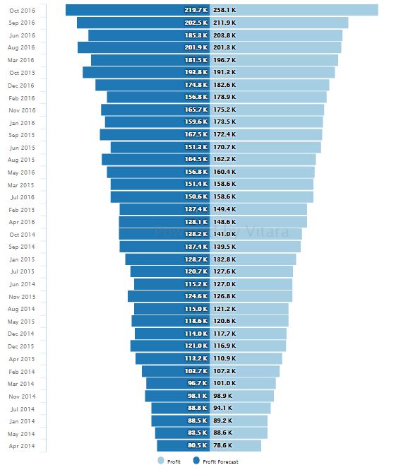<figcaption></figcaption></figure>

#### Series 

We can make the sparkline chart as a combinational chart by changing the series type in the series tab. Instead of a bar, we can make a chart to show either line/area/column/scatter.

From version 4.9.0, this charts have the Pattern fill option (Grid/Square/Double Square/Slash) in the Series tab, which allows us to display data in a more presentable manner.

<figure>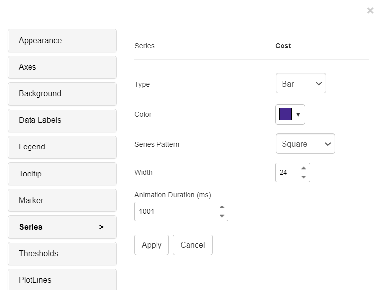<figcaption></figcaption></figure>

<figure>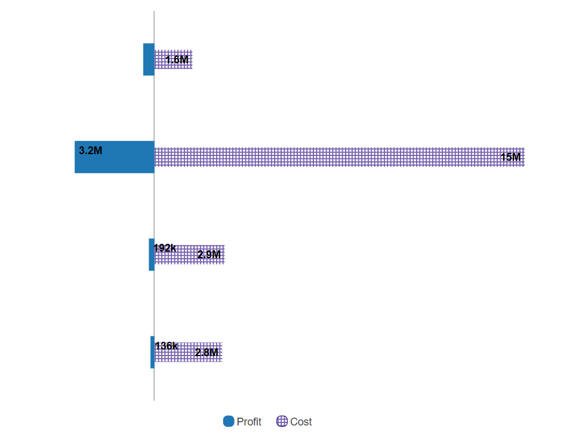<figcaption></figcaption></figure>

#### Markers 

In the case when tornado chart series is changed to either line/scatter/area, we can change the marker to any shape listed in ‘marker type’ in the ‘marker’ tab.

#### Thresholds 

In the business point of view, certain part of the chart needs to be highlighted to draw more attention from the desicion makers. For example, highlight the stores where total sales is greater than a specific value or highlight the top 10 products whose sales is high during last year’s winter. Thresholds are very useful objects in these use cases.

Thresholds will display some conditional formatting in a chart to highlight certain data points depending on predefined criteria.The criteria are attribute or metric qualifications. If a qualification’s expression evaluates to TRUE, the report displays the threshold. We can also include markers in thresholds.

To apply thresholds in vitara charts, hover the cursor on the chart. Vitara chart will display an ‘Edit’ button. When you click on this ‘Edit’ button the properties window will pop out. Select the thresholds tab to open threshold editor. In the window you can add a new threshold or delete any existing threshold or modify the existing threshold.

Note: From 4.6 version we can apply thresholds using attributes. The source drop down box in the threshold editor window will list all the attributes and metrics in the chart. we can select an attribute as source and define a threshold condition. The target of the threshold depends on the series of the chart. This means, if the chart series is created using metrics then target drop down box will display the metrics. If we enabled ‘color by’ mode, by adding an attribute to the ‘color by’ drop zone in the dossier’s editor panel, the chart series will be created using attributes. In this case the threshold target drop down box will show all the elements of attribute used in the color by drop zone. In this case we can set threshold target using attribute.

<figure>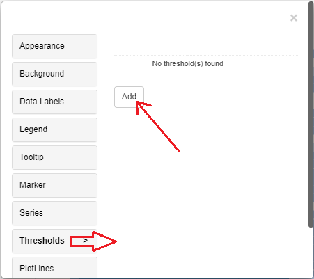<figcaption></figcaption></figure>

In the threshold editor window apply source, target, threshold condition and the other related information to set a threshold on the chart.

<figure>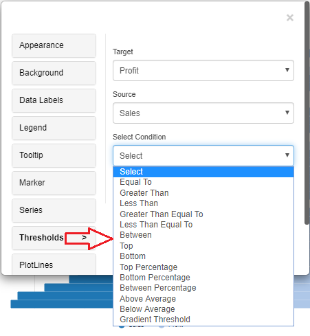<figcaption></figcaption></figure>

After giving all the inputs click on ‘Apply’ button.

From version 4.9.0, we can use pattern fill in thresholds, certain part of the chart can be filled with a pattern.

<figure>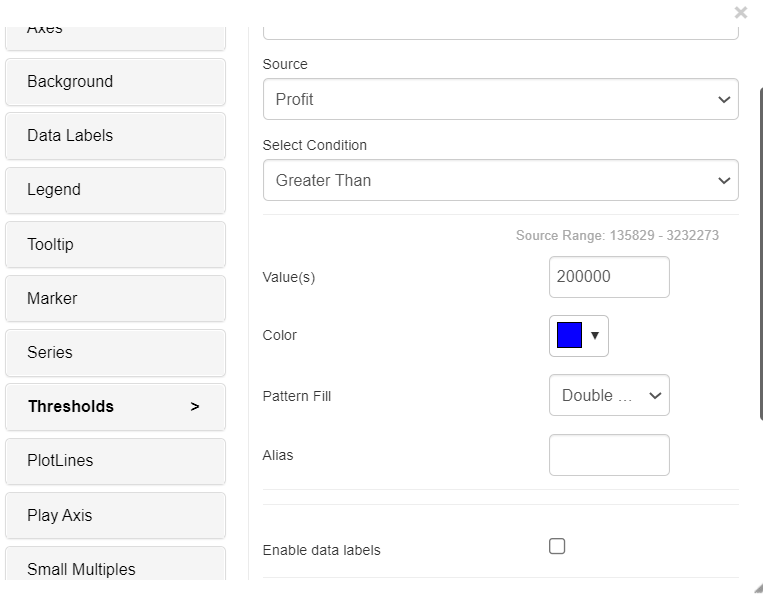<figcaption></figcaption></figure>

<figure>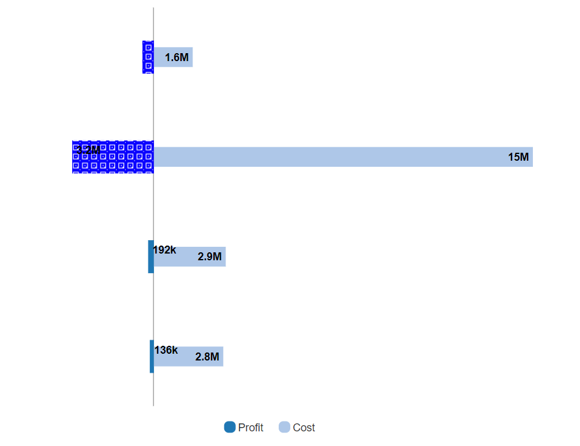<figcaption></figcaption></figure>

#### Play-by Animation 

Play by - animation shows the chart for each element of the first attribute. For more details about the play by feature please refer to [play-by](play-animation.md).

#### Background Image 

The steps to set a background image for all Vitara charts are explained in [_backgroundImage_](background-images.md).

#### Small Multiples 

Tornado supports small multiples feature. Small multiples is explained in [_smallMultiples_](small-multiples.md).

#### Gradient Color 

Gradient color in a tornado chart helps illustrate variable impact. It assigns colors to bars based on the magnitude of influence: darker colors represent greater impact, lighter colors signify less. This visual aid makes it easier to identify key factors, aiding decision-makers in assessing risks and making informed choices in fields like finance and data analysis.

From version 5.0, Gradient color fill can be added where the series property is available.

It can be enabled by selecting options from the series tab for individual series.

<figure><figcaption></figcaption></figure>

It will show the color palette, which will have two selection handles to choose two colors that will render from beginning to end on the series. (From left to right)

<figure>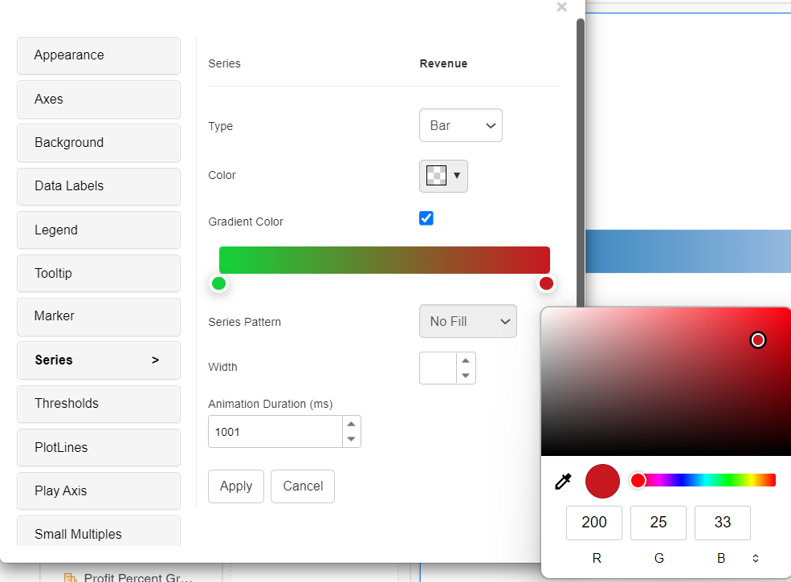<figcaption></figcaption></figure>

<figure>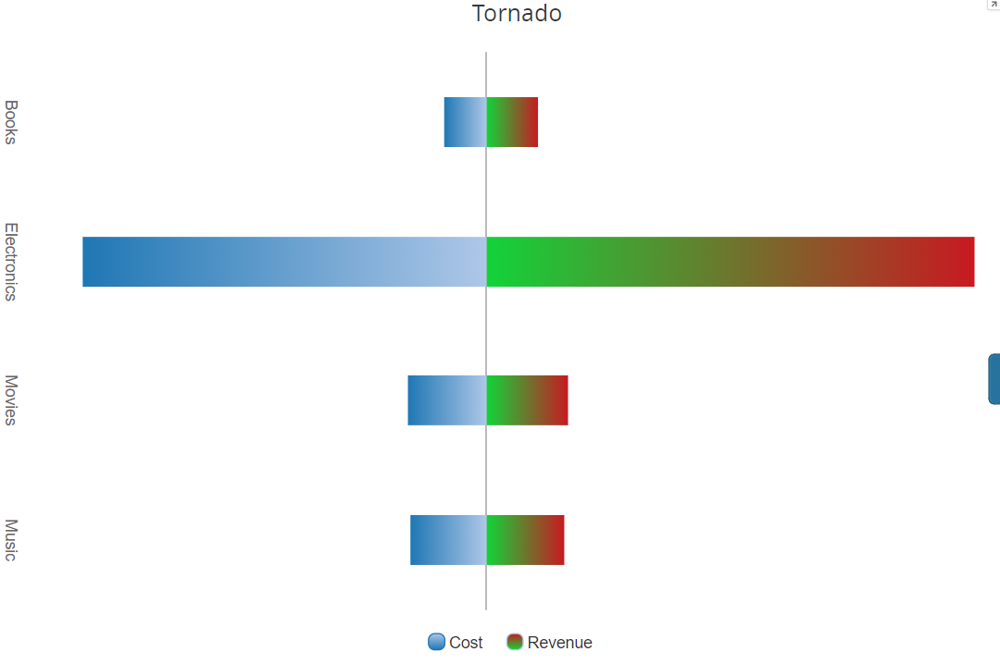<figcaption></figcaption></figure>

#### Zero Value Bar 

A zero-value bar in a tornado chart represents variables that have no impact on the outcome, helping users identify and disregard insignificant factors in decision-making or risk assessment.

In Version 5.1.1.010, we included a new feature that allows users to show zero value bars. This feature can be enabled under the “Tornado” tabs, where it can be used to display metrics, whose values are zero.

<figure>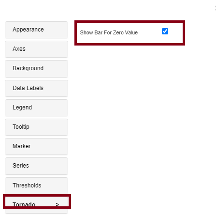<figcaption></figcaption></figure>

<figure>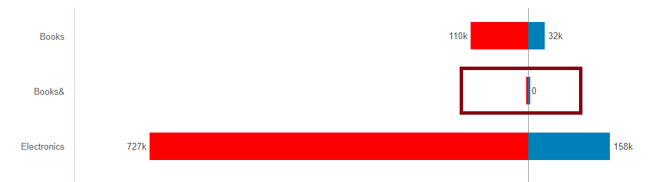<figcaption></figcaption></figure>

#### Series based Tooltip and Datalabels 

We introduced in version 5.2.4 ,the “Series-based Tooltip” and “Data Labels” features enhance chart data display. When you hover over a data series, series-based tooltips appear, revealing insights into individual data points. Data Labels, on the other hand, allow you to directly display data values on chart elements, which improves data comprehension. These characteristics are useful for expressing precise information and promoting a deeper comprehension of plotted data, making charts more informative and user-friendly.

This feature will be accessible from the “Series” tab in the chart editor menu. Users can access this tab when editing a bar/column chart. Within the “Series” tab, under the metrics two new option named “Data label and Tooltip “ is added, accompanied by a dropdown menu that allows users to select the desired formatting , by default it will be none.In the below screenshots ,I have made changes for the ‘Cost’ series.

<figure>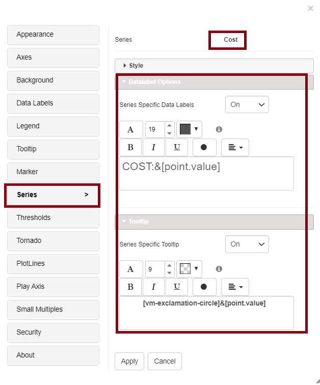<figcaption></figcaption></figure>

<figure><figcaption></figcaption></figure>
