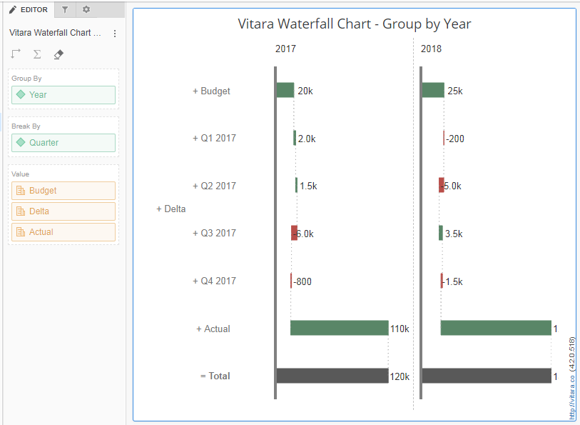

---
layout:
  title:
    visible: true
  description:
    visible: false
  tableOfContents:
    visible: true
  outline:
    visible: true
  pagination:
    visible: true
---

# Waterfall Chart

A waterfall chart is a type of data visualisation that shows the cumulative effect of consecutively added positive or negative numbers. If the values are not predefined or flexible, such as starting budget, quarterly spend (YTD), and remaining budget, the number of quarters elapsed cannot be predetermined at build time. Vitara provides a waterfall widget version that includes a starting metric and the cumulative sum of all successive metrics, which results in a total bar. The chart provides plot possibilities depending on certain metrics. The property editor provides a list of metrics; each statistic can be extended to select plot settings.We have the Non-Additive option, which means that we cannot include the starting value in the total value, and the Auto compute total option, which means that we can disable the total value in the chart.

## Inputs 

**Attributes:** Optional. For the attribute, there are two drop zones. The ‘group by’ and ‘break by’ drop zones. Attributes are only required if we wish to establish groups based on attribute values or divide metrics based on attribute values. We can also use both properties together. If you wish to see the metric break up over attribute elements, place an attribute in the ‘break by’ drop zone. The metric values for each attribute element will be displayed in incremental order. To make small multiples, drag an attribute into the ‘group by’ zone. Click here to learn more about small multiples. [here](small-multiples.md)

**Metrics:** A minimum of two metrics must be used. The first metric, M1, is used as the starting value, while the second metric, M2, is utilized to add or remove from the starting value. The final bar (Total) represents the total of metric M1 and metric M2.

Option to use as a filter - not available.

The group by and break by features are described using the following data in the example below.

<figure><figcaption></figcaption></figure>

**Break by:** If we drop the quarter property in the ‘break by’ drop zone, the chart will default to using the first value of the first measure as the start value. We can also alter it to total or last value if we like. The second metric will be displayed in the break by the quarter attribute format. In our example, the quarterly Delta metric values are added/subtracted in four steps: Q1, Q2, Q3, and Q4. The third metric will be a total of the first and second metrics. Total is the default function for the third metric. We can also apply a break to individual indicators.

<figure><figcaption></figcaption></figure>

**Group by:** When we add an attribute to a group using Dropbox, a separate chart is created for each piece of the attribute. The year attribute is added to the group by drop zone in the preceding example. The year attribute is made up of two elements: 2015 and 2016. The chart will now display the results sorted by year attribute, i.e. quarterly data for 2015 and quarterly data for 2016.

<figure><figcaption></figcaption></figure>

## Appearance 

We can change the appearance of the waterfall chart by changing the bar colours and width. **1. Colours of the bars** We can change the colour of the bars in the Vitara waterfall chart. They are the colour of the up value, the colour of the down value, and the colour of the total bar. These options can be found in the Appearance tab. See the screenshot below for the bar colours that we chose. Green is the up colour, red is the down colour, and blue is the total colour.&#x20;

<figure><figcaption></figcaption></figure>

**2. The width of the bar** In the waterfall chart, we can also change the width of the bars. To change the width of the bars, go to the appearance tab and enter a value (for example, 10) in the Bar/Column Width input area. Compare the bar width(10) in the screenshot below to the bar width in the screenshot above.&#x20;

<figure><figcaption></figcaption></figure>

## Vertical/Horizontal Waterfall 

In the Waterfall chart, we have a ‘Invert Axes’ option that allows us to flip between Vertical and Horizontal Waterfall charts.

**1. Waterfall in the Vertical** The ‘Invert Axes’ option is enabled by default, which results in a Vertical Waterfall chart. Vertical waterfall charts have horizontally oriented bars with the category axis shown on a vertical axis. Please see the screenshot below.

<figure><figcaption></figcaption></figure>

**2. Waterfall Horizontal** Simply uncheck the ‘Invert Axes’ item to use the Horizontal waterfall chart. The bars in the Horizontal waterfall chart are vertical, and the category axis is presented on a horizontal axis. Take a look at the image below:&#x20;

<figure><figcaption></figcaption></figure>

## Axes 

‘Auto Compute Start Value’ is a unique feature for the value axis in the waterfall chart. This setting will be helpful if we are unsure of which value should be set as the start value and the first metric value in the chart is comparably much larger than the succeeding metric values. Axes > Value axis > Start Value is where you can change this parameter. This option’s deactivated mode is the default state. View the ensuing screenshot.&#x20;

<figure><figcaption></figcaption></figure>

Below is the screenshot which shows how the chart looks before and after enabling ‘Auto Compute Start Value’

<figure><figcaption></figcaption></figure>

If you noticed the above screenshot, the start value in value axis and bar lengths are different. Also the space between the category axis line and bars has also changed.

## Data Labels 

In the 4.4 edition, a feature is added to the waterfall chart that allows the data labels to be displayed outside of the bar/column. The ‘Show Label Outside Bar/Column’ checkbox is available in the data labels tab. See the image below.&#x20;

<figure><figcaption></figcaption></figure>

This feature is enabled by default for charts created after 4.1. The screenshot below depicts how the data labels appear after enabling the ‘Show Label Outside Bar/Column’ option.&#x20;

<figure><figcaption></figcaption></figure>

The option ‘Show Label Outside Bar/Column’ is tied to horizontal data label positions. For example, if the data label is set to appear outside the bar/column, the horizontal data label locations right, left, and centre will have no effect on the chart.

## Creating Groups and group settings: 

The idea of group creation in the waterfall chart is introduced in release 4.2. Metrics of the same kind can be grouped. For instance, group all the measures related to revenue and all the indicators related to expenses. The net profit/loss statement is produced by adding these groups collectively.

## **1. The default Group:**

A default group is formed by all of the metrics in the chart. We can add new metrics to this default group as well as remove metrics from it. When we add a new metric to a dossier or document, it is placed in the default group. From the metrics in the default group, we may construct a new group. The screenshot below shows the default group when the waterfall chart is given three metrics: Budget, Delta, and Actual.

<figure><figcaption></figcaption></figure>

We can rename the default group or any other group. Place the cursor in the group name text input box and type the text you want as the group name.

### **2. Group Settings:**

Each group will have two options. 1. Add subTotal and 2. Deduct Value. Expand the ‘Group Settings’ tab to get these options.

<figure><figcaption></figcaption></figure>

#### **Add Subtotal:**

We can create a bar for each group displaying the subtotal of that specific group. Enable the ‘Add Subtotal” check box.

#### **Deduct Value:**

The cumulative sum of the metrics/metric groups in the chart will be computed by the waterfall graphic. If we wish to subtract any metric/metric group value from this total, we can do so by selecting the ‘Deduct Value’ option in that group. For example, in order to construct the profit/loss statement, we must deduct expenses from revenues. In this case, we must enable ‘Deduct Value’ for the expense-related metric/metric group.

### **3. Creating New groups:**

To create a new group of metrics please refer the below screenshots.

<figure><figcaption></figcaption></figure>

<figure><figcaption></figcaption></figure>

By default all the metrics in the chart will be in the default group. To add metrics to the new group drag and drop the metrics from the default group into the newly created group.

Each group will have its own ‘Group settings’ option and option to create a new group.

<figure><figcaption></figcaption></figure>

## Plot line 

From 4.8.0 version, we’ve introduced plotlines feature to the waterfall chart , plotlines can be added on metric sources in waterfall chart.

<figure><figcaption></figcaption></figure>

 

<figure><figcaption></figcaption></figure>

## Background Image 

The steps to set a background image for all Vitara charts are explained in [_backgroundImage_](background-images.md).

## Small Multiples 

When we apply an attribute in the ‘Group by’ drop zone in Vitara charts 4.1, the waterfall chart by default supports small multiple features. To turn off small multiples, enter the property editor by selecting the ‘Edit’ button. The property editor is seen in the screenshot below.

<figure><figcaption></figcaption></figure>

Disable the checkbox ‘Enable Small Multiples’.

Small multiples is explained in [_smallMultiples_](small-multiples.md).

## Zero Value Bar 

In Version 5.1.1.010, we included a new feature that allows users to show zero value bars. This feature can be enabled under the “Waterfall” tabs, where it can be used to display metrics, whose values are zero.

<figure><figcaption></figcaption></figure>

<figure><figcaption></figcaption></figure>

## Enhanced Data Label Placement for Waterfall Charts 

In the latest update, a new and highly anticipated feature has been introduced to the dataLabels tab, specifically tailored for waterfall charts. This enhancement allows users to precisely control the placement of data labels for negative and positive values, offering a more granular and intuitive representation of data in waterfall charts.

### **Feature Details**

The key highlight of this update is the introduction of a new option that enables users to display negative values (i.e., values below the zero line) at the bottom of the bar, while positive values are shown on top of the bar. This feature is specifically designed to enhance the visual clarity of waterfall charts, providing users with a more insightful representation of data distribution.

This feature is exclusively available for waterfall charts and can be accessed within the dataLabels tab. To activate this enhanced placement option, users must also have the “Show Label Outside Bar/Column” option enabled.

### **Implementation**

To implement this feature, navigate to the dataLabels tab and locate the newly added option “Show Negative Value Label Below Bar/Column” related to the placement of negative and positive values. By selecting this option and ensuring that “Show Label Outside Bar/Column” is enabled, users can effortlessly enhance the presentation of their waterfall charts.

<figure><figcaption></figcaption></figure>

Consider a scenario where a waterfall chart represents financial data, including positive and negative values. With the new feature enabled, negative values (e.g., expenses) are displayed at the bottom of the bar, emphasizing their impact, while positive values (e.g., profit) are showcased prominently on top of the bar.

<figure><figcaption></figcaption></figure>
