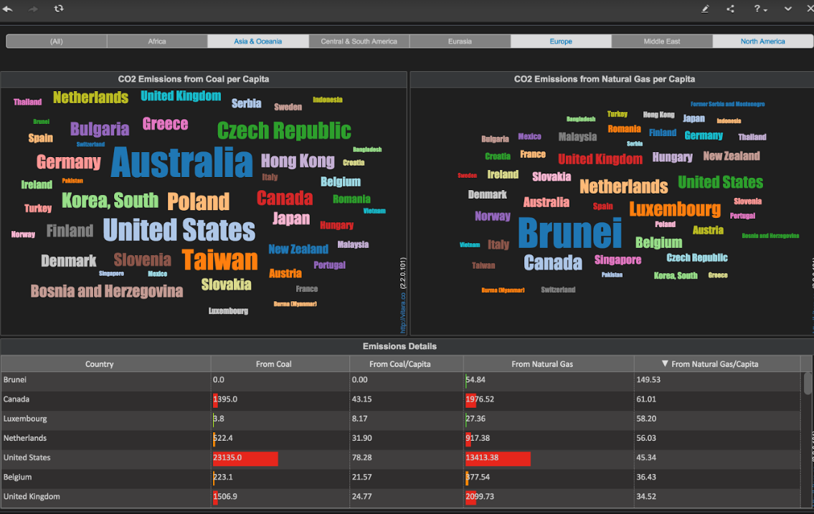
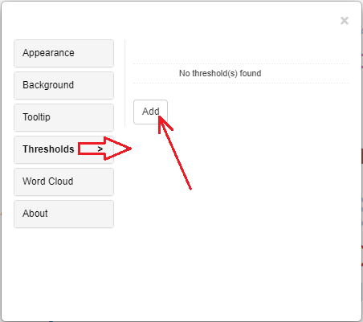
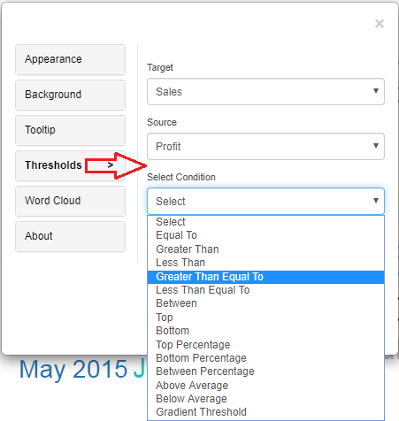
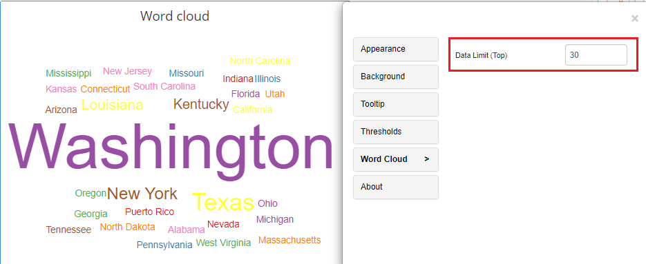

# Wordcloud Chart

## Word Cloud 

Vitara’s Word Cloud chart displays attribute elements on the chart, with larger metric values displayed in larger sizes. You can change the colors and size of the text in Vitara Word Cloud.

A word cloud chart is a visual representation of text data, where words are displayed in varying sizes based on their frequency or importance within the dataset. It provides a quick and intuitive way to identify key terms or trends in text-based information, making it easier to visualize and understand textual data patterns.

### Inputs: 

Metrics: 1 metric Attributes: At least 1 attribute Use as Filter Option - Available

<figure><figcaption></figcaption></figure>

## Thresholds 

In the business point of view, certain part of the chart needs to be highlighted to draw more attention from the desicion makers. For example, highlight the stores where total sales is greater than a specific value or highlight the top 10 products whose sales is high during last year’s winter. Thresholds are very useful objects in these use cases.

Thresholds will display some conditional formatting in a chart to highlight certain data points depending on predefined criteria.The criteria are attribute or metric qualifications. If a qualification’s expression evaluates to TRUE, the report displays the threshold. We can also include markers in thresholds.

To apply thresholds in vitara charts, hover the cursor on the chart. Vitara chart will display an ‘Edit’ button. When you click on this ‘Edit’ button the properties window will pop out. Select the thresholds tab to open threshold editor. In the window you can add a new threshold or delete any existing threshold or modify the existing threshold.

Note: As of version 4.6, we can use attributes to impose thresholds. All the measurements and attributes in the chart are listed in the source drop-down box in the threshold editing window. We can choose a source characteristic and set a threshold condition.

<figure><figcaption></figcaption></figure>

In the threshold editor window apply source, target, threshold condition and the other related information to set a threshold on the chart.

<figure><figcaption></figcaption></figure>

After giving all the inputs click on ‘Apply’ button.

## Thresholds Priority

When multiple thresholds are applied to the same metric, the most recently added threshold takes precedence—even if the conditions differ.

For example, if a threshold is applied to the Cost metric with a "greater than" condition and sets a background color, and then another threshold is added to the same Cost metric with a different condition that includes a text color and a marker, the chart will reflect only the styling from the most recently applied threshold.

## Word Cloud 

We can limit the data in the word cloud chart. See the below screenshot the number of elements is limited to 30.

<figure><figcaption></figcaption></figure>

## Background Image 

The steps to set a background image for all Vitara charts are explained in [_backgroundImage_](background-images.md).
