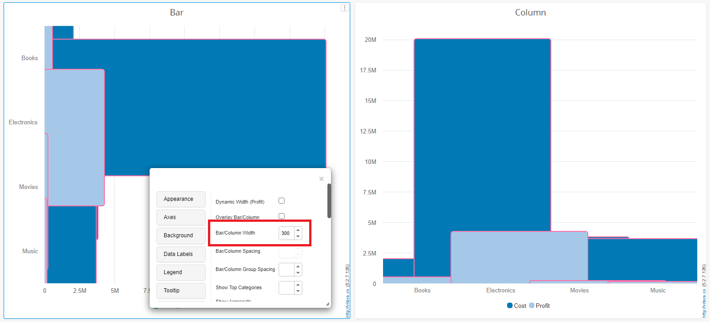

# Bar/Column Width

There is no longer a limit on the width of bar/column . The width of bars plays a crucial role in highlighting differences between data points and aiding viewers in interpreting the information presented. On one hand, the removal of limitations on bar width provides greater flexibility and customization in chart design. Users now have the freedom to adjust the width of bars according to their preferences, leading to more visually appealing and engaging charts. This enhancement allows for better alignment with specific design requirements and the ability to create charts that effectively convey the intended message.

Below is the screenshot of charts with bar width:

<figure><figcaption></figcaption></figure>

<figure><figcaption></figcaption></figure>
