---
layout:
  title:
    visible: true
  description:
    visible: false
  tableOfContents:
    visible: true
  outline:
    visible: true
  pagination:
    visible: true
---

# Bubble Chart

A Bubble chart is a type of chart that displays three dimensions of data. The size of the bubble, the color of the bubble and the location can all be used to represent information in an intuitive manner.

## Inputs 

Three metrics are necessary. The first metric M1 is utilized for the X-axis, the second for the Y-axis, and the third for determining the size of the bubble. The bubble chart can also be used as a scatter chart because the size of the bubbles does not change. We simply require two measures in this situation, M1 and M2.

Attributes - To define the context for the metric data, one or more attributes are necessary. Revenue (M1), Profit (M2), and Profit Margin (M3) are plotted across Month in the example below.

Use as Filter Option - Available

<figure>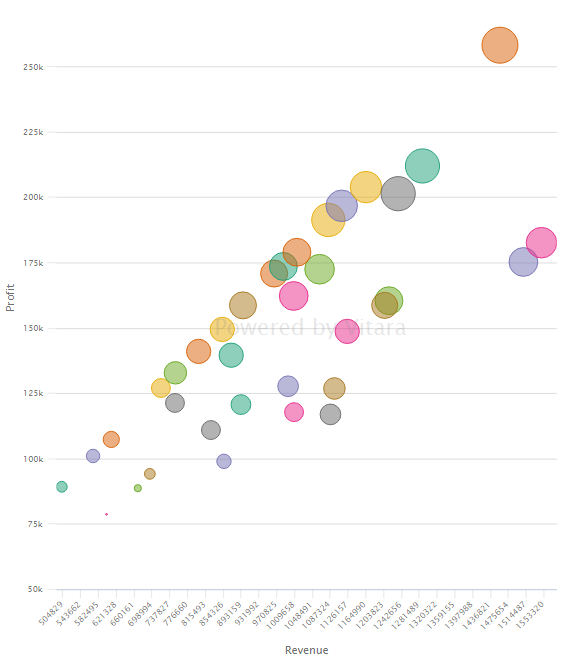<figcaption></figcaption></figure>

## Bubble Size 

From 4.4, a feature is added in Bubble chart to specify the minimum and maximum bubble sizes proportional to the metric values. The bubble size feature assigns varying bubble sizes to represent a third data dimension. Larger bubbles signify higher values, enabling the chart to display three data attributes at once. This enhances data visualization, aiding in the analysis of multi-dimensional datasets, and identifying trends and correlations effectively.

This is added in the bubble tab of the property editor.\
The default minimum and maximum bubble sizes are ‘4’ and ‘40’ respectively. See the screenshot

<figure>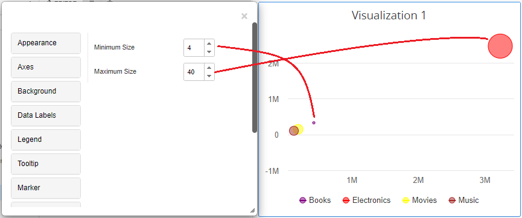<figcaption></figcaption></figure>

Now lets change the bubble sizes and below is the screenshot that shows how bubbles scale according to the sizes specified.

<figure>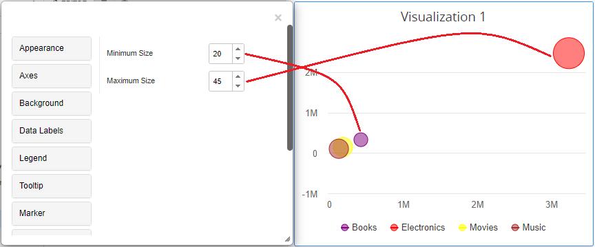<figcaption></figcaption></figure>

## Thresholds 

In the business point of view, certain part of the chart needs to be highlighted to draw more attention from the desicion makers. For example, highlight the stores where total sales is greater than a specific value or highlight the top 10 products whose sales is high during last year’s winter. Thresholds are very useful objects in these use cases.

Thresholds will display some conditional formatting in a chart to highlight certain data points depending on predefined criteria. The criteria are attribute or metric qualifications. If a qualification’s expression evaluates to TRUE, the report displays the threshold. We can also include markers in thresholds.

Hover the cursor over the chart to apply thresholds in Vitara charts. ‘Edit’ button will appear on Vitara chart. This “Edit” button will cause the properties window to appear. To open the threshold editor, select the thresholds tab. You have the option to add a new threshold, remove an existing threshold, or change an existing threshold in the window.

**Note:** From 4.6 version we can apply thresholds using attributes. The source drop down box in the threshold editor window will list all the attributes and metrics in the chart. we can select an attribute as source and define a threshold condition. The target of the threshold depends on the series of the chart. This means, if the chart series is created using metrics then target drop down box will display the metrics. If we enabled ‘color by’ mode, by adding an attribute to the ‘color by’ drop zone in the dossier’s editor panel, the chart series will be created using attributes. In this case the threshold target drop down box will show all the elements of attribute used in the color by drop zone. In this case we can set threshold target using attribute.

<figure>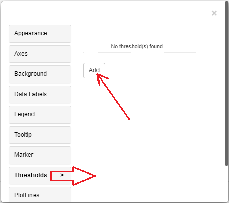<figcaption></figcaption></figure>

In the threshold editor window apply source, target, threshold condition and the other related information to set a threshold on the chart.

<figure>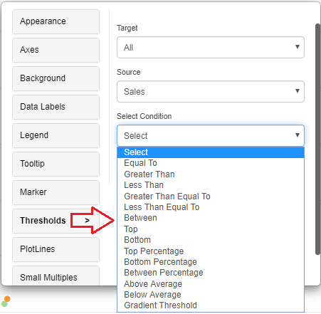<figcaption></figcaption></figure>

After giving all the inputs click on ‘Apply’ button.

When the bubble chart is working as a scatter chart, thresholds can also set the type of marker to display when the condition is true. In the below screenshot a threshold with markers is set on profit with a condition less than 200K.

<figure>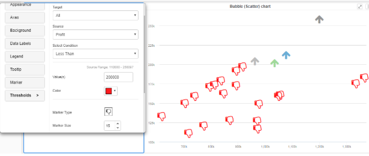<figcaption></figcaption></figure>

From version 4.9.0, we can use pattern fill in thresholds (Grid/Square/Double Square/Slash), certain part of the chart can be filled with a pattern.

The pattern fill feature in a bubble chart employs different patterns or textures within the bubbles to represent additional categorical data. This visual element enhances the chart’s clarity by distinguishing between various groups or subcategories within the dataset. It helps users identify patterns and relationships in complex datasets more easily.

<figure>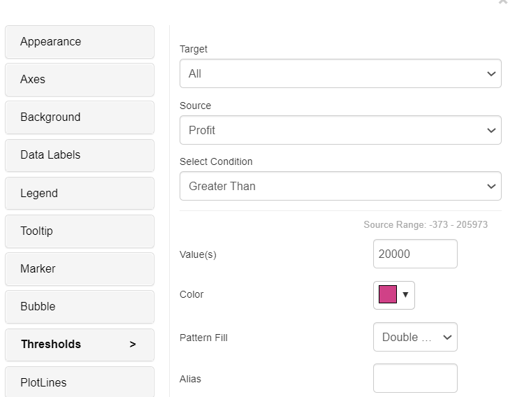<figcaption></figcaption></figure>

<figure>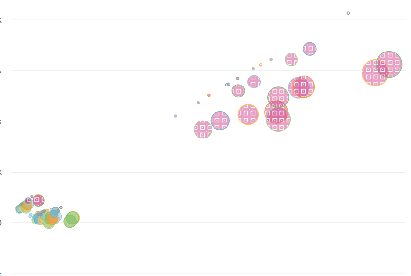<figcaption></figcaption></figure>

## Play-by Animation 

Play by - animation shows the chart for each element of the first attribute. For more details about the play by feature please refer to play-by.

From version 4.9.3, we’ve included the option to switch on Transition lines between the trail and current sequences in the bubble chart.

The transition line feature in a bubble chart is a connecting line that visually represents the flow or progression of data between bubbles over time or within a process. This feature aids in understanding the sequence or relationships between data points, making it useful for depicting dynamic data, trends, or changes within a series of events or categories. It enhances the chart’s storytelling capabilities and helps users interpret data more effectively.

For a specific category axis attribute element, a line will be created between the play axis elements (current play axis value versus first play element OR current play axis value against last but one play axis value). To see the lines, enable the “Show Transition Lines” option in the play axis menu and set the “Retain Points” to ‘First’ or ‘Last but One’. Please see the screenshots below.

<figure>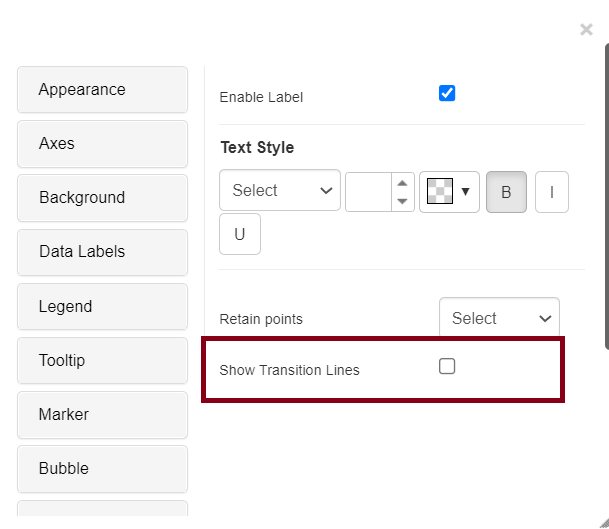<figcaption></figcaption></figure>

<figure>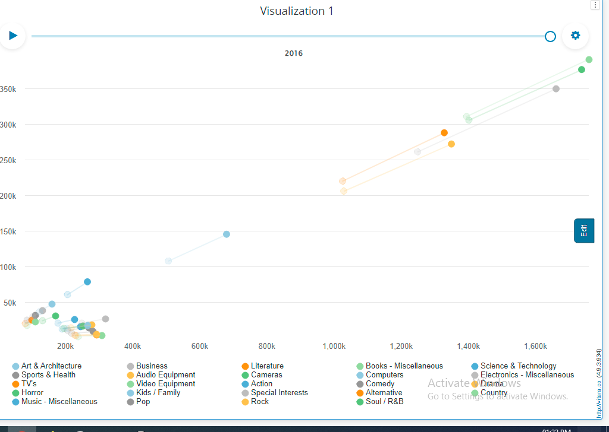<figcaption></figcaption></figure>

## Background Image 

The steps to set a background image for all Vitara charts are explained in backgroundImage.

## Small Multiples 

Bubble chart supports small multiples feature. Small multiples feature is explained in smallMultiples

## Series 

The series property in a bubble chart allows you to group and categorize data points into distinct series or data sets. Each series typically has its own color, marker, and series pattern, making it easier to distinguish and analyze various subsets of data within the same chart. This property is particularly useful when you want to compare and contrast different categories, helping users to identify patterns and trends within each series.

From version 5.0, Bubble chart now has an ability to individually set markers,color pattern from the addition of the new series property on the property editor.

<figure>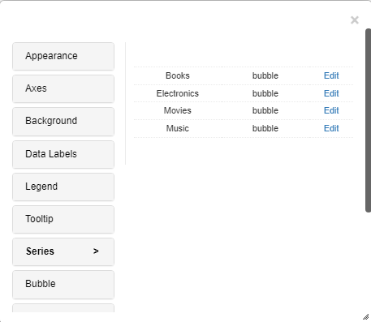<figcaption></figcaption></figure>

Users now have the ability to pick colors for the specific series.

<figure>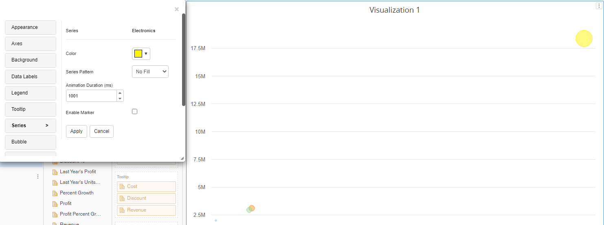<figcaption></figcaption></figure>

And can add marker of the desired choice.

<figure>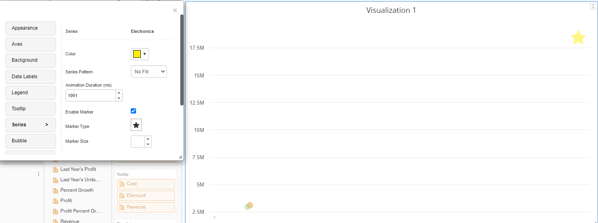<figcaption></figcaption></figure>

Series pattern can also be applied to the marker.

<figure>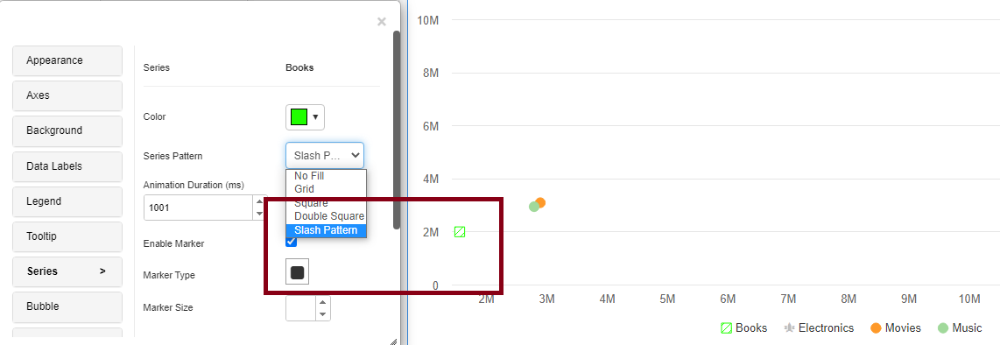<figcaption></figcaption></figure>

## Marker Type 

From version 5.2.4 we have intrdocued a new feature in a bubble chart, the “marker type” feature refers to the shape or symbol used to represent individual data points. By customizing marker types, you can add an extra layer of information to the chart, visually distinguishing different categories or data series. This enhances clarity and comprehension in multi-dimensional data visualizations.

This feature will be accessible from the “Bubble” tab in the chart editor menu. Users can access this tab when adding a new marker type with the size required in a bubble chart.

<figure>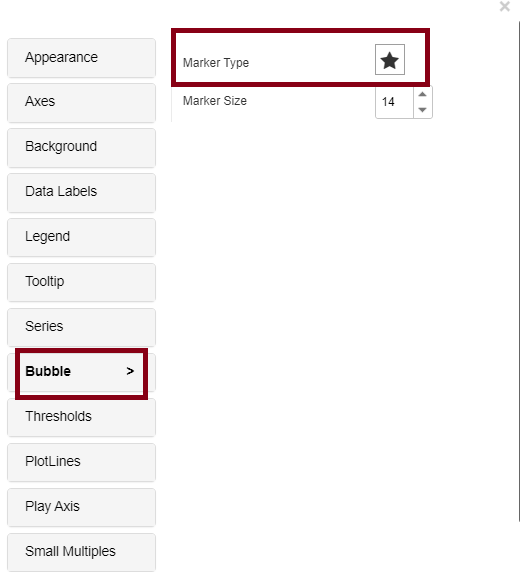<figcaption></figcaption></figure>

<figure>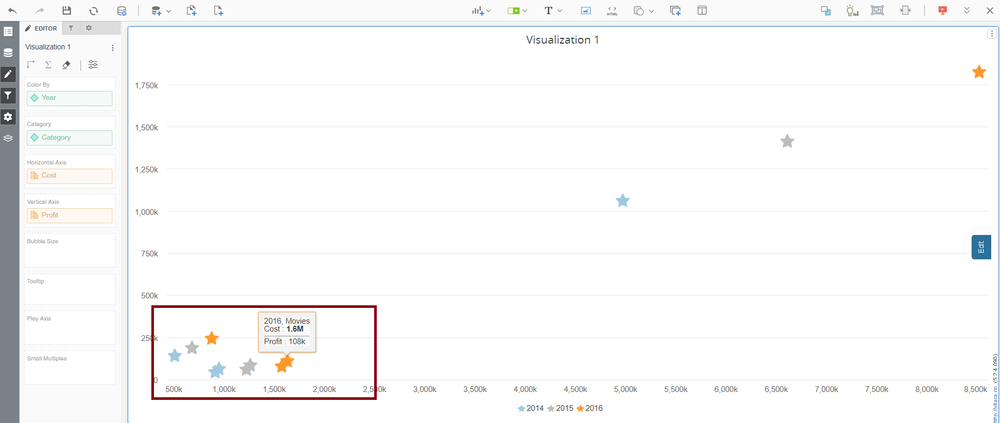<figcaption></figcaption></figure>

## Plot line 

Starting with 5.2.4, we have the “plot line” feature in a bubble chart is used to show lines that are either vertical or horizontal or other directions as well and act as reference points. In addition to helping with data visualization and comparison, these lines can represent thresholds, averages, or other data points. This allows users to evaluate how individual data points relate to particular standards or values.

Plotline orientation will be displayed in both horizontal and vertical directions (exclusive to bubble charts) especially 45 degrees. When you click on the slope option in the property editor’s plotline orientation dropdown, the other dropdown will be disabled and the input text will appear. You must enter a slope value between the chart’s maximum value (e.g., 0.1, 0.2, etc.) based on the chart’s values.

The chart editor menu’s “Plot line” tab will provide access to this capability. When adding slope, horizontal or vertical orientation to the bubble chart’s plot line, users can access this tab. The ‘Source’ and ‘Target condition’ become constrained when we add orientation directly as ‘Slope’ under the “Plot line” tab.

<figure><figcaption></figcaption></figure>

<figure><figcaption></figcaption></figure>
