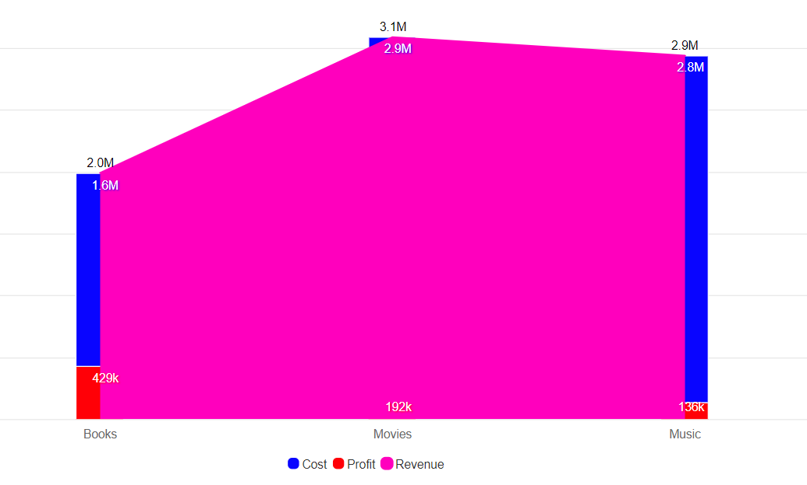
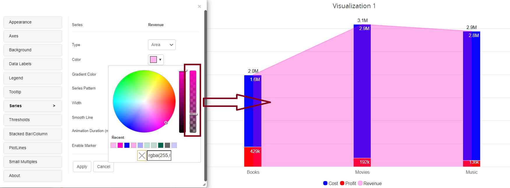

---
layout:
  title:
    visible: true
  description:
    visible: false
  tableOfContents:
    visible: true
  outline:
    visible: true
  pagination:
    visible: true
---

# Color Picker with Opacity

In Version 5.1, a new slider is included that allows users to vary the transparency of any specific colour applied to regions where colour opacity can be adjusted as desired. The legends, thresholds, data labels, appearance, tooltip, series, and axes tabs all have this feature.

In the example below, we can observe that the ‘revenue’ metric overlaps the ‘cost’ and ‘profit’ metrics, preventing us from seeing past the chart’s overlapping region.

<figure><figcaption></figcaption></figure>

So, from the below image when we adjust the opacity of the ‘revenue’ from Series tab, we can see that the ‘cost’ and ‘profit’ metrics are clearly visible.

<figure><figcaption></figcaption></figure>
