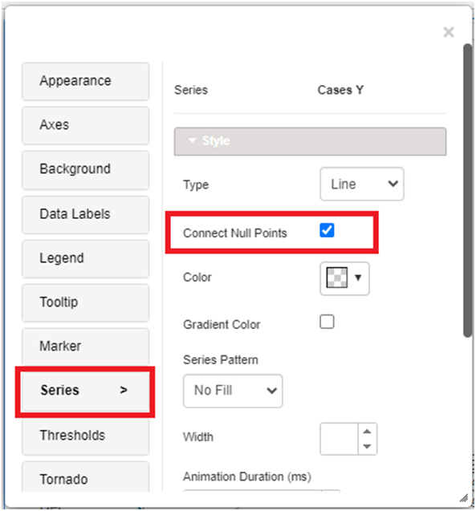
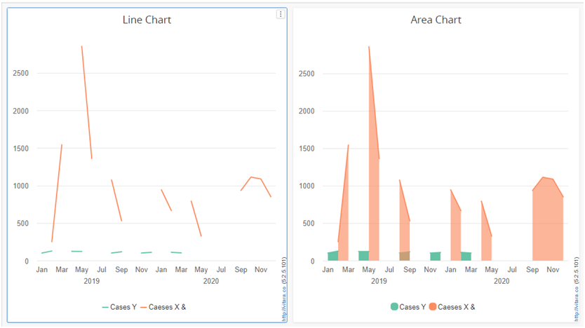
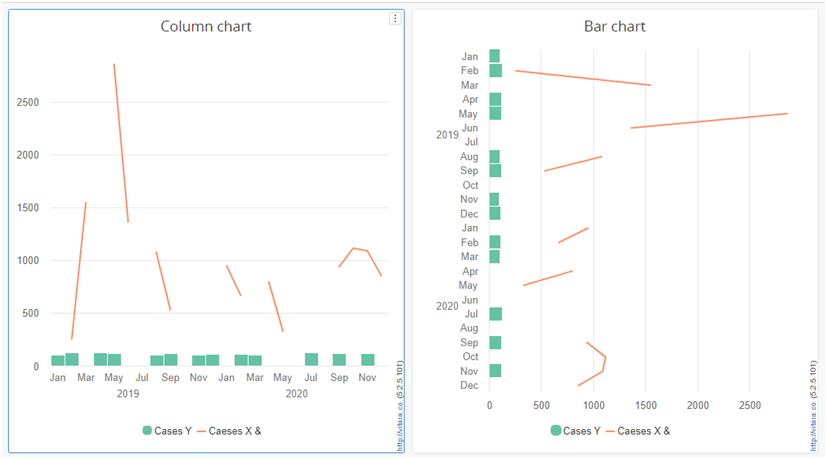
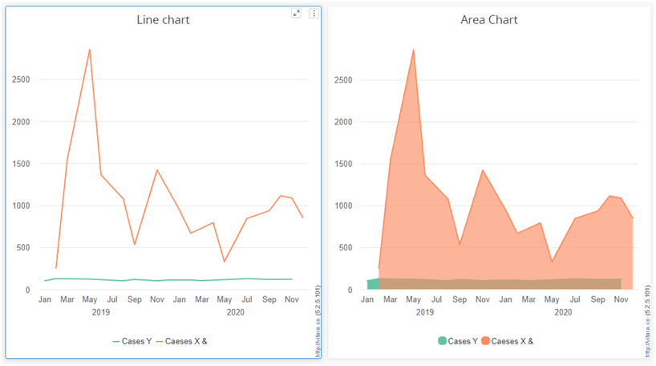
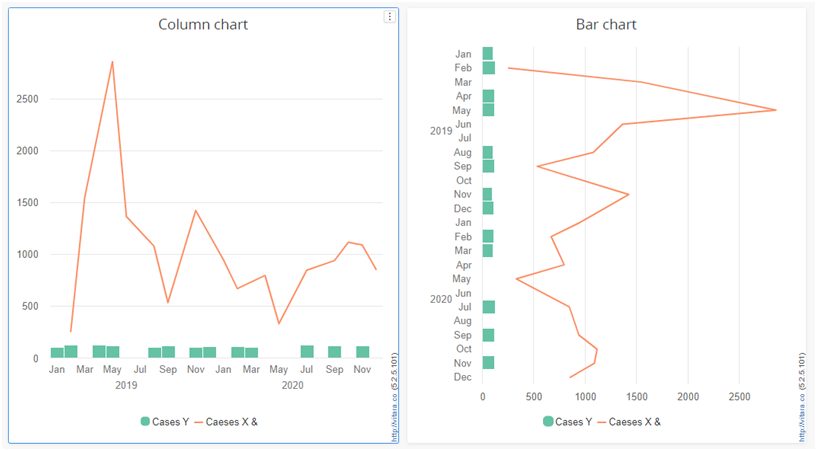

---
layout:
  title:
    visible: true
  description:
    visible: false
  tableOfContents:
    visible: true
  outline:
    visible: true
  pagination:
    visible: true
---

# Connect Null Points

In the latest version, 5.2.5, we have the ability to connect line breaks when there are nulls. When creating a line chart or combination chart, it is important to consider how to handle null points. Null points occur when there is missing data or when a value is not available for a specific point in time. One approach to handling null points is to connect them using a straight line. This can provide a visual representation of the data trend, even when there are gaps in the data. The “connect null points” option is a useful feature that allows users to connect a null object to a specific point in a series of objects or elements. These null points can be frustrating, as they create a visual break in the data and make it difficult to interpret the overall trend. Here, we will explore how to connect those null points in a line chart. By doing so, we can create a more seamless and accurate representation of the data, allowing us to better understand the underlying patterns and insights. So let’s dive in and discover how to bridge those gaps in your line charts.

## **List of charts supports this feature:**

* Bar Chart
* Column Chart
* Stacked Bar Chart
* Stacked Column Chart
* Line Chart
* Area Chart
* Tornado Chart
* Sparkline Chart

The null point connection option is available directly in Line and Area charts, making it simple to use. The new null point connection option is also applicable to other chart types. Simply change the series type to Line or Area to take advantage of this fantastic feature.

## **How to Connect Null Points?**

The Series tab contains the Connect Null Points option. By choosing the Series tab and then clicking the “Edit” button, you can see the “connect null points” option in area and line charts directly. We can change other charts to line or area by changing the series type. At that point, you will be able to see the new (connect null points) option. Transform your lines by filling in the gaps with our innovative tool. Enhance data visualization and make your insights more impactful. Try it now!

<figure><figcaption></figcaption></figure>

### Below is the screenshot of charts with Connect Null points 

Screenshots of the connect null point before and after are provided. The following screenshots demonstrate the effect of enabling the connect null point feature. Users can see what enhancements or modifications occurred as a result of activating this feature by comparing these images. This can be especially helpful for troubleshooting purposes or for evaluating the effectiveness of the connect null point feature in enhancing connectivity and performance.

### **Before enabling connect null points.**

<figure><figcaption></figcaption></figure>

<figure><figcaption></figcaption></figure>

### **See the screenshots below after enabling the connect null points.**

<figure><figcaption></figcaption></figure>

<figure><figcaption></figcaption></figure>
