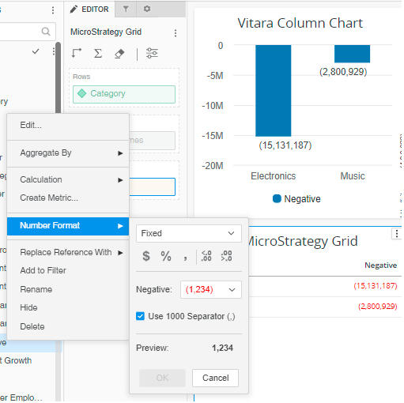
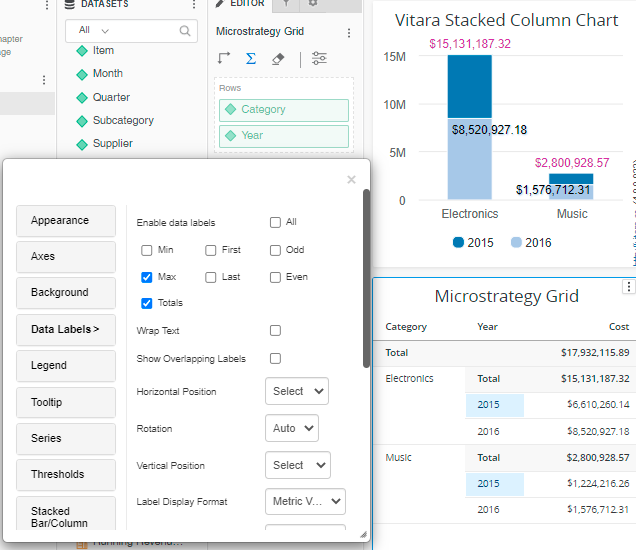
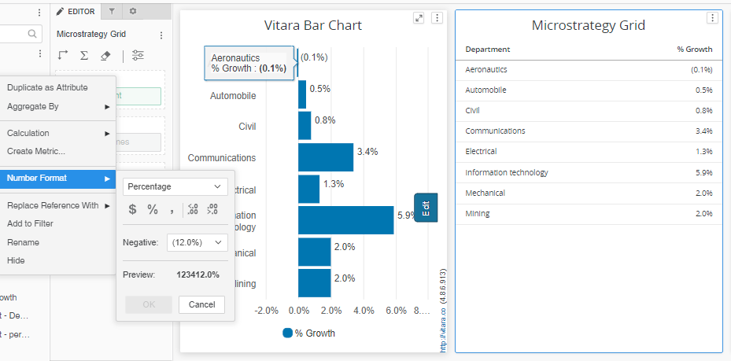

# Formatting metric data

\

* Use the _**Number Format**_ option under the right click menu on a metric name (from the dossier’s dataset panel) to define the desired format.
* All formats available under the _**Number Format**_ menu are supported (except aggregated values are not formatted in fraction)
* Red color coding for negative numbers is not supported (in any format). But use of minus (-) sign or parentheses () is retained in the vitara charts.

<figure><figcaption></figcaption></figure>

#### Usage of Metric Formatting: 

There are two types of numbers in Vitara Charts

**Actual data numbers**

* These numbers have a formatted value as defined by the users in the dataset.
* The actual data numbers are used in data labels and tooltips.

**Aggregated numbers**

* These figures are the outcome of various aggregations conducted in Vitaracharts. (For example, axis labels, stack totals, and data values in charts such as Calendar Heat Map where the data is provided at the day level but graphically represented at a higher level such as week, month, or year)
* The formatted value of an Actual data number or format string from metric information is used to identify metric Format for these numbers.
* The identified metric format is used to format the aggregated value.
* Fractional formatting is not supported.

<figure><figcaption></figcaption></figure>

#### Vitara charts Identifying Metric Format: 

Microstrategy delivers metrics with metadata that includes the format string and metric type.

The metric type is used to identify data values such as dates and percentages. Condensed format is identified via the Format string. Currency prefixes and suffixes (such as $/€). When the number format is set to automatic or custom, the date, scientific, and percentage metric types are displayed. In negative values, the following format is used: a minus symbol ‘-‘ or a pair of parenthesis ‘()’

#### Percentage Format 

**Existing Functionality:** MicroStrategy format string is used to identify percentage data. This is done regardless of the number format chosen in Microstrategy. When the % format string is specified, all data from the metric is assumed to be in percentage form. Aggregations made to metric data (through VitaraCharts menus) are updated as needed. All labels (data labels, axis labels, totals) and tooltips are properly formatted. Vitara Bar Chart Formatting (Formatted Values are shown in Microstrategy Grid Chart):&#x20;

<figure><figcaption></figcaption></figure>

In all of the above instances, regardless of the metric’s Number Format, a formatted number (as seen in the Grid Chart) is utilised to denote the percentage data. Metric values are expressed as percentages in Data labels, Axis labels, and Tooltips.

**Limitation:**

* If the formatted string contains ‘%’ symbol, the metric is identified to contain percentage data.\
  **Dossier with ‘%’ symbol in formatted string:**\

In all the above screenshot, Formatted value(as shown in Grid Chart) shows ‘%’ even though the data is not in percentage form. Metric values in Data labels, Axis labels and Tooltips are incorrectly formatted as percentage.
