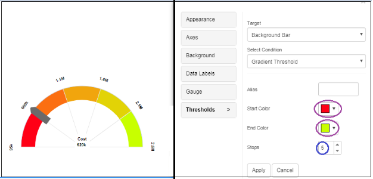
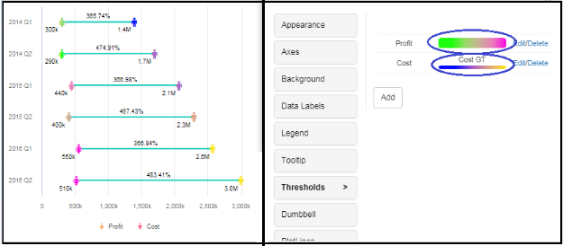

# Gradient Threshold

A new threshold condition called ‘Gradient threshold’ is added to the following charts in the threshold’s properties: Bar, Stacked Bar, Column, Stacked Column, Line, Area, Bubble, Tornado, Sparkline, Heatmap, Column range, Bullet, Calendar Heatmap, Trellis, Mekko, Word Cloud, Dumbbell, Slope, Angular Gauge, and Sankey chart.

Gradient thresholds with the required number of stops are applied between two colors. Gradient thresholds are applied to Attributes and Metrics with the Start and End colors based on the Target and Source settings.

Click on the Edit Button→ Thresholds Button→ We can set Gradient Thresholds through conditions.

Examples for Gradient Threshold:

1. In the below screenshot, for the Angular Gauge Chart, we applied the Gradient threshold on Background Bar, and Red as Start color and Yellow as End color, with 5 Stops.

<figure><figcaption></figcaption></figure>

2. In the below screenshot, in the Dumbbell chart, we applied Target and Source as Cost, and applied Gradient threshold condition, with alias name and number of stops at 4.

<figure><figcaption></figcaption></figure>
