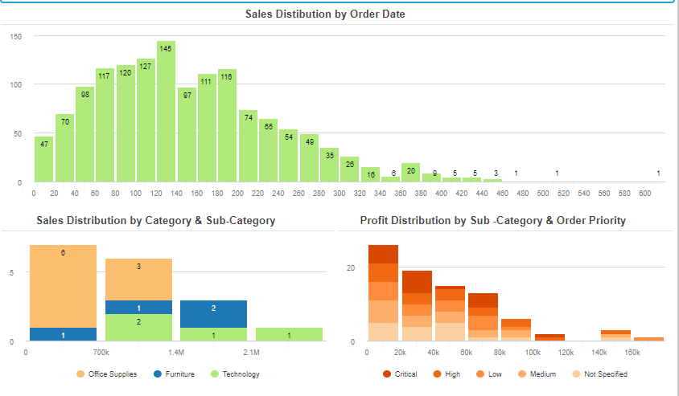
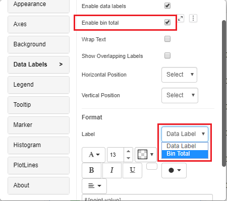
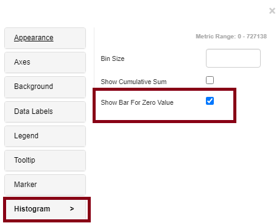
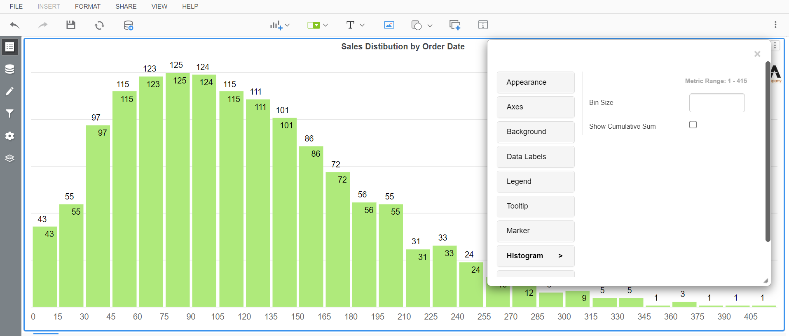
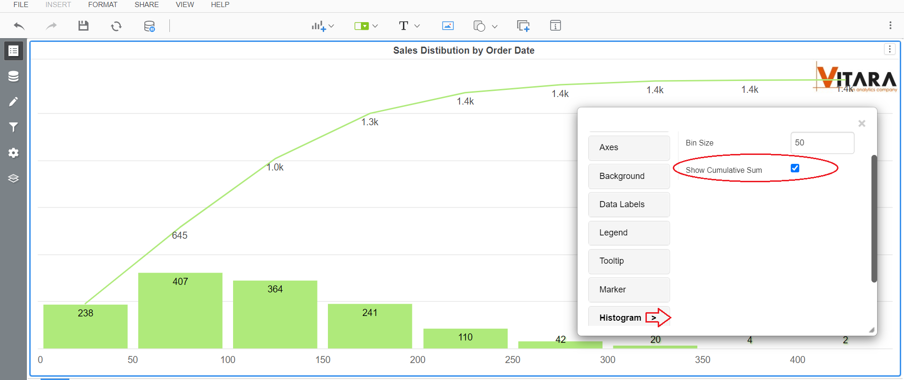
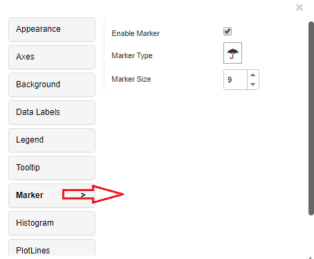
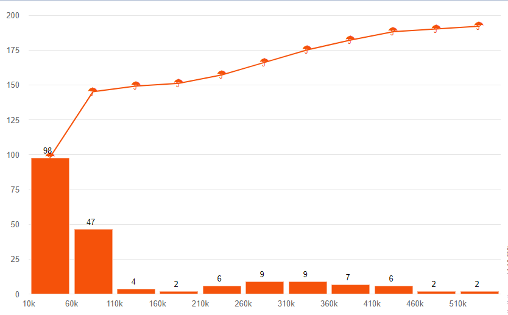
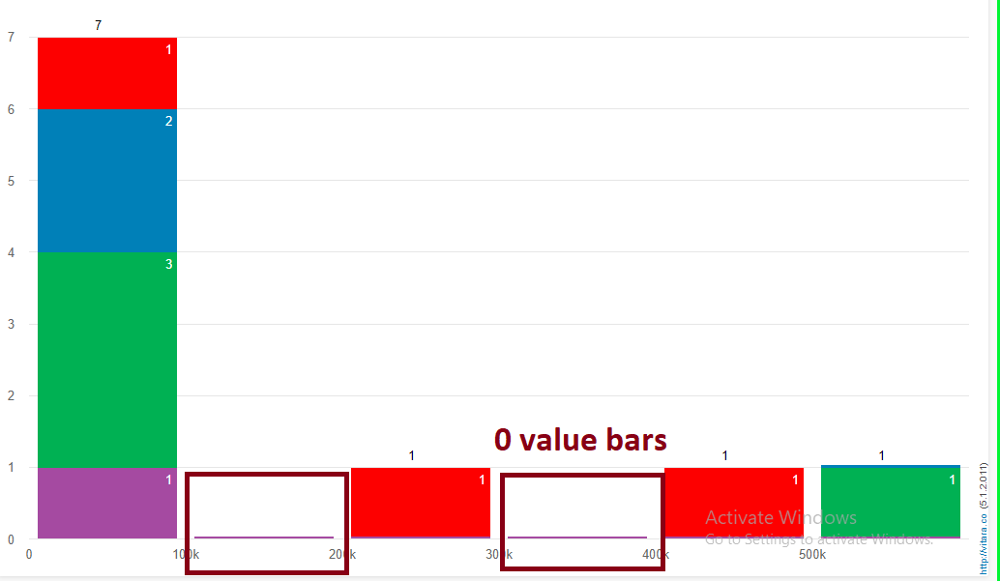

---
layout:
  title:
    visible: true
  description:
    visible: false
  tableOfContents:
    visible: true
  outline:
    visible: true
  pagination:
    visible: true
---

# Histogram Chart

To categorise values of a metric into predetermined bins, a histogram is utilized. Data is shown graphically using bars of various heights. A histogram groups metric values into ranges (bin size), similar to a bar chart, but you may choose which ranges to use. You can adjust the bin size to meet your needs. The values under each bin’s cumulative sum line can also be displayed.

#### Inputs 

Metrics: 1 metric Attributes: 1 attribute. Use as Filter Option - Not Available

<figure><figcaption></figcaption></figure>

#### Data labels 

Data labels in a histogram chart show the count of data points in each bar. They help viewers understand data distribution and make comparisons, aiding in statistical analysis and data presentations.

We can format the data labels and bin total also. You can see the attached screenshots below.&#x20;

<figure><figcaption></figcaption></figure>

#### Bin Size and Cumulative Sum 

Bin Size:

Bins are the towers or bars that make up a histogram. Each bin’s height indicates how many values from the data fall within that range. Below is the screenshot of the property to modify the bin size.

<figure><figcaption></figcaption></figure>

**Default bin size:**&#x20;

<figure><figcaption></figcaption></figure>

**Modified bin size:**&#x20;

<figure><figcaption></figcaption></figure>

**Cumulative Sum:** A cumulative histogram is a mapping that counts the total number of observations in all bins up to the chosen bin.&#x20;

<figure><figcaption></figcaption></figure>

#### Markers 

When the Vitara histogram chart shows the cumulative sum line, we can make a chart to show a marker at each intersection of each bin and the cumulative sum line. The type and size of the marker customizable.

Markers in a histogram chart are used to emphasize specific data points or statistics, such as the mean or median. They enhance data interpretation by providing clear visual cues, aiding in identifying important values and trends within the distribution, making the chart more informative and insightful for viewers.

<figure><figcaption></figcaption></figure>

Below is the example of histogram chart shows the cumulative sum line with markers.

<figure><figcaption></figcaption></figure>

#### Background Image 

The steps to set a background image for all Vitara charts are explained in backgroundImage.

#### Zero Value Bar 

In Version 5.1.1.010, we included a new feature that allows users to show zero value bars.

The “zero value bar” feature in a histogram chart is an option that allows you to include or visualize bars for data bins that have a count of zero. It’s useful for maintaining the continuity of the chart, showing that certain data intervals were considered and had no occurrences, ensuring a more accurate representation of the entire data range and preventing gaps in the visual display.

This feature can be enabled under the “Histogram” tabs, where it can be used to display metrics, whose values are zero.

<figure><figcaption></figcaption></figure>

<figure><figcaption></figcaption></figure>
