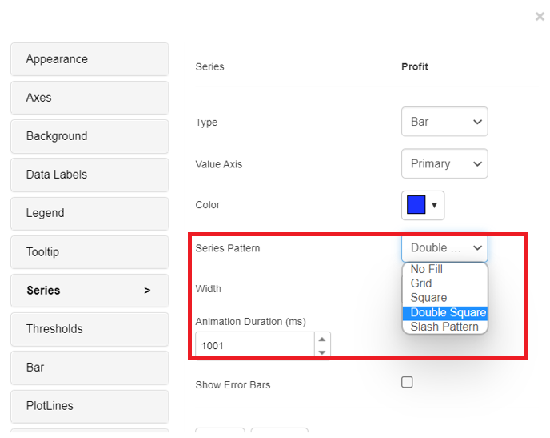
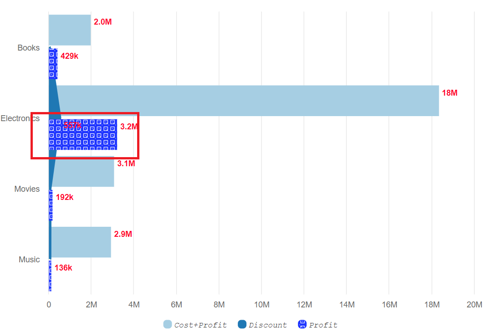
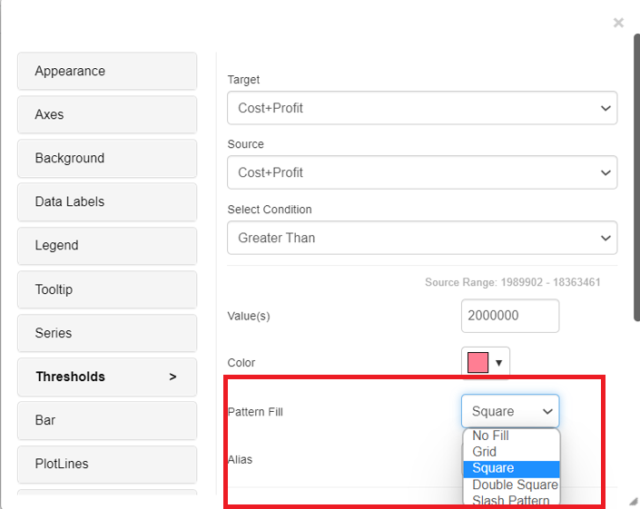
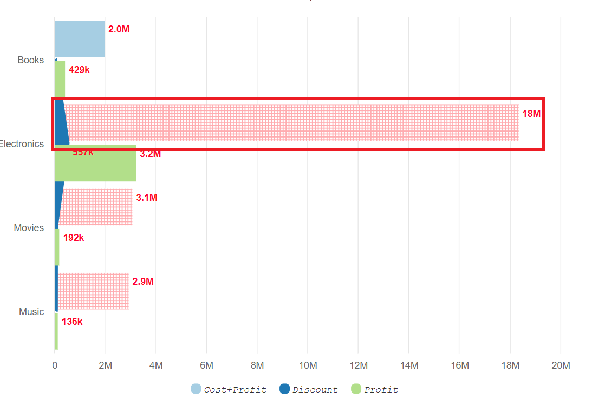

# Pattern Fill

## Pattern Fill Option in the ‘Series’ tab. 

From version 4.9.0, pattern fill feature is available in the following charts: area/line , tornado, bar/column, stacked column/bar, trellis, pie and sparkline.These charts have the Pattern fill option (Grid/Square/Double Square/Slash) in the Series tab, which allows us to display data in a more presentable manner.

<figure><figcaption></figcaption></figure>

<figure><figcaption></figcaption></figure>

## Pattern Fill Option in the ‘Threshold’ tab. 

Using pattern fill in thresholds, certain part of the chart can be filled with a pattern.The following charts support this feature: area/line, tornado,bar/column, stacked column/bar, trellis, dumbbell, slope, bubble, pie and sparkline.

<figure><figcaption></figcaption></figure>

<figure><figcaption></figcaption></figure>
