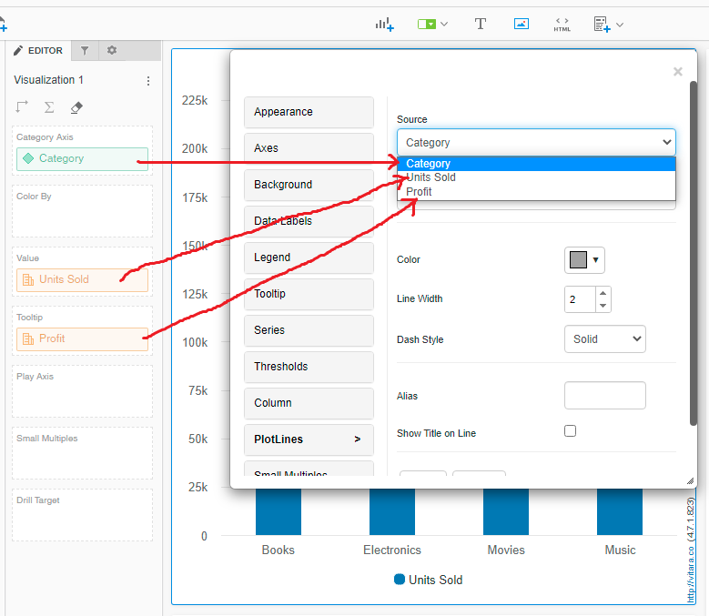
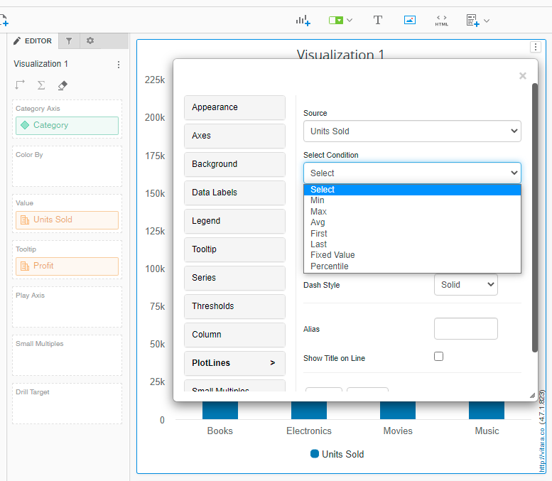
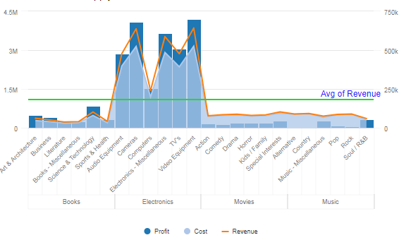
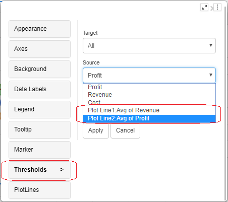
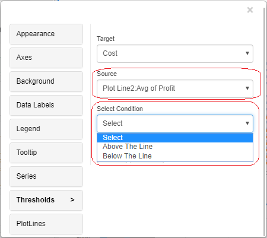

# Plot lines/Reference lines

Note: Plotlines can be drawn using attributes in version 4.6. All the attributes and data in the chart are listed in the source drop-down box in the plotline editor window. We can choose a source attribute and specify a plotline condition.

Line, area, sparkline, bar, column, stacked bar, stacked column, bullet, tornado, column range, slope, dumbbell, bubble, and histogram charts are among the charts that contain this functionality.

Select the measure you wish to base your plotline on from the’source’ drop-down menu under the ‘Plot Lines’ tab in the property editor window.

The plotline editor is seen in the screenshot below. The’source’ drop down box will show attributes added to the category axis drop zone, metrics added to the value drop zone, and metrics added to the tooltip drop zone. As the source, choose an attribute or measure.&#x20;

<figure><figcaption></figcaption></figure>

Apply the conditions like min, max, avg, first, last, and percentile. Apart from these fixed conditions, you can give a particular value as input at which you want to draw a plot line.

<figure><figcaption></figcaption></figure>

You can apply colors to plot line, change the plot line width, change the style of the line and title to the plot line. At last click on the ‘Apply’ button.

<figure><figcaption></figcaption></figure>

The bubble chart now supports plotlines on the vertical axis in version 3.8. Please see the screenshot below, which displays plot lines and reference lines on the horizontal and vertical axes.

<figure><figcaption></figcaption></figure>

#### Thresholds based on ‘Plot Lines/Reference Lines’: 

Plot lines/Reference lines can be used in the ‘source’ field in thresholds.

<figure><figcaption></figcaption></figure>

When we set the plot line in any Vitara chart, the name of the plot line appears in the thresholds tab’s source field. In the thresholds, we can provide plot lines as a source. When we specify a plot line as the ‘Source’ in a threshold, we can include the condition ‘Above the line’ or ‘Below the line’ in the threshold.

<figure><figcaption></figcaption></figure>

A screenshot of a bubble chart with two thresholds applied based on the storyline “Plot line1: Avg of Revenue” is shown below. The first threshold is based on the criterion ‘above the plotline, set bubble color as green,’ and the second threshold is based on the condition ‘below the plotline, set bubble color as red.’

<figure><figcaption></figcaption></figure>

#### Slope Plotline 

Starting with 5.2.4, we have the “plot line” feature in a bubble chart is used to show lines that are either vertical or horizontal or other directions as well and act as reference points. In addition to helping with data visualization and comparison, these lines can represent thresholds, averages, or other data points. This allows users to evaluate how individual data points relate to particular standards or values.

Plotline orientation will be displayed in both horizontal and vertical directions (exclusive to bubble charts) especially 45 degrees. When you click on the slope option in the property editor’s plotline orientation dropdown, the other dropdown will be disabled and the input text will appear. You must enter a slope value between the chart’s maximum value (e.g., 0.1, 0.2, etc.) based on the chart’s values.

The chart editor menu’s “Plot line” tab will provide access to this capability. When adding slope, horizontal or vertical orientation to the bubble chart’s plot line, users can access this tab. The ‘Source’ and ‘Target condition’ become constrained when we add orientation directly as ‘Slope’ under the “Plot line” tab.

<figure><figcaption></figcaption></figure>

<figure><figcaption></figcaption></figure>
