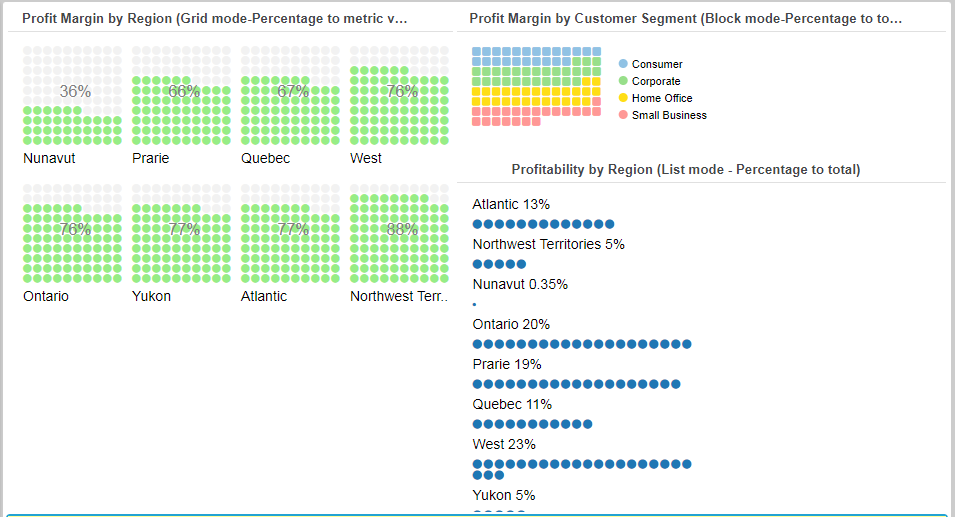
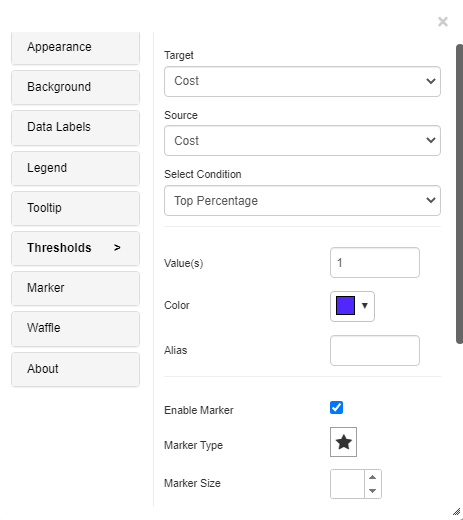
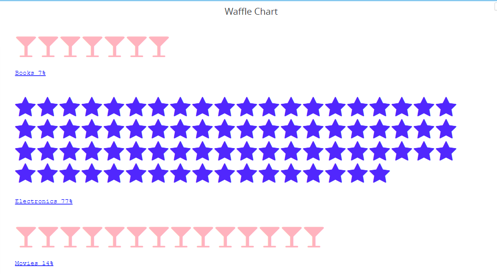
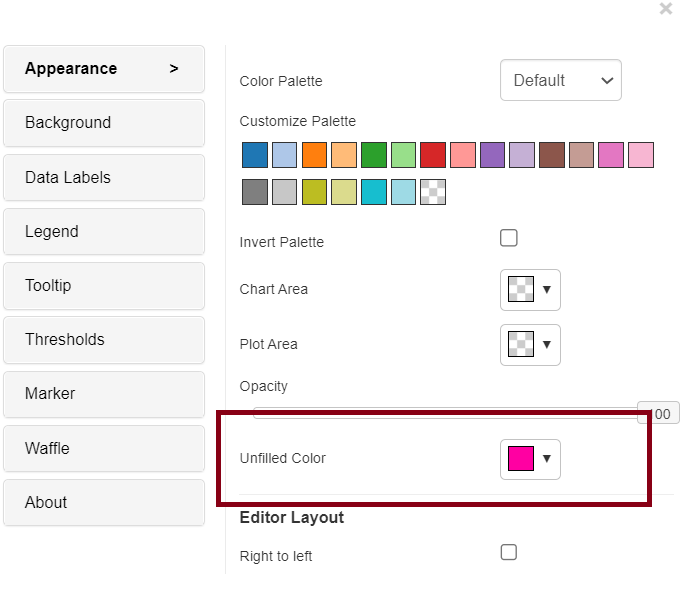

# Waffle Chart

A waffle chart is a visual representation that uses a grid of small squares to display data proportions or progress toward a goal. Each square represents a portion of the whole, making it easy to visualize and compare different categories or track achievements in a visually intuitive manner. Block (Percentage to total), list (Percentage to total), and grid (Percentage metric value) are the three charting modes supported by the Vitara.

## Inputs 

Metrics: 1 metric

Attributes: 1 attribute.

Use as Filter Option - Available

The screenshot below showcases all the three modes of waffle chart.

<figure><figcaption></figcaption></figure>

## Markers 

We can choose from different types of markers available in the ‘Marker’ tab of the waffle chart. The size of the marker is also customizable.

## Threshold 

In the business point of view, certain part of the chart needs to be highlighted to draw more attention from the desicion makers. For example, highlight the stores where total sales is greater than a specific value or highlight the top 10 products whose sales is high during last year’s winter. Thresholds are very useful objects in these use cases.

Thresholds will display some conditional formatting in a chart to highlight certain data points depending on predefined criteria.The criteria are attribute or metric qualifications. If a qualification’s expression evaluates to TRUE, the report displays the threshold. We can also include markers in thresholds.

To apply thresholds in vitara charts, hover the cursor on the chart. Vitara chart will display an ‘Edit’ button. When you click on this ‘Edit’ button the properties window will pop out. Select the thresholds tab to open threshold editor. In the window you can add a new threshold or delete any existing threshold or modify the existing threshold.

Note: From 4.9.3 version we can apply thresholds using attributes. All the measurements and attributes in the chart are listed in the source drop-down box in the threshold editing window. We can choose a source attribute and specify a threshold condition. The series of the chart determines the threshold’s aim. This indicates that the metrics will be displayed in the target drop-down box if the chart series was generated using metrics.

<figure><figcaption></figcaption></figure>

In the threshold, the editor window apply source, target, threshold condition and the other related information to set a threshold on the chart.

<figure><figcaption></figcaption></figure>

Apply all the inputs and click on ‘Apply’ button.

<figure><figcaption></figcaption></figure>

## Unfilled Color 

From version 5.0, the Waffle Chart now has an unfilled Color option that changes the waffle chart’s default colour (grey unused part of grid). An “unfilled color” option in a waffle chart allows users to designate a color that represents empty or unused portions of the chart, typically used to convey a visual representation of data where not all squares or cells in the chart are filled. This helps to maintain clarity and convey information effectively in the absence of data.

This feature is enabled via the appearance tab.

<figure><figcaption></figcaption></figure>

## Background Image 

The steps to set a background image for all Vitara charts are explained in [_backgroundImage_](background-images.md).
